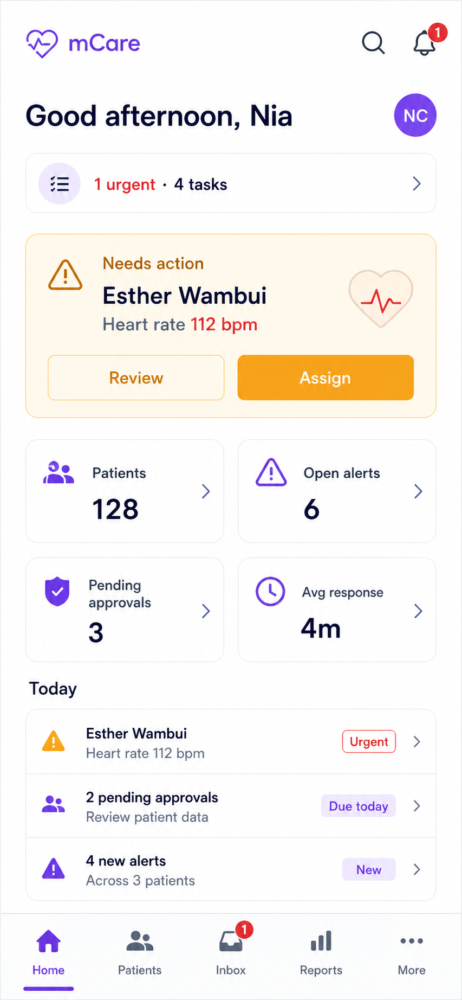
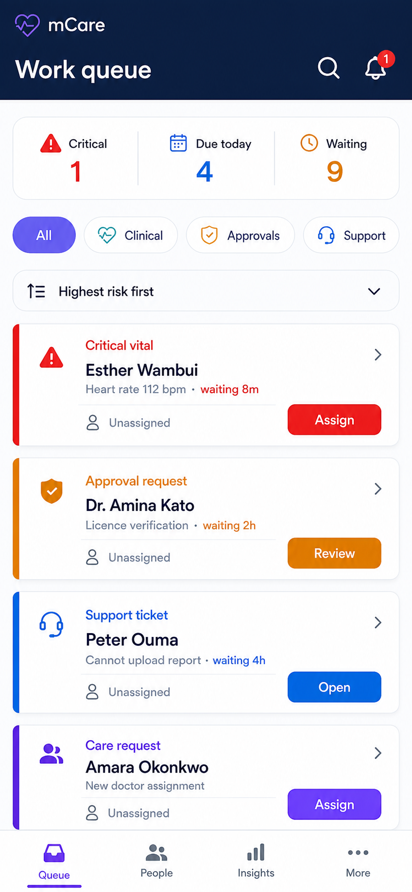
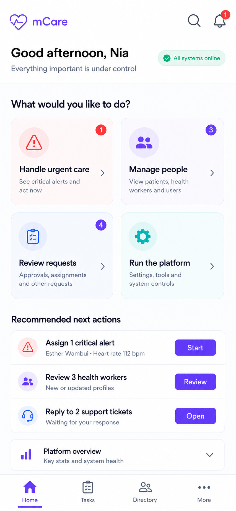

# mCare Admin Experience — Design Proposal

> **Design-history note:** The Guided Operations direction was selected and expanded into the implementation-ready documentation package indexed by [README.md](README.md). This earlier comparison is retained for traceability; the newer package is authoritative.

**Status:** Proposal for approval — no application UI has been changed  
**Scope:** Admin and permission-filtered mCare Assistant experience  
**Goal:** Make urgent work obvious, reduce navigation depth, and preserve every backend capability.

## 1. Executive recommendation

Adopt a hybrid of **Concept A (Action Hub)** and **Concept B (Unified Work Queue)**.

- Use Concept A for the home screen: calm, clear, and focused on the few things that need attention now.
- Use Concept B for daily operations: alerts, SOS, approvals, care requests, assignments, and support tickets become one filterable work queue.
- Use the plain-language labels and guided actions demonstrated in Concept C for onboarding and empty states.

The recommended persistent navigation is:

1. **Home** — urgent status, today's work, and a compact platform pulse.
2. **Work** — all actionable queues in one workspace.
3. **People** — patients, doctors, assistants, and administrators.
4. **Messages** — direct conversations and clinical/admin communication.
5. **More** — analytics, audit, security, announcements, vital catalog, system settings, and account tools.

Notifications stay in the header bell. Profile and personal settings stay in the avatar menu. The same five destinations become a left rail on larger screens.

This is primarily a frontend information-architecture change. Existing routes and endpoints remain available for deep links, bookmarks, and individual details.

## 2. Current design audit

### What already works

- The violet mCare identity is friendly and recognizable.
- Cards make the interface feel approachable.
- The dashboard exposes useful operational counts.
- Warning icons and badges make abnormal activity visible.
- The mobile bottom navigation is familiar.

### Main usability problems

1. **Important information is repeated.** One alert can appear in the top alert banner, an Open alerts metric, Needs attention, Platform activity, and a navigation badge.
2. **Quick access duplicates navigation.** Patients, Users, Alerts, and Support already exist elsewhere, so the dashboard behaves like a second menu.
3. **The first screen does not clearly answer “What should I do next?”** Statistics and operational tasks have similar visual weight.
4. **Labels are truncated.** Examples include “Pending appro…” and “Avg. response t…”. Important labels must never depend on guessing.
5. **The page is too tall.** Large cards and generous gaps force users to scroll before seeing the complete operational picture.
6. **Some trends are noise.** Repeated `0.0%` values use space without helping a decision.
7. **Pastel surfaces weaken hierarchy.** When almost every card has a tint, gradient, or shadow, urgent information is less distinct and secondary text can lose contrast.
8. **Badges do not explain severity.** A red count could represent a message, warning, overdue task, or emergency.
9. **Patients and Users are separate primary areas.** Users naturally expect one searchable place for people.
10. **Rare platform tools compete with daily work.** Audit, analytics, permissions, settings, and clinical configuration are important but should not be peer-level mobile destinations.

## 3. Design principles

### 3.1 Decision first

The opening screen must answer:

1. Is anyone in immediate danger?
2. What requires my action today?
3. Is the platform operating normally?

### 3.2 One item, one primary location

An alert appears once in the ranked work queue. Other places may show a count or link, but must not repeat the full patient card.

### 3.3 Organize by user task, not database entity

Admins think in jobs such as “handle an alert”, “approve a worker”, or “find a patient”. The interface should not expose every controller or resource as a separate top-level page.

### 3.4 Progressive disclosure

- **Layer 1:** Five stable destinations.
- **Layer 2:** Filters or segmented controls inside a destination.
- **Layer 3:** A detail bottom sheet on mobile or right-side panel on desktop.
- **Layer 4:** Rare or destructive actions in an overflow menu with confirmation.

### 3.5 One design language for Admin and Assistant

Assistants use the same shell. Their permissions remove unavailable filters and actions; they do not receive a separate or duplicated interface.

### 3.6 Status must be accessible

Never communicate severity using colour alone. Always combine colour with an icon and text such as **Critical**, **Warning**, **Due today**, or **Resolved**.

## 4. Proposed information architecture

| Primary destination | Content | Existing capability preserved |
|---|---|---|
| **Home** | Immediate attention, top three work items, active patients, open work, median response, system/sync status | Admin session and KPI/analytics summaries |
| **Work** | All, Emergency, Alerts, Approvals, Care, Support filters | Vital alerts, SOS, health-worker approvals, care requests, assignments, support tickets, relevant security work |
| **People** | Patients and Staff segments, universal search, contextual account/care-team actions | Users, patient summary, assignments, roles, account state, assistant permissions |
| **Messages** | Conversations, unread state, threads, compose | Existing admin/assistant messaging APIs |
| **More** | Insights, Content & clinical setup, Platform, Account | Analytics, audit/export, security, announcements, vital catalog, system settings, profile/settings |

### Items that should not become permanent bottom tabs

- Notifications — use the header bell.
- SOS — show a persistent, labelled SOS indicator only while an emergency is active.
- Profile and Settings — use the avatar menu.
- Analytics and Audit — group under More → Insights.
- Permissions — place under an assistant's People → Access tab.
- Assignments — place in Work and inside the relevant patient's Care team tab.

## 5. Screen blueprints

### 5.1 Home

The first viewport contains only:

1. Compact header: mCare, greeting/role, search, bell, avatar, and `Updated X seconds ago`.
2. One urgent banner, shown only when genuinely urgent.
3. **My work today:** the three highest-priority actionable items.
4. Three compact pulse metrics: Active patients, Open work, Median response.
5. One **View all work** action.

Detailed analytics, audit activity, and long feeds do not belong above the fold.

### 5.2 Work

Use one unified queue with filter chips:

- All
- Emergency
- Alerts
- Approvals
- Care
- Support

Every row shows:

- Severity and task type
- Person or service affected
- Clear reason
- Waiting time or due state
- Current owner
- Exactly one primary action

Sorting options should include **Highest risk first**, **Oldest first**, and **Assigned to me**. Resolving one item should return the user to the queue and offer the next item.

An aggregated backend endpoint can be added later for efficiency, but the first version can compose existing endpoint responses in the frontend.

### 5.3 People

Use one search field and two primary segments:

- **Patients** — overview, vitals, medications, documents, and Care team.
- **Staff** — doctors, assistants, and administrators with role/status filters.

Contextual detail actions:

- Patient: review chart summary and manage care-team assignment.
- Staff: activate/suspend, reset password, unlock, resend invite, and change role when authorized.
- Assistant: an additional **Access** tab for permission management, visible only to admins.

### 5.4 Messages

Keep direct conversations in one dedicated workspace with search, unread state, threads, compose, send, and mark-read behavior. Support tickets remain in Work because they are owned, timed, and resolved like operational tasks.

### 5.5 More

Group low-frequency tools instead of presenting a flat menu:

- **Insights:** Analytics, Audit/export, Security incidents.
- **Content & clinical setup:** Announcements, Vital catalog.
- **Platform:** System settings and administration-only configuration.
- **Account:** Profile, security, preferences, sign out.

## 6. Backend and permission alignment

No backend feature is removed. Existing named routes remain valid and can open the correct hub, filter, and detail panel.

### Assistant visibility

| Capability | Permission rule |
|---|---|
| SOS location/work | `can_access_emergency_location` |
| Health-worker approvals | `can_approve_healthworkers` |
| Care requests | `can_manage_care_requests` |
| Patient assignments | `can_assign_patients` |
| User creation / patient profile access | `can_create_users` |
| Audit and analytics | `can_view_activity_logs` |
| Announcements | `can_manage_advertising` |
| Security incidents | `can_view_security_incidents` |
| Vital catalog | `can_manage_vital_catalog` |
| Role changes | `can_change_user_types` |
| Create administrator | `can_register_admin` |
| Create assistant | `can_register_assistant` |

Assistant-permission editing and System settings remain admin-only.

Rules:

- Show a parent hub if the user can access at least one child.
- Omit inaccessible filters and actions rather than showing dead-end cards.
- Direct links to unavailable features show a clear permission message.
- If access is revoked during the live session refresh, close the affected panel, return to Home, and show: **“Your access was updated.”**

## 7. Visual concepts for approval

### Concept A — Action Hub

**Best for:** A balanced home screen for administrators and assistants.  
**Strengths:** Calm hierarchy, visible urgent task, understandable KPIs, clear actions.  
**Trade-off:** The KPI cards still consume space and should collapse on smaller devices.  
**Recommendation:** Use this visual foundation for Home.

### Concept B — Unified Work Queue

**Best for:** High-volume operational work.  
**Strengths:** Lowest navigation depth; urgency, ownership, and waiting time are obvious.  
**Trade-off:** It feels more operational than a traditional dashboard.  
**Recommendation:** Use this structure for Work.

### Concept C — Guided Operations Hub

**Best for:** New, occasional, or less technical users.  
**Strengths:** Plain-language goals and a very low learning curve.  
**Trade-off:** Less information-dense for experienced administrators.  
**Recommendation:** Reuse its language, helper text, and guided next actions throughout Concepts A and B.

The mockups are design explorations rather than pixel-perfect implementation specifications. Final labels should use the approved five-destination architecture: **Home, Work, People, Messages, More**.

## 8. Visual system recommendations

### Colour

- Background: `#F7F9FC`
- Surface: `#FFFFFF`
- Primary text/navy: `#172033`
- mCare violet: `#6250E8`
- Teal/success support: `#078A93`
- Critical: `#C62828`
- Warning: `#B45309`
- Success: `#137A4A`

Reserve red and amber for real clinical or operational status. Do not use them decoratively.

### Type and spacing

- Body text: at least 16 logical pixels where practical.
- Secondary text: 13–14 logical pixels with WCAG AA contrast.
- Touch targets: at least 48 × 48 logical pixels.
- Card radius: 12–16 logical pixels.
- Use an 8-point spacing system.
- Never truncate the task type, patient/staff name, or primary action.

### Cards and effects

- Prefer white surfaces and fine borders over strong shadows.
- Remove decorative full-page gradients and glass effects.
- Use a narrow severity rail or status icon instead of tinting an entire large card.
- Keep one primary button per card; place secondary actions in detail.

### Responsive behavior

- Mobile: bottom navigation, full-width list, bottom-sheet details.
- Tablet: navigation rail, two-column content where useful.
- Desktop: five-item rail, work list in the center, detail panel on the right.
- Preserve the same labels and grouping at every size.

## 9. Key workflows

### Handle a vital alert

`Home urgent item → Work / Alerts → Detail → Acknowledge → Resolve`

The detail shows the reading, clinical threshold, recorded time, patient, and care-team context.

### Respond to SOS

`Persistent SOS indicator → Work / Emergency → SOS detail → Location/contact context → Resolve`

SOS remains visually and semantically distinct from an ordinary vital warning.

### Approve a health worker

`Work / Approvals → Worker detail and credential → Approve, Reject, or Request information → Next item`

### Route a care request

`Work / Care → Request detail → Route or Cancel → Review/create assignment`

### Find and manage a person

`People → Search/filter → Patient or Staff detail → Contextual action`

## 10. Safety, privacy, and accessibility

- Meet WCAG AA contrast for text, icons, and interactive controls.
- Use icon + text + colour for every status.
- Display last sync time because sessions reconcile through polling.
- Use a persistent active-SOS indicator, but do not add an always-visible SOS tab.
- Require confirmation for role changes, suspension, permission changes, SOS resolution, and system settings.
- Record and expose audit context after sensitive actions.
- Avoid showing unnecessary clinical details in general activity feeds; reveal them only when the user opens the relevant work item and has permission.
- Use clear loading, empty, offline, expired-session, permission-changed, and error states.

## 11. Proposed delivery sequence after approval

1. Approve the information architecture and one visual direction.
2. Define reusable design tokens and shared components.
3. Update `RoleShell` / `StaffDestinations` to the five-destination model.
4. Build Home and the client-composed Work queue.
5. Consolidate People and move permissions/assignments into contextual detail.
6. Group low-frequency tools under More while preserving deep links.
7. Apply the same shell to permission-filtered assistants.
8. Test with an administrator and an assistant on mobile and desktop.
9. Add an aggregated Work endpoint only if profiling shows it is needed.

## 12. Approval decision

Choose one:

- **A+B Hybrid — recommended:** Concept A Home + Concept B Work + Concept C language.
- **Concept B first:** Best if speed and queue throughput are the priority.
- **Concept C first:** Best if most users are new or occasional administrators.

Approval should also confirm the final primary navigation labels: **Home, Work, People, Messages, More**.
