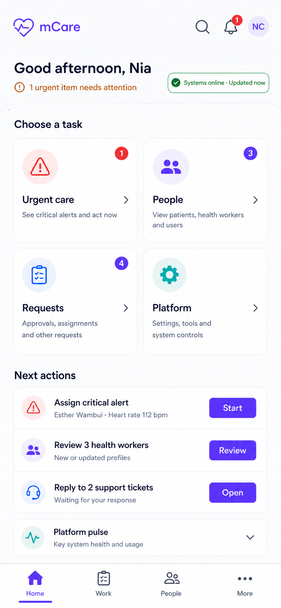
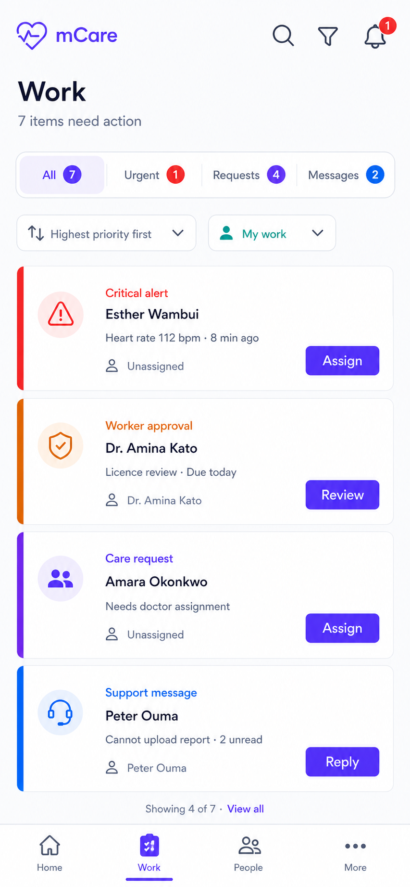
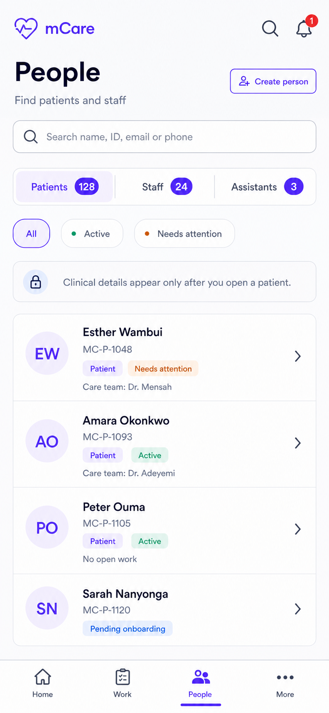
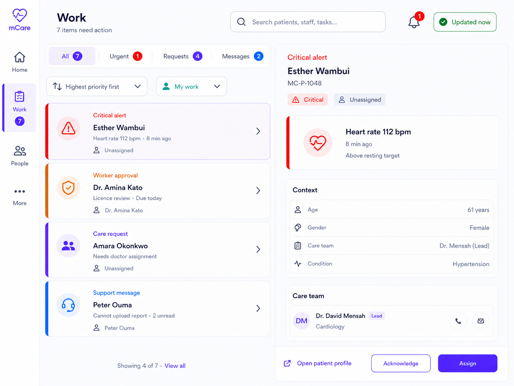
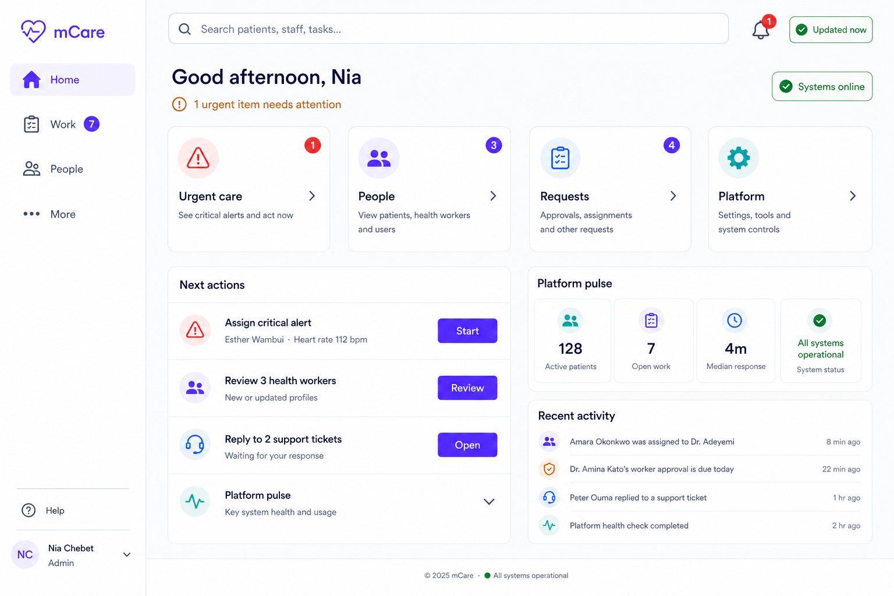

# mCare Guided Operations Hub — Design Blueprint

> **Superseded for stakeholder approval:** The complete all-role blueprint now lives at [`../application/README.md`](../application/README.md) and includes this Admin/Assistant direction together with Patient, Doctor, External Clinical Access, the shared design system, the complete screen atlas, and the application-wide rollout plan. This directory remains design history and detailed supporting evidence.

**Document version:** 2.0-draft  
**Date:** 2026-08-07  
**Decision status:** Selected design direction; implementation is not yet approved  
**Applies to:** Admin and permission-filtered mCare Assistant experiences  
**Implementation rule:** No production UI cutover until the security and regression gates in this package pass.

## Approved direction

The selected direction is the **Guided Operations Hub**, refined into four stable destinations:

1. **Home** — choose a goal, see urgent state, and start the next task.
2. **Work** — one permission-aware queue for alerts, SOS, approvals, care requests, assignments, support, and conversations.
3. **People** — one directory for patients and staff; actions live in the selected person's context.
4. **More** — insights, audit, security, announcements, clinical setup, platform settings, profile, and help.

Global search, the notification bell, the profile menu, and the active-SOS indicator live in the shell instead of becoming more navigation tabs.

This design uses **one Flutter codebase and one backend contract**. Screen size changes presentation only; it must never change authorization, data scope, clinical behavior, or available server-side commands.

## Complete PDF

[Open the visually verified 51-page design blueprint](../../../output/pdf/mcare-guided-operations-design-blueprint.pdf)

The PDF can be rebuilt deterministically with `python docs/design/admin/build_blueprint_pdf.py`. The companion render script performs the page-level verification workflow.

## Documentation map

| Document | Purpose |
|---|---|
| [01_PRODUCT_UX_BLUEPRINT.md](01_PRODUCT_UX_BLUEPRINT.md) | Product goals, information architecture, design principles, jobs and workflows |
| [02_SCREEN_AND_STATE_SPECIFICATIONS.md](02_SCREEN_AND_STATE_SPECIFICATIONS.md) | Exact Home, Work, People, More, detail, and UI-state requirements |
| [03_RESPONSIVE_FLUTTER_ARCHITECTURE.md](03_RESPONSIVE_FLUTTER_ARCHITECTURE.md) | One-codebase adaptive layout, shared components, tokens, and input/accessibility behavior |
| [04_ROUTE_API_PERMISSION_TRACEABILITY.md](04_ROUTE_API_PERMISSION_TRACEABILITY.md) | Existing routes and APIs mapped to the new hubs without breaking deep links |
| [05_SECURITY_PRIVACY_SAFETY.md](05_SECURITY_PRIVACY_SAFETY.md) | Existing controls, production blockers, threat boundaries, privacy and security requirements |
| [06_IMPLEMENTATION_MIGRATION_TEST_PLAN.md](06_IMPLEMENTATION_MIGRATION_TEST_PLAN.md) | Additive rollout, feature flags, exact code seams, tests, telemetry, and rollback |
| [07_APPROVAL_CHECKLIST.md](07_APPROVAL_CHECKLIST.md) | Decisions and release gates that must be signed off before implementation/cutover |
| [IMAGE_MANIFEST.md](IMAGE_MANIFEST.md) | Mockup inventory, intent, limitations, and the final image prompt set |
| [ADMIN_DESIGN_PROPOSAL.md](ADMIN_DESIGN_PROPOSAL.md) | Earlier concept comparison retained as design history |

## Updated mockups

### Mobile Home

### Mobile Work

### Mobile People

### Tablet Work detail

### Desktop/Web Home

Mockups communicate hierarchy and responsive intent. They are not evidence that a metric, system-health signal, permission, or backend action already exists. The specifications in this package are authoritative when a mockup and the code disagree.

## Non-negotiable safeguards

- Laravel remains the authorization authority; hiding a Flutter control is never a security boundary.
- Existing named routes and screens remain available during migration.
- No destructive schema migration is required for the first rollout.
- Admin and Assistant receive independent runtime feature flags and independent rollback.
- The Work queue delegates to existing typed mutations; it must not convert different tasks into a generic Resolve command.
- Permission revocation removes restricted data and closes the affected detail immediately.
- No false “Systems online” claim: show only a real health signal, or show sync freshness such as `Updated 18 seconds ago`.
- Home and directory surfaces expose the minimum necessary patient information.
- Production cutover is blocked until the P0 security items are resolved and tested.

## Source-code evidence used

The blueprint was checked against these current implementation seams:

- `frontend/lib/shared/widgets/role_shell.dart`
- `frontend/lib/shared/widgets/responsive.dart`
- `frontend/lib/shared/navigation/staff_destinations.dart`
- `frontend/lib/shared/dashboard/admin_workspace_catalog.dart`
- `frontend/lib/admin/dashboard/admin_dashboard_view.dart`
- `frontend/lib/core/api/admin_api.dart`
- `frontend/lib/shared/services/admin_session_service.dart`
- `frontend/lib/shared/auth/auth_state.dart`
- `frontend/lib/main.dart`
- `backend/routes/api.php`
- `backend/app/Http/Middleware/EnsureRole.php`
- `backend/app/Http/Middleware/EnsurePermission.php`
- Admin controllers under `backend/app/Http/Controllers/Api/V1/Admin/`

## Change control

Any change to navigation, permissions, clinical action semantics, session storage, external access, audit behavior, or patient-data exposure requires updating this package in the same change set. Implementation PRs should link the relevant requirement identifiers from these documents.
