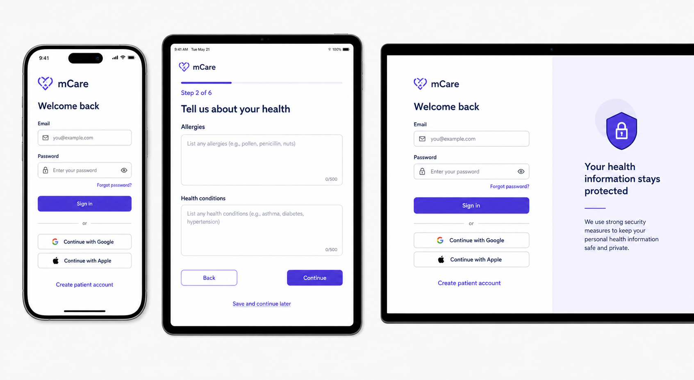

# 03 — Shared Authentication, Onboarding and Account Experience

## 1. Purpose, authority and scope

This chapter defines the public entry experience and the authenticated account experience shared by Patient, Doctor, Administrator and mCare Assistant. It is a presentation and migration specification for the existing Flutter named-route application and Laravel API. It does not authorize removal of a route, change an API payload, or turn a client-side gate into authorization.

The current application has one public patient registration flow, one shared sign-in flow, staff invite/approval gates, patient health onboarding, staff profile completion, forced-password gates, and role-specific account destinations. The target design makes those flows feel like one product while keeping their existing role and backend boundaries.

External clinical access is mentioned in the public route inventory but is fully specified in [08_EXTERNAL_CLINICAL_ACCESS.md](08_EXTERNAL_CLINICAL_ACCESS.md). It is a patient-issued guest capability, not an authenticated account role.

### Status vocabulary used in this chapter

- **Current** — implemented route/API behavior observed in the repository.
- **Target UI** — approved presentation improvement that can reuse the current contract.
- **Hardening gate** — security/backend work required before the target may be enabled in production.
- **Future-only** — not represented by a current route or API and therefore excluded from visual-only implementation.

## 2. Visual direction



**Figure 03-1 — visual intent, not a changed data contract.** Mobile uses a focused single-column sign-in card; tablet demonstrates the same components in patient onboarding; desktop adds a calm privacy panel without adding a second workflow. The mockup's step count is illustrative. The implemented onboarding step sequence remains authoritative until separately approved and contract-tested.

### Visual principles

1. One `AuthShell` and one field/button language across every role.
2. The screen explains the current task in plain language and exposes one primary action.
3. Clinical imagery is quiet and supportive; it never competes with form labels, errors or recovery links.
4. Role accent may colour a completion or forced-password gate, but form structure and behavior stay identical.
5. No patient names, identifiers, email addresses or auth secrets appear in page URLs, analytics, screenshots, decorative panels or generic error logs.
6. Password, approval and verification states are explicit; the application never shows an unexplained blank redirect.

## 3. Current route inventory and target page ownership

### 3.1 Public and pre-login routes

| Named route | Current owner | Current purpose | Target presentation |
|---|---|---|---|
| `/` | `LandingView` | Bootstrap/entry alias | Branded launch state; restore the saved session before offering public actions |
| `/home` | `LandingView` | Public landing page | Concise value statement, `Sign in`, `Create patient account`, and external-access entry/help |
| `/login` | `LoginView` | Shared email/phone/unique-ID sign-in plus Google/Apple | One focused form; role is detected by the server, never chosen by the user |
| `/register` | `RegisterView` | Patient-only self-registration | Patient wording and an explicit notice that staff accounts are administrator-provisioned |
| `/verify-email` | `OtpView` | Six-digit verification | Destination/purpose summary, segmented code entry, retry/resend state |
| `/forgot-password` | `ForgotPasswordView` | Request reset instructions | Enumeration-safe confirmation regardless of whether an account exists |
| `/reset-password` | `ResetPasswordView` | Consume email + reset token and choose password | Token-aware form with expired-link recovery; secret stays out of telemetry |
| `/pending-approval` | `PendingApprovalView` | Hold a pending staff user outside the workspace | Clear status, expected next step, refresh/sign-out; no protected preview |
| `/accept-invite` | `AcceptInviteView` | Consume staff invite token and set password | Invite context, password/confirmation, invalid/expired recovery |
| `/external` | `ExternalDoctorView` | Token/code-scoped access to one patient record | Dedicated guest access gate; no normal account navigation |

The router already parses deep-link query parameters for reset, invite and external access. The redesign keeps the same route names and argument parsing. Sensitive query values must be removed from browser history after exchange as part of the security hardening work.

### 3.2 Authenticated shared account endpoints

| API | Role scope | Existing responsibility |
|---|---|---|
| `GET /auth/me` | Any authenticated role | Current user, health-profile presence, and assistant permission keys when applicable |
| `POST /auth/logout` | Any authenticated role | Revoke current Sanctum access token |
| `PUT /auth/profile` | Any authenticated role | First name, last name, phone; specialty/licence accepted only for Doctor |
| `POST /auth/avatar` | Any authenticated role | Upload JPG/JPEG/PNG/WebP avatar, maximum 4096 KB |
| `DELETE /auth/avatar` | Any authenticated role | Remove current avatar |
| `POST /auth/change-email` | Any authenticated role | Verify current password, change email, create/send six-digit code |
| `POST /auth/verify-otp` | Public verification operation | Verify six-digit code for `email_verify` or `login` purpose |
| `POST /auth/change-password` | Any authenticated role | Verify current password, update password, clear forced-password/lock state, revoke other tokens |
| `GET /me/settings` | Any authenticated role | Read the role user's JSON preference payload |
| `PATCH /me/settings` | Any authenticated role | Merge theme, language, notification and privacy preference fields |

Patient health identity remains owned by `GET /patient/profile`, `PUT /patient/profile/account`, `PUT /patient/profile/health` and `POST /patient/onboarding`; it must not be merged into the generic `/auth/profile` form.

### 3.3 Dedicated post-authentication gates

| Role | Complete profile | Force password | Normal destination |
|---|---|---|---|
| Patient | `/patient/onboarding` (health-profile onboarding) | `/patient/force-password` | `/patient` |
| Doctor | `/doctor/complete-profile` | `/doctor/force-password` | `/doctor` |
| Administrator | `/admin/complete-profile` | `/admin/force-password` | `/admin` |
| mCare Assistant | `/assistant/complete-profile` | `/assistant/force-password` | `/assistant` |

There is deliberately no separate patient `complete-profile` route. The patient completes health data through `/patient/onboarding`. There is deliberately no External Doctor profile/force-password route because the external flow is not an account session.

## 4. End-to-end entry architecture

```text
Application launch
  |
  +-- no saved session / restore fails ----------------------> Public landing
  |                                                            |-- Sign in
  |                                                            |-- Patient register
  |                                                            `-- External access
  |
  `-- saved session -> GET /auth/me
                         |
                         +-- 401/invalid -> clear local state -> Sign in
                         |
                         `-- valid -> apply current role/account state
                                      |
                                      +-- Patient
                                      |    |-- must change password -> patient force-password
                                      |    |-- no confirmed health profile -> onboarding
                                      |    `-- otherwise -> patient home
                                      |
                                      +-- Doctor
                                      |    |-- pending approval -> pending approval
                                      |    |-- incomplete account -> doctor complete-profile
                                      |    |-- must change password -> doctor force-password
                                      |    `-- otherwise -> doctor home
                                      |
                                      +-- Administrator
                                      |    |-- incomplete account -> admin complete-profile
                                      |    |-- must change password -> admin force-password
                                      |    `-- otherwise -> admin home
                                      |
                                      `-- mCare Assistant
                                           |-- incomplete account -> assistant complete-profile
                                           |-- must change password -> assistant force-password
                                           `-- otherwise -> assistant home
```

### Gate ordering rule

The current navigation service checks patient forced password before onboarding, but staff checks profile completion before forced password. The target implementation must define one tested server-authoritative precedence and make the client match it. Recommended safety order is:

1. session valid and current;
2. active/approved/verified account state;
3. forced password or required step-up;
4. required identity/profile completion;
5. role home.

Changing that order is not a visual refactor. It requires backend middleware, migration tests and a rollback plan.

## 5. Responsive authentication shell

### 5.1 Compact: width below 600 px

- Safe-area page with 16–24 px horizontal inset.
- Single column; no decorative side panel.
- Logo, title, one-sentence helper, fields, primary action, alternatives and footer in that order.
- Keyboard inset keeps the active field and submit button visible.
- Patient registration may remain a dismissible bottom sheet from the landing page, but `/register` continues to work as a full deep link.
- Long forms scroll; primary action is never covered by the software keyboard.

### 5.2 Medium: 600–1023 px

- Centered form with a 520–680 px readable width.
- Multi-step onboarding may use a progress header and a sticky Back/Continue action row.
- Two short related fields may share a row only when 200% text still fits; otherwise they stack.
- Supporting privacy text appears below the form, not in a distracting side rail.

### 5.3 Expanded: 1024 px and above

- Split canvas: functional form column and non-interactive trust/privacy panel.
- Form column remains 420–520 px; the page does not stretch controls to the full viewport.
- Decorative panel contains no live account status, PHI or misleading compliance claims.
- At widths above 1440 px, the composition is centered and content width remains bounded.

### 5.4 Shared responsive invariants

- Breakpoints change layout only, never validation, permissions, API calls or navigation outcome.
- Touch targets are at least 48×48 on compact/medium; pointer controls remain at least 40–44 px high.
- All content survives 200% text scale without clipped actions or hidden errors.
- Browser Back returns to the prior safe public page; it must not resurrect a consumed token form or a protected page after logout.

## 6. Screen-by-screen design specifications

### 6.1 Launch and public landing — `/` and `/home`

**Purpose:** resolve bootstrap safely, then let a guest choose the correct entry path.

**Content:** mCare identity, short monitoring/coordination statement, `Sign in`, `Create patient account`, and a subtle `Have a patient access code?` path to `/external`. Terms, privacy and support links are persistent in the footer.

**Interaction:** during session restore, show a branded launch skeleton with no interactive sign-in controls. On restore failure, reveal the landing page. On offline launch with a previously authenticated snapshot, do not expose cached clinical content until the session has been validated or an approved offline-auth policy exists.

**Backend:** bootstrap calls `GET /auth/me` only when a stored session exists. Public landing itself requires no API.

### 6.2 Shared sign in — `/login`

**Purpose:** authenticate every registered account without a role selector.

**Fields and actions:** `Email, phone or mCare ID`, `Password`, reveal-password control, `Sign in`, `Forgot password?`, Google, Apple, and `Create patient account`. A staff notice directs invited clinicians/assistants/admins to sign in with provisioned credentials.

**Current contract:** `POST /auth/login` accepts `identifier` and `password`; identifier may match case-insensitive email, phone or unique ID. The server returns 423 for a locked account and 403 for a suspended account. Google and Apple use `/auth/google` and `/auth/apple`; web Google also has redirect/callback routes.

**Target behavior:**

- Keep the entered identifier after a recoverable error; clear the password.
- Disable every competing auth action while one attempt is pending.
- Map 422 credential failure to the identifier/password group, 423 to an account-lock panel, 403 to a neutral access-status panel, 429 to a retry-later message, and network failure to an inline reconnect/retry state.
- Do not disclose whether an identifier exists beyond the current login contract.
- Do not ask the user to choose Patient, Doctor, Admin or Assistant; route from the server user payload.

### 6.3 Patient registration — `/register`

**Purpose:** create a patient account only.

**Fields:** first name, last name, email, phone, password, and explicit Terms/Privacy acceptance. Google/Apple patient creation remains available when configured.

**Current contract:** `POST /auth/register` validates first/last name to 100 characters, unique valid email to 255, optional phone to 30, password minimum 8, and only accepts role `patient`. The current Flutter form requires phone and performs basic email/password checks. The current backend creates the patient as active and email-verified and returns an auth session immediately.

**Compatibility rule:** the design may add a confirmation field, password guidance and better terms links in the UI because only `password` is submitted. It must not insert a mandatory new verification step or approval state until the backend registration contract is deliberately changed and tested.

**Completion:** successful registration routes to patient onboarding when the health profile is confirmed missing; it must never route to staff approval.

### 6.4 Email/OTP verification — `/verify-email`

**Purpose:** verify a six-digit code for an explicitly stated purpose.

**Content:** masked destination, six accessible one-time-code cells that also support full paste/autofill, expiry guidance, `Verify`, `Resend` with countdown, and `Use another address` only where the workflow safely supports it.

**Current contract:** `POST /auth/verify-otp` accepts `identifier`, exactly six characters in `code`, and optional `purpose` of `email_verify` or `login`; it consumes a valid `EmailVerificationCode` and returns a normal auth payload. The email-change sheet uses this endpoint after `/auth/change-email`.

**Caveat:** there is no public resend endpoint in the current route inventory. Do not render a working resend action unless it is backed by the originating flow or a new approved endpoint; an inactive action must explain how to restart safely.

### 6.5 Forgot password — `/forgot-password`

**Purpose:** start recovery without revealing account existence.

**Field:** email or phone identifier. `Send reset instructions` is the only primary action.

**Current contract:** `POST /auth/forgot-password` always responds with `If an account exists, reset instructions were sent.` When a user exists it stores a hashed random token and attempts email delivery.

**Target states:** submitting replaces the form with a neutral check-your-inbox panel, `Try another identifier`, and `Back to sign in`. SMTP failure must not become an account-enumeration leak; operational delivery monitoring belongs outside the public response.

### 6.6 Reset password — `/reset-password`

**Purpose:** consume the reset deep link and set a new password.

**Inputs:** email and token from allowlisted deep-link parameters/arguments, new password, confirm password. Token is never shown.

**Current contract:** `POST /auth/reset-password` validates email, token and password minimum 8; it clears lockout and `must_change_password`, deletes the reset row, then returns the user to sign in. Invalid token returns 422; missing user returns 404.

**Target behavior:** confirmation is client-side; submit once; on success use a complete state with `Sign in`. On invalid/expired link offer `Request a new link`. Do not silently retry a consumed token.

### 6.7 Accept staff invite — `/accept-invite`

**Purpose:** let an administrator-provisioned Doctor, Admin or Assistant claim an invited account.

**Inputs:** opaque invite token from argument/query, new password, confirm password. If safe invite metadata becomes available, show the invited email and role; do not infer either from the token.

**Current contract:** `POST /auth/accept-invite` accepts token and password minimum 8, marks the invite accepted, sets email verified, clears lock/forced-password, and changes `pending_approval` to `active`, then returns an auth session.

**Target states:** loading invite, valid form, submitting, accepted/routing, invalid or expired, already used, offline. The form does not offer public role changes or patient registration.

### 6.8 Pending approval — `/pending-approval`

**Purpose:** explain that access is not yet authorized while keeping protected modules inaccessible.

**Content:** status icon, `Your account is awaiting approval`, what the administrator reviews, `Check again`, support guidance and `Sign out`. Do not show patient, queue or platform data behind the panel.

**Backend dependency:** the target requires central server account-state middleware. The current login controller explicitly blocks `suspended`, but protected APIs do not yet uniformly enforce every pending/rejected/unverified/forced-password state. The UI alone cannot close that gap.

### 6.9 Patient health onboarding — `/patient/onboarding`

**Purpose:** collect the existing patient health profile before normal patient use.

**Layout:** concise step title, progress with text (`Step n of total`), existing health-profile fields, Back/Continue and final Review/Complete. Autosave or `Save and continue later` may only be shown if backed by a defined persistence contract; otherwise it remains a future interaction.

**Backend:** `POST /patient/onboarding` is canonical completion. Account identity updates and health updates remain separate patient profile calls. The gate redirects only after the API has confirmed a missing health profile; a temporary null during loading must not cause a redirect loop.

**Safety:** allergies and emergency contact fields use explicit `None known`/`No known allergies` semantics rather than interpreting a blank field as a clinical negative.

### 6.10 Staff complete profile — role-specific `*/complete-profile`

**Purpose:** complete identity/contact fields required for staff work.

**Shared fields:** first name, last name and phone. Doctor additionally supports specialty and licence number. Admin and Assistant must not see clinical credential fields that the backend ignores.

**Backend:** `PUT /auth/profile`; server applies specialty/licence only when current role is Doctor. Successful response updates both in-memory and persisted user snapshot, then routes through the remaining gate.

**Design:** same form component for all three staff roles with a thin role configuration. No duplicated Admin/Assistant/Doctor implementations.

### 6.11 Forced password — role-specific `*/force-password`

**Purpose:** prevent normal use of an administrator-issued temporary password.

**Fields:** temporary/current password, new password, confirm password. One `Save and continue` action; no workspace navigation.

**Backend:** `POST /auth/change-password`; success clears `must_change_password`, failed attempts/lock, and revokes all other tokens while retaining the current token. The UI then recomputes the correct role destination.

**Hardening dependency:** protected backend routes must independently reject a must-change session except for the narrowly allowed password/profile operations. A Flutter gate is not sufficient authorization.

### 6.12 Profile and account settings — authenticated roles

**Entry:** role header/avatar opens an account sheet; role-specific Profile and Settings routes remain bookmarkable. The account menu must not duplicate destinations already present in the role's primary navigation.

**Shared account capabilities:**

- view role and identity;
- edit name/phone, plus doctor specialty/licence;
- upload/remove avatar;
- change email and verify the new address;
- voluntarily change password once from the Security section;
- choose theme, language and role-appropriate notification preferences;
- sign out.

**Patient-only account areas:** health profile, emergency contacts, care-team/privacy controls, and patient-managed external access. **Administrator-only platform settings** are not personal settings and remain a separately authorized module. **External guests** receive no account/profile/settings menu.

**Logout behavior:** revoke current token best-effort, unregister push token, clear API token, persisted auth, role stores, PHI state, SOS overlays/ringing and demo session data, then replace the navigation stack with the public entry route.

## 7. Form and validation contract

Client validation provides immediate guidance; Laravel remains authoritative. Server field errors should be mapped to the matching control while the safe response message appears in an error summary.

| Field/action | Client guidance | Current server authority | Error placement |
|---|---|---|---|
| Login identifier | Required; trim surrounding whitespace | Required string; matched against email, phone or unique ID | Identifier/password group; avoid account disclosure |
| Login password | Required | Required string + hash check | Password group; clear value after failure |
| Registration names | Required | String, max 100 each | Under each field |
| Registration email | Basic email form | Valid, max 255, unique | Under email; do not expose another user's details |
| Registration phone | Current Flutter requires plausible length | Backend optional string, max 30 | Under phone; resolve optional/required mismatch before redesign cutover |
| Registration/reset/invite password | Minimum 8; show strength guidance; confirmation matches | Minimum 8 | Under password/confirmation |
| OTP | Six characters; paste/autofill supported | Exactly six; valid, unused, unexpired record | Code group and summary |
| Profile names | Required | Required strings, max 80 | Under fields |
| Profile phone | Required | Required string, max 30 | Under phone |
| Doctor specialty/licence | Optional in generic endpoint | Nullable, 120/80; applied only to Doctor | Under matching doctor field |
| Change email | Valid, different from current | Current password required; unique email max 255 | Password or new-email field |
| Avatar | Preview supported types and size | Image JPG/JPEG/PNG/WebP, max 4096 KB | Upload card with Retry/Choose another |

Every submit action must:

1. validate before network work;
2. prevent double submission;
3. keep the user's non-secret input after recoverable errors;
4. put focus on the first invalid field;
5. expose errors through visible text and screen-reader announcement, not colour/toast alone;
6. navigate only after the authoritative success response is applied.

## 8. Shared state model

| State | Required visual/interaction behavior |
|---|---|
| Bootstrap | Branded skeleton; no flash of protected or public action content |
| Idle | Enabled fields and one clear primary action |
| Validating | Inline errors; focus first error; no network call |
| Submitting | Button progress + disabled competing actions; fields remain readable |
| OAuth handoff | Explain browser/provider transition; handle cancel separately from failure |
| Success | Apply session/user state once, announce success, replace stack with computed destination |
| Validation 422 | Field errors plus concise summary; preserve safe inputs |
| Unauthenticated 401/419 | Clear every session/PHI store and return to sign in with `Your session expired` |
| Forbidden 403 | Explain account/access state without leaking protected content |
| Locked 423 | Show lock guidance and recovery/contact path; do not loop automatic retries |
| Rate limited 429 | Show retry guidance/countdown when `Retry-After` is available |
| Offline/timeout | Inline connection state and explicit Retry; never report invalid credentials |
| Server 5xx | Stable error panel with correlation/support reference if supplied; no stack trace |
| Deep-link expired/used | Replace form with recovery action; never leave a disabled blank form |

Toasts may confirm a completed secondary action, but form failure and security-critical state must remain visible in the page.

## 9. Shared component contract

The target should reuse or evolve these shared components instead of creating role copies:

```text
SharedAuthScaffold
├── AuthBrandHeader
├── AuthTrustPanel                (expanded only; static and PHI-free)
├── AuthFormCard
│   ├── AppTextField / PasswordField
│   ├── FormErrorSummary
│   ├── AppButton
│   ├── SocialSignInRow
│   └── AuthRecoveryLinks
├── OtpCodeField
├── AuthStatusPanel               (approval, lock, success, expiry)
└── LegalAndSupportFooter

AuthenticatedAccount
├── ProfileHeaderCard
├── EditAccountSheet
├── ChangeEmailSheet
├── ChangePasswordSheet
├── AvatarPicker
└── PersonalSettingsBody
```

Role configuration supplies title, accent, allowed fields and destination routes. It never supplies a different validator or bypasses backend authorization.

## 10. Backend compatibility and migration rules

1. Keep Navigator 1 and every current `RouteNames` value during the redesign.
2. Preserve query/argument parsing for reset, invite and external links.
3. Keep `AuthService` as the single routing coordinator until a replacement is contract-tested.
4. Do not combine patient health profile data with generic account profile payloads.
5. Do not add a public staff role picker or staff registration API.
6. Do not claim OTP is required for live password change: the current live endpoint verifies current password directly; OTP in `ChangePasswordSheet` is currently demo-mode behavior.
7. Do not claim new patient email verification is mandatory: current registration marks email verified. A future change needs email-delivery, resend, incomplete-state and migration contracts.
8. Keep legacy screens behind independent role feature flags; new shared shell can be enabled without changing auth payloads.
9. Add contract tests for every successful auth payload: `token`, `user`, `has_health_profile`, and `assistant_permissions` when applicable.
10. Treat server account state and capability data as authoritative on every session restore/refresh.

## 11. Security and privacy hardening gates

The visual redesign must not hide these current production blockers:

- Mock Google/Apple identity paths must be impossible outside local/test builds.
- Central middleware must enforce active, approved, verified and forced-password state on every protected API and realtime authorization.
- Sessions need finite lifetime/rotation and immediate invalidation on suspension, rejection, role/grant/password-reset changes.
- The current web bearer token/local user snapshot in local storage is not the target for production health data. Use an HttpOnly Secure SameSite web session with CSRF where feasible; use Keychain/Keystore-backed secure storage on native.
- Add one global 401/419 handler that clears every role and PHI store. Current API calls can throw without centralized cleanup.
- Password reset, invite and OTP secrets require explicit expiry, hashed-at-rest handling, atomic single use, replay prevention, attempt budgets and session invalidation tests.
- Endpoint-specific throttles must normalize the actual `identifier`; the existing auth limiter mismatch must not create a global/shared bucket.
- Login, reset and invite errors must be enumeration-safe and free of internal exception text.
- Avatar and identity files need safe storage/delivery policy; no public predictable PHI path.
- Terms and Privacy links must resolve to approved, versioned documents before real patient registration.

Production enablement is blocked until the corresponding security plan items are closed or formally risk-accepted with time-bounded compensating controls.

## 12. Accessibility and content requirements

- Labels remain visible; placeholders are examples, never the only label.
- Password reveal announces `Show password`/`Hide password` and does not move focus.
- OTP accepts paste and platform autofill; individual boxes are exposed as one understandable field to assistive technology.
- Error summary receives focus after failed submit and links/focuses the affected field.
- Status is never conveyed by colour or icon alone.
- Progress uses text (`Step 2 of 6`) in addition to a bar.
- Focus order follows visual order; Enter submits only the active valid form; Escape closes a dismissible sheet, not a required gate.
- Reduced-motion preference removes nonessential entrance/transition animation.
- Copy uses `Sign in`, `Create patient account`, `Awaiting approval`, `Set a new password`, and similarly direct language; avoid technical terms such as Sanctum, token or 422 in user-facing text.
- All text and controls meet WCAG 2.2 AA contrast and reflow expectations; target controls meet 44×44 CSS px minimum and the Flutter compact target remains 48×48 where practical.

## 13. Test and approval matrix

### Functional contract tests

- Email, phone and unique-ID sign in route to the correct role.
- Patient registration cannot create another role.
- Google/Apple create/sign-in/cancel/error branches preserve role boundaries.
- Reset and invite deep links parse safely, work once, and handle expired/used tokens.
- Email change keeps the in-progress verification flow stable, then refreshes the persisted user.
- Voluntary and forced password change clear the appropriate flag and route correctly.
- Profile update applies doctor-only fields only for Doctor.
- Logout clears tokens, snapshots, role stores, PHI, push registration and overlays.

### Account-state and security tests

- Pending, rejected, suspended, unverified and must-change users cannot call protected APIs outside their allowed gate.
- Suspension, role/grant change, reset and rejection invalidate active sessions.
- 401/419 from JSON, multipart and byte-stream calls produces the same safe sign-out.
- Mock OAuth fails closed in a production configuration.
- Rate-limit, lockout, OTP replay and token replay tests pass.
- No password, token, OTP, identifier or patient data enters logs, analytics or URL history after exchange.

### Responsive and accessibility tests

- Golden/widget coverage at 360×800, 390×844, 599×900, 600×960, 800×1024, 1024×768, 1440×900 and 1920×1080.
- Repeat login, registration, OTP, onboarding and forced-password at 200% text, dark mode and reduced motion.
- Keyboard-only path completes every web form; focus remains visible; browser Back is safe.
- Screen-reader labels, error announcements and OTP semantics are verified.
- Software keyboard never covers the active field or sole primary action.

## 14. Acceptance criteria

- [ ] Every public/shared named route above remains wired and directly testable.
- [ ] One shared responsive auth shell serves all roles without duplicated business logic.
- [ ] Patient-only registration is unmistakable; staff provision/invite is unmistakable.
- [ ] Successful auth uses server role/account state to choose exactly one safe destination.
- [ ] Patient onboarding, staff profile completion and forced-password gates cannot be bypassed by client navigation or direct API calls.
- [ ] All forms define idle, validation, submitting, success, 401/403/422/423/429, offline and 5xx states.
- [ ] Validation is consistent with the current Laravel contract; any intentional contract change is separately approved.
- [ ] Account profile, avatar, email, password, settings and logout work for every authenticated role that currently supports them.
- [ ] The external guest route is visibly separate from account sign in and follows Chapter 08.
- [ ] No sensitive value is exposed in analytics, logs, screenshots, clipboard defaults or browser history after exchange.
- [ ] Security hardening gates and negative authorization tests are green before production rollout.
- [ ] Compact, medium and expanded layouts pass 200% text, keyboard and screen-reader review.

