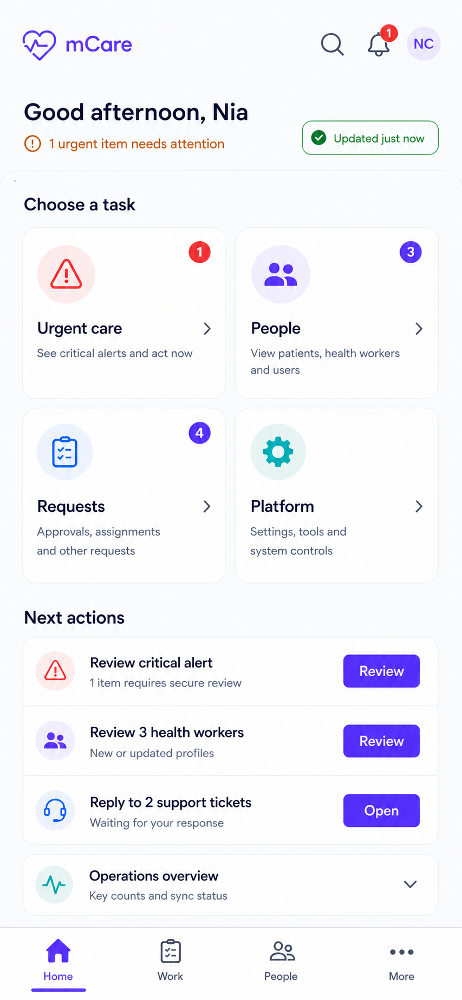
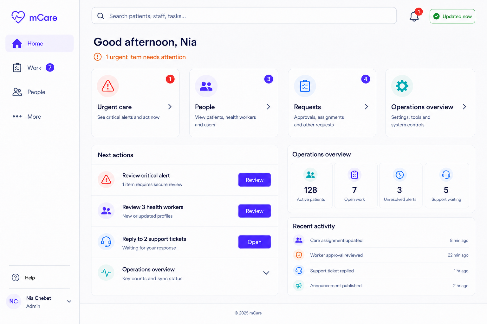

# 04 — Administrator Portal

## 4.1 Role, scope and approval status

The Administrator portal is the first implementation target for the unified mCare design. An administrator is a privileged human operator responsible for operational work, people, delegated access, safety oversight, audit, and the currently implemented platform configuration. The redesign changes presentation and navigation only until a separately approved backend change is required.

This chapter is a **pre-implementation design contract**. It distinguishes three states throughout:

| Label | Meaning |
|---|---|
| **Current** | A route, endpoint, permission or workflow verified in the repository. It must keep working. |
| **Proposed** | An additive UI structure or contract intended for the redesign. It does not exist until implemented and tested. |
| **Future** | A requested product area with no verified current admin route/API/domain model. It is not to be simulated, exposed, or described as functional. |

Design objectives:

- reduce the current module-heavy navigation to four understandable destinations;
- show the highest-priority authorized work without duplicating it across the dashboard;
- keep all 24 current Administrator routes addressable and bookmark-compatible;
- use the same Flutter components and command layer as the mCare Assistant, with role and capability configuration injected;
- preserve Laravel authorization, validation, state transitions, audit behavior, notifications and data ownership;
- reveal the minimum necessary personal or clinical information before a deliberate detail open;
- adapt one implementation across mobile, tablet, web and desktop;
- retain the legacy experience behind an independent rollback flag until compatibility is proven.

## 4.2 Approved visual direction

The visual language is calm, clinical and task-oriented: neutral surfaces, strong ink typography, restrained violet role accent, and red/amber only for genuine status. Cards are not ornamental navigation duplicates; each card starts a real workflow. Severity always uses icon, label and colour.

### Home — compact



### Home — expanded



### Work — compact and medium


### People — compact


These images establish composition, density and hierarchy. The written component, state, privacy and responsive rules in this chapter are authoritative where generated imagery differs from the verified application contract.

## 4.3 Target information architecture

```text
Administrator
├── Home
│   ├── urgency and freshness
│   ├── goal cards
│   ├── recommended next actions
│   └── collapsed platform pulse
├── Work
│   ├── Urgent: SOS and clinical alerts
│   ├── Requests: approvals, care requests and assignments
│   ├── Messages: support and conversations
│   └── Security work, when presented as an operational task
├── People
│   ├── Patients
│   ├── Staff: doctors, assistants and administrators
│   ├── person detail
│   └── Assistant Access, administrator-only
└── More
    ├── Insights: analytics, audit/export and security incidents
    ├── Communication: announcements
    ├── Clinical setup: vital catalog
    ├── Platform: system settings
    └── Account: profile, preferences, security, help and sign out

Global: search · notification bell · profile menu · data freshness
Gates: complete profile · force password
```

Proposed canonical section routes are `/admin` (Home), `/admin/work`, `/admin/people`, and `/admin/more`. Only `/admin` exists today. The other three are additive; no existing route is renamed or deleted.

### Navigation behavior by width

| Available content width | Navigation | Page composition | Detail behavior |
|---|---|---|---|
| `<600` compact | Four-item bottom bar | One column; 2×2 goal cards | Full-screen named route or full-height accessible sheet |
| `600–1023` medium | 72–88 px compact rail | One/two columns from local constraints | Split view only when post-rail width is about 900 px or more |
| `1024–1439` expanded | 220–240 px labelled rail | Constrained two-column workspace | Persistent list/detail pane |
| `≥1440` wide | Same labelled rail | Maximum 1280–1360 px content; optional third pulse region | Master/detail with stable selection |

The shell always exposes search, notifications, profile and freshness. A current child route highlights its new parent section through a typed route registry; exact string equality is not sufficient.

## 4.4 Complete current route inventory — 24 of 24

All routes below remain valid with the redesign flag off and on. “Parent” is the proposed selected destination, not a replacement route.

| # | Current constant and path | Parent | Screen/template | Current backend or state contract | Access and preservation rule |
|---:|---|---|---|---|---|
| 1 | `adminDashboard` — `/admin` | Home | Guided Home | `GET /admin/session`; permitted KPI data | Administrator; flag chooses legacy or Guided Home |
| 2 | `adminSos` — `/admin/sos` | Work → Urgent/SOS | Work detail: emergency | `GET/PATCH /admin/sos-events/*` | Administrator; preserve `SosNavigation` string/map arguments; correct frontend guard to admin-only |
| 3 | `adminPatients` — `/admin/patients` | People → Patients | Directory/list | session/user data plus `GET /admin/patients/{patient}` | Administrator; current patient clinical view is read-only |
| 4 | `adminUsers` — `/admin/users` | People → Staff | Directory/list/create | `GET/POST /admin/users` | Administrator; retain filters and create flow |
| 5 | `adminUserDetail` — `/admin/users/detail` | People → selected person | Person detail | user list/detail state and `/admin/users/{user}/*` commands | Preserve string ID argument and allowlisted query-ID behavior |
| 6 | `adminApprovals` — `/admin/approvals` | Work → Requests/Approvals | Work list/detail | `/admin/approvals/*` | Preserve approve, reject, request-information and credential operations |
| 7 | `adminCareRequests` — `/admin/care-requests` | Work → Requests/Care | Work list/detail | `/admin/care-requests/*` | Preserve route and cancel commands |
| 8 | `adminAssignments` — `/admin/assignments` | Work → Requests/Assignments | Work list/detail | `/admin/assignments/*` | Preserve create/remove and role/object validation |
| 9 | `adminVitalCatalog` — `/admin/vital-catalog` | More → Clinical setup | Governed settings list/detail | `/admin/vital-catalog/*` | Preserve CRUD; redesign adds safety controls without inventing new rights |
| 10 | `adminPermissions` — `/admin/permissions` | People → Staff/Assistant/Access | Access editor | `GET/PATCH /admin/permissions/*` | Administrator-only on server; never reachable by Assistant |
| 11 | `adminSupport` — `/admin/support` | Work → Messages/Support | Work list/detail | `/admin/support-tickets/*` | Preserve reply, assign, resolve, close and reopen |
| 12 | `adminAudit` — `/admin/audit` | More → Insights/Audit | Searchable audit table | `GET /admin/audit`, `/admin/audit/export` | Preserve filters/export; export itself must be audited |
| 13 | `adminAnalytics` — `/admin/analytics` | More → Insights/Analytics | KPI/chart dashboard | `/admin/analytics/kpis`, `/admin/analytics/timeseries` | Never use hard-coded KPI fallbacks |
| 14 | `adminSystem` — `/admin/system` | More → Platform | Settings catalog/detail | `GET/PATCH /admin/system/settings/*` | Administrator-only server route; step-up for sensitive changes |
| 15 | `adminMessages` — `/admin/messages` | Work → Messages/Conversations | Conversation list | `/admin/conversations*` | Preserve list/create and unread behavior |
| 16 | `adminChatThread` — `/admin/messages/thread` | Work → selected conversation | Conversation detail | `/admin/conversations/{id}/messages`, `/read` | Preserve thread ID argument and back-stack position |
| 17 | `adminNotifications` — `/admin/notifications` | Header bell | Notification centre | `/admin/notifications*`; `/me/notification-states*` where applicable | Not a fifth tab; resolving a notification does not resolve its underlying clinical task |
| 18 | `adminProfile` — `/admin/profile` | More/avatar → Account | Profile | `/auth/me`, `PUT /auth/profile`, avatar routes | Preserve role identity and profile editing |
| 19 | `adminSettings` — `/admin/settings` | More → Account | Personal preferences | `GET/PATCH /me/settings`; `POST /auth/change-password` | Personal settings remain distinct from platform configuration |
| 20 | `adminCompleteProfile` — `/admin/complete-profile` | Gate | Required profile flow | `PUT /auth/profile` and current gate state | Outside shell; cannot be bypassed by direct hub navigation |
| 21 | `adminForcePassword` — `/admin/force-password` | Gate | Required security flow | `POST /auth/change-password` | Outside shell; temporary session may access only the required flow |
| 22 | `adminAnnouncements` — `/admin/announcements` | More → Communication | Content list/editor | `/admin/announcements/*` | Preserve create/update/publish/delete and audit behavior |
| 23 | `adminSecurity` — `/admin/security` | More → Insights/Security | Incident list/detail | `/admin/security-incidents/*` | Resolve the canonical incident only; reason and audit required |
| 24 | `adminAlerts` — `/admin/alerts` | Work → Urgent/Alerts | Work list/detail | `/admin/alerts/*` | Preserve acknowledge versus resolve as separate typed commands |

### Route registry acceptance

- Every current route maps to exactly one parent, header-only destination, or gate.
- `/admin/sos`, user detail and conversation thread retain their current argument parsers.
- Unknown role, route argument, work type or return path fails closed to a safe role home.
- A new administrator route causes a test failure until it is registered.
- Authentication and server authorization happen before pending-route restoration.
- The legacy named-route cases stay wired for at least one complete mobile release after 100% rollout.

## 4.5 Screen-family design contract

The following families cover every current Administrator page. A route table above identifies the family used by each page. This avoids separate mobile/web implementations and duplicated specifications while still defining every required state and behavior.

### A. Guided Home

| Contract area | Specification |
|---|---|
| **Purpose** | Orient the administrator and start the next authorized task in five seconds or less; it is not an exhaustive analytics page. |
| **Hierarchy** | Greeting/role → freshness → urgency statement → four goal cards → up to three compact/four expanded next actions → collapsed platform pulse. |
| **Permission** | Administrator role and valid account/session state. Each metric/action is independently derived from authorized server data. |
| **Primary actions** | Open Urgent care, People, Requests or Platform; open one recommended item. Sensitive/clinical completion never occurs directly on Home. |
| **Validation** | Unauthorized data is absent, not represented by zero. Unknown metrics read `Not available`. `Systems online` appears only with a defined health endpoint; otherwise show sync freshness. |
| **Components** | `AdaptiveStaffHeader`, `SyncStatusChip`, `GoalCard`, `WorkItemTile`, `StaffSurfaceCard`, notification bell and profile menu. |
| **State/backend** | One atomically applied authorized snapshot from `GET /admin/session`; optional additive redacted `work_summary`; avoid a second KPI fetch and legacy hard-coded fallbacks. |
| **Responsive** | Compact 2×2 goal cards and one column; medium reflows locally; expanded four cards and side pulse; text may wrap at 200% without hiding actions. |
| **Safety/privacy** | Maximum 3–5 minimum-necessary previews; no generic activity feed containing readings, diagnoses, messages, coordinates or credential details. |
| **Accessibility** | Logical heading order; count semantics such as `1 urgent work item`; 48×48 touch targets; visible focus; severity announced with text. |
| **Acceptance** | One event appears once; highest authorized priority is first; loading/offline/partial/401/403 are distinguishable; no fabricated reassurance or values. |

Goal-card contract:

| Card | Opens | Badge rule |
|---|---|---|
| Urgent care | Work filtered to authorized canonical SOS and urgent alerts | Canonical event count only; notification duplicates are excluded |
| People | People at the previous/default segment | Authorized attention count, never an unrestricted population total |
| Requests | Work filtered to approvals/care/assignments | Authorized pending/due count |
| Platform | More | Badge only for a defined actionable platform state |

### B. Work queue and adaptive detail

| Contract area | Specification |
|---|---|
| **Purpose** | Provide one ranked operational home for SOS, alerts, approvals, care requests, assignments, support, conversations and eligible security work. |
| **Hierarchy** | Title/freshness → search/ownership/sort → primary filters `All`, `Urgent`, `Requests`, `Messages` → virtualized rows → selected detail. |
| **Permission** | Administrator role plus object/state policy. The server supplies or verifies `allowed_actions`; a visible control is never authorization. |
| **Primary actions** | Open, assign/respond, acknowledge, route, review or reply according to exact type. Only one clear row action; secondary/destructive actions live in detail. |
| **Validation** | Typed form rules; required reasons/notes retained; disable repeated submit; reject stale state with refresh guidance; unknown type is read-only and links to its safe legacy page. |
| **Components** | Filter chips, sort/ownership menu, severity rail, typed work tile, virtualized list, `AdaptiveDetailHost`, status timeline, sticky action footer, confirmation/re-auth dialog. |
| **State/backend** | `StaffWorkItem` presentation adapters compose existing authorized sources first; commands call existing state/API methods and canonical endpoints, never a generic resolve method. |
| **Responsive** | Compact list then full-height detail; medium conditional split; expanded persistent 40/60 list/detail; Back/Escape closes detail before leaving Work. |
| **Safety/privacy** | Row shows only type, subject if needed, short reason, age/due, owner and one action. No unnecessary vitals, diagnosis, location, credential or ticket body. |
| **Accessibility** | Row announces type, severity, subject, due/age, owner and action as one group; keyboard arrows do not replace Tab; no swipe-only action. |
| **Acceptance** | Deterministic ranking/deduplication; correct endpoint for every command; 409/403/401/network states recover safely; list position persists; SOS is never resolved through notification state. |

Typed work commands:

| Type | Detail information | Commands and validation | Canonical backend |
|---|---|---|---|
| SOS | Status, timestamps, minimum subject/context; location only after explicit open | Respond/resolve; require current authorization, confirmation and reason/status; no optimistic completion | `GET/PATCH /admin/sos-events/*` |
| Alert | Severity, vital context, acknowledgement/resolution history | Acknowledge; resolve with action/note; reject invalid repeated transition | `GET/PATCH /admin/alerts/*` |
| Approval | Applicant identity/status and credential only when opened | Approve, reject, request information, upload/view credential; validate role, file and reason | `/admin/approvals/*` |
| Care request | Request context and candidate provider | Route or cancel; validate selected provider, request state and conflict | `/admin/care-requests/*` |
| Assignment | Patient, clinician and active assignment context | Create/remove; validate actor-target roles and duplicate/current state | `/admin/assignments/*` |
| Support | Ticket summary, assignee, status and thread | Reply, assign, resolve, close, reopen; validate nonblank bounded reply and legal transition | `/admin/support-tickets/*` |
| Conversation | Participants, thread and unread state | Create/open, send, mark read; validate membership, recipient and bounded message | `/admin/conversations/*` |
| Security | Incident facts and audit history without unnecessary PHI | Resolve exact incident with required reason and step-up where risk requires it | `/admin/security-incidents/*` |

Ranking order is active authorized SOS, unacknowledged critical alerts, overdue clinical/safety work, due-today requests, SLA-bound support/messages, then routine oldest-first. Server priority, due time, creation time and stable ID are deterministic tie-breakers.

### C. People directory and person detail

| Contract area | Specification |
|---|---|
| **Purpose** | Combine Patients and Staff into one searchable directory while keeping clinical and privileged operations contextual. |
| **Hierarchy** | Search → Patients/Staff segment → role/status filters → paginated directory → selected person → authorized sections/actions. |
| **Permission** | Administrator role. Object and action policies still apply. Assistant Access is administrator-only. |
| **Primary actions** | Open person; create user; update eligible status; unlock; resend invite; start password reset; change eligible role; edit Assistant grants. Patient clinical view remains read-only. |
| **Validation** | Debounced name/ID/email/phone search; normalized input; valid email/phone/role; server uniqueness; target hierarchy; block self/last-active-admin hazards; confirmation/reason/step-up by action tier. |
| **Components** | Search field, segment control, filter chips/drawer, virtualized rows/table, avatar/initials, state chip, detail tabs, form fields, permission checklist, impact summary and confirmation dialog. |
| **State/backend** | `GET/POST /admin/users`; `GET /admin/patients/{patient}`; `/admin/users/{user}/*`; `/admin/permissions/*`; paginate/search server-side before production volumes. |
| **Responsive** | Compact list→detail route; medium list/detail when width permits; expanded sortable table or master/detail. Filters collapse into an accessible sheet, never vanish. |
| **Safety/privacy** | Generic row contains identity, unique ID, role/status and one permitted operational fact—no diagnosis, reading, medication, address, location, credential or message text. Search text is excluded from URL/telemetry/logs. |
| **Accessibility** | Results count announced; table has labelled columns; rows are keyboard-openable; validation is associated with fields; focus moves to first error and returns after dialog. |
| **Acceptance** | Empty versus forbidden versus failed states differ; direct IDs are scoped; no cross-target mutation; protected actions are audited; back returns to query/filter/scroll state. |

Person-detail sections:

| Person type | Sections | Current boundaries |
|---|---|---|
| Patient | Overview, permitted clinical summary, vitals, medications, documents, care team, authorized audit link | Admin patient endpoint is read-only; no diagnosis/prescription/document mutation is invented |
| Doctor/Staff | Account, approval, invite/security state, role, operational activity as permitted | Existing user status/reset/unlock/invite/role commands only |
| mCare Assistant | Staff sections plus Access | 12-grant editor is server admin-only; display effective changes and audit receipt |
| Administrator | Staff sections | Protect self, peer, last-active-admin and privileged-role operations with target policy and step-up |

### D. More — insights, content, clinical setup and platform

| Contract area | Specification |
|---|---|
| **Purpose** | House infrequent, analytical or configuration work without crowding daily navigation. |
| **Hierarchy** | Grouped tiles: Insights → Communication → Clinical setup → Platform → Account. Opened tools use list/detail or form layouts and preserve the More parent selection. |
| **Permission** | Administrator; each child remains server-checked. System and Assistant Access endpoints require administrator explicitly. |
| **Primary actions** | Inspect/filter/export analytics/audit, resolve a security incident, manage announcements, govern vital catalog, update current system settings, open account/help. |
| **Validation** | Date/range/filter limits; safe CSV export; bounded announcement fields/schedule; catalog numeric invariants and version conflict; typed system-setting schema; reason and confirmation. |
| **Components** | Grouped settings list, metric/chart cards, data table, filter bar, empty/error panels, editor form, change-impact panel, audit receipt, step-up dialog. |
| **State/backend** | Analytics, audit, incidents, announcements, vital-catalog and system endpoint families listed in the route inventory. No undocumented generic configuration endpoint. |
| **Responsive** | Compact grouped list and drill-down; medium two-column tiles/forms; expanded grouped catalog with right detail. Wide charts remain max-width and tables scroll within their region. |
| **Safety/privacy** | Audit/export and sensitive settings require least-privilege data, no-store delivery, formula-safe CSV, audit, recent auth/MFA where specified, and no secrets rendered after save. |
| **Accessibility** | Charts have textual summaries/tables; headings identify groups; status never depends on colour; form help/errors are programmatically linked; reduced motion respected. |
| **Acceptance** | Every current More child remains reachable; no empty unauthorized group; updates preserve existing API shape; failed writes retain input; privileged changes provide clear impact and receipt. |

Page-specific design deltas:

| Page | Required content and controls | Special acceptance rule |
|---|---|---|
| Analytics | Date range, real KPI cards, trend chart plus accessible data summary, freshness/export only if supported | Missing metric is omitted/`Not available`, never `0` or a fabricated trend |
| Audit | Actor/action/object/date filters, paginated event table, safe export | Export is permission checked, formula neutralized and audited |
| Security | Severity/status filters, incident detail/history, typed resolution form | Never map to alert/notification generic resolution |
| Announcements | Status list, editor, audience/timing if existing contract supports it, preview, publish/delete confirmation | Do not invent unsupported scheduling/audiences; preserve current payload exactly |
| Vital catalog | Catalog rows, threshold/detail editor, change impact/version/reason | Clinical invariants, step-up and governance are P0 before broad production editing |
| System | Typed current setting rows and safe editor | Administrator-only; never expose secret values; unknown setting is read-only |

### E. Messaging, notifications and account/gates

| Contract area | Specification |
|---|---|
| **Purpose** | Support communication, passive awareness and secure self-service without creating more primary tabs. |
| **Hierarchy** | Messages/support live in Work; bell opens Notifications; avatar/More opens Profile and Settings; complete-profile/force-password stay blocking gates. |
| **Permission** | Administrator and object membership for threads; personal notification/profile/settings ownership; account-state middleware for gates. |
| **Primary actions** | Send/reply/mark read; open canonical linked task; update profile/avatar/preferences/password; sign out. |
| **Validation** | Bounded nonblank messages; valid recipient/membership; safe upload types where present; current-password/new-password rules; normalized profile fields. |
| **Components** | Thread list/detail, composer, unread chip, notification list, profile form, avatar control, preference switches, password sheet, gate scaffold. |
| **State/backend** | `/admin/conversations*`, `/admin/support-tickets*`, `/admin/notifications*`, `/me/notification-states*`, `/auth/me`, `/auth/profile`, `/auth/avatar`, `/auth/change-password`, `/me/settings`. |
| **Responsive** | Compact routes between list/thread; expanded split conversation; notification drawer may supplement but never replace named page; forms remain single-column at readable width. |
| **Safety/privacy** | Generic push/lock-screen copy; no PHI in URL, telemetry or crash logs; 401 clears all staff/PHI stores; notification state cannot complete canonical clinical work. |
| **Accessibility** | New-message and status announcements are controlled; message order/author/time readable; switches include state/name; password rules are text; gate focus cannot escape into hidden shell. |
| **Acceptance** | Thread IDs are scoped; failed send retains draft; logout/session expiry purges state; gates cannot be bypassed; every linked task re-checks authorization. |

## 4.6 Required Administrator workflows

### Urgent alert

```text
Home preview or Work/Urgent
→ open canonical Alert detail
→ acknowledge
→ review authorized context
→ resolve with action and note
→ server confirmation and audit receipt
→ next ranked item
```

The UI does not equate acknowledgement, notification read state and clinical resolution.

### SOS response

```text
Authorized active-SOS indicator
→ Work/Urgent/SOS
→ fetch canonical event
→ deliberate open of contact/location context
→ respond or resolve with confirmation
→ audited canonical SOS update
```

Location and emergency notes are absent from push, summary telemetry and generic notification surfaces.

### Health-worker approval

```text
Work/Requests/Approvals
→ applicant detail
→ deliberate credential stream
→ approve | reject | request information
→ reason/confirmation as required
→ result, audit receipt and next item
```

### Care routing and assignment

```text
Work/Requests
→ care request and current state
→ select eligible clinician
→ route request
→ create/verify assignment if applicable
→ confirmation and refreshed state
```

Conflict or stale state returns to current server truth rather than overwriting it.

### User and delegated-access management

```text
People/Staff
→ person detail
→ choose one authorized action
→ validate target hierarchy
→ recent authentication/MFA for privileged change
→ explicit impact + reason + confirmation
→ server update and audit receipt
```

### Platform/clinical configuration

```text
More/Platform or Clinical setup
→ setting detail and current version
→ change impact
→ step-up + reason
→ typed validated mutation
→ verify saved value and audit receipt
```

## 4.7 Backend compatibility and data contract

All current admin operations remain under `/api/v1/admin`, protected by `auth:sanctum`, `throttle:api-general`, and `role:admin,mcare_assistant`; administrators explicitly bypass assistant permission middleware. The redesign must not rely on that bypass to skip object policies, account-state checks, target hierarchy or clinical invariants.

Proposed additions to `GET /admin/session` are versioned and additive:

```json
{
  "capabilities": ["alerts.view", "alerts.acknowledge"],
  "capability_version": 42,
  "session_expires_at": "2026-08-07T16:30:00Z",
  "ui_flags": { "guided_operations_hub": false },
  "work_summary": { "counts": {}, "items": [] }
}
```

Contract rules:

- keep current fields for older clients through the compatibility window;
- return only the signed-in role's resolved flag;
- unauthorized fields are absent/null, not misleading zeroes;
- summary items are redacted, bounded and carry `type`, `state_version`, `allowed_actions` and an opaque canonical ID;
- fetch sensitive detail only after a deliberate authorized open;
- fetch into a temporary snapshot and atomically apply success; retain a visibly stale last-known snapshot on recoverable failure;
- 401/419 purges all role/PHI state; 403 removes the affected capability data and returns to a safe section; 409 refreshes current detail;
- UI widgets call shared state/controller commands, not HTTP directly.

## 4.8 Requested modules not present in the current Administrator contract

The following terms were requested for the complete product vision but are not verified current Administrator modules. They are explicitly **Future**, not hidden current screens. Approval of this visual blueprint does not authorize their backend implementation.

| Requested area | Verified current relationship | Design treatment before a future discovery/API phase |
|---|---|---|
| Laboratory management | No admin route/API/domain workflow verified | Future clinical operations module; define orders, results, lab roles, lifecycle and safety policy first |
| Pharmacy management | Medication features exist for patient/doctor/external workflows, but no admin pharmacy inventory/dispensing module | Future; do not relabel vital catalog or prescriptions as pharmacy management |
| Billing and payments | No verified billing/payment admin route or ledger contract | Future financial domain requiring ledger, reconciliation, refund, audit and compliance design |
| Insurance management | No verified payer, eligibility or claims contract | Future; needs data model, integrations, consent and access policy |
| Backup and recovery UI | Deployment backups are an operational P0, but no in-app admin backup route/API exists | Keep as secured infrastructure runbook until a governed operations service is designed |
| Integration settings | OAuth/FCM/mail/storage are environment configuration, not a verified runtime admin module | Future; never expose secrets through a generic settings screen |
| API configuration | No tenant-facing API key/client-management contract exists | Future; requires scoped credentials, rotation, secret-once display and audit |
| AI / “mCare Assistant” management | Current mCare Assistant is a delegated **human staff role**, not an AI service | Future AI capability must be named separately and pass clinical validation, human oversight, privacy and model governance |
| External Doctor management | Current outside clinician is a patient-issued token guest, not a registered admin-managed role | Future only if product changes identity/access model; current design belongs to the external portal and patient link management |
| File management | Medical/credential files are contextual resources, not a global admin file browser | Do not create a global PHI explorer; future records governance needs strict purpose and scope |
| Appointment administration | Patient/doctor appointment workflows exist; no current Administrator route is verified | Future operational calendar only after backend ownership and commands are defined |
| Medical-record authoring | Current Administrator patient clinical access is read-only | Do not add clinical editing rights through UI redesign |

## 4.9 Safe Administrator implementation sequence

1. **Baseline:** freeze route/API fixtures, current screenshots, tests and known failures; resolve dirty-worktree overlap.
2. **Security gate:** close or formally time-bound the documented P0s—mock OAuth, account-state/session revocation, assistant PHI exposure, SOS recipients, target hierarchy, threshold governance, browser/native session storage, external secrets, private files, IDOR, recovery secrets, rate limits and typed commands.
3. **Typed IA:** add `/admin/work`, `/admin/people`, `/admin/more`, exhaustive `StaffHubRouteRegistry`, parent selection and independent `guided_admin_hub_enabled=false`.
4. **Shared shell/components:** opt-in header, four destinations, accessible surface/goal/work components and adaptive detail host; leave patient/doctor/external shells untouched.
5. **Guided Home:** use one authorized snapshot and link recommended items to legacy detail/action flows.
6. **Read-only Work:** normalize/redact/rank/deduplicate existing sources; open legacy screens without changing mutations.
7. **Typed actions:** migrate support, approvals, care/assignments, alert acknowledge, alert resolve, SOS last, then conversations—one parity-tested command family at a time.
8. **People:** add shared directory/detail; then privileged actions and Assistant Access after policy, step-up and IDOR tests.
9. **More/account:** regroup existing screens and add required safety UX without changing endpoint meaning.
10. **Controlled rollout:** internal admin → all admins; monitor non-PHI errors, 401/403/409 and route fallbacks. Retain legacy for rollback through at least one complete mobile release.

Immediate rollback is the server-side administrator flag set to false. Because existing routes, endpoints, state and database fields are retained, rollback requires no destructive migration or app-store release.

## 4.10 Administrator approval and test gates

The Administrator design is approved for implementation only when stakeholders accept:

- the four-section IA and representative visuals;
- the mapping of all 24 current routes;
- the boundary between current and future modules;
- minimum-necessary Home, Work and People summaries;
- typed command consequences and ranking order;
- the security P0 closure/exception process;
- one shared Admin/Assistant component architecture;
- independent role flags and legacy rollback.

Implementation acceptance requires:

- route tests flag-off and flag-on for all 24 routes and deep-link arguments;
- admin, wrong-role and unauthenticated API contract tests plus cross-target IDOR cases;
- command success, validation, network, double-submit, idempotency, 403, 409 and audit tests;
- widget/golden coverage at 360, 390, 599, 600, 800, 1024, 1440 and 1920 logical widths;
- light/dark, 200% text, reduced motion, keyboard-only and screen-reader semantics checks;
- no PHI in URL, push, telemetry, crash logs, generic activity, browser/service-worker cache or filenames;
- no list overflow, eager full-directory render, duplicate KPI/session request or full-shell rebuild on row state change;
- production-like migration and rollback rehearsal with the legacy implementation still available.

