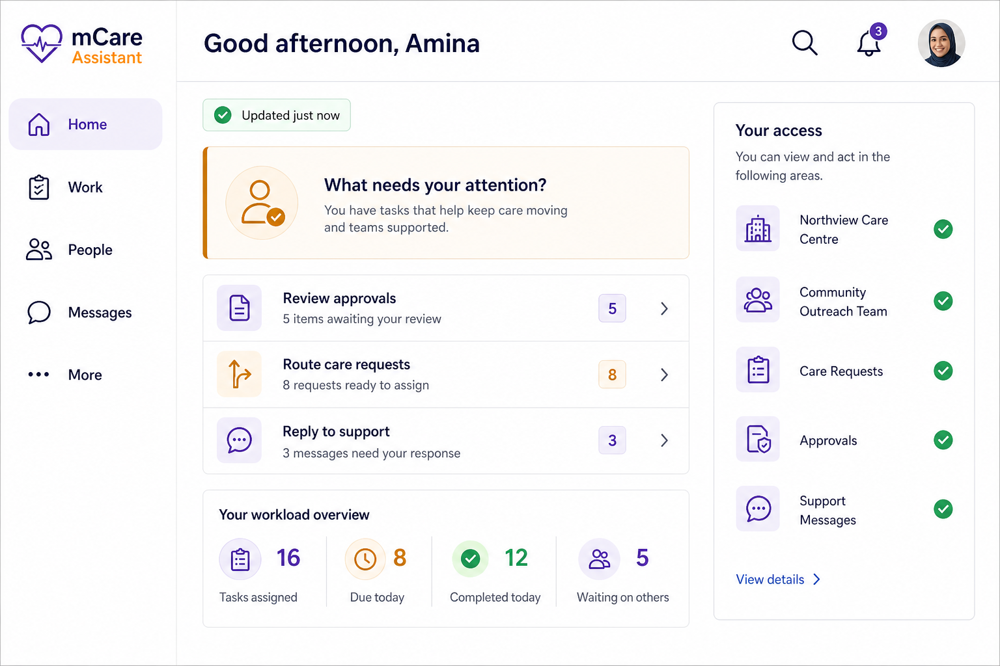
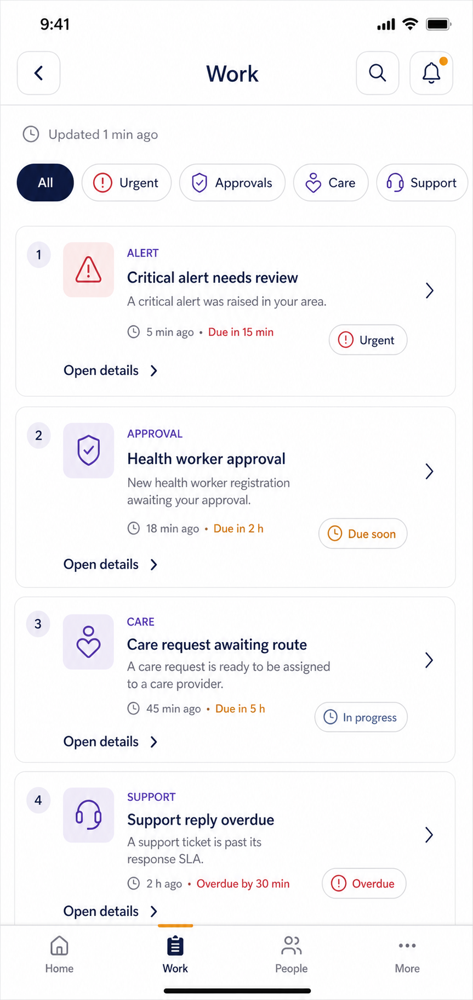

# 05 — mCare Assistant Portal

## 5.1 Identity and product boundary

An **mCare Assistant is a delegated human staff member**. It is not an artificial-intelligence chatbot, clinical model, voice assistant or automated decision-maker. The current code identifies the role as `mcare_assistant`, stores 12 administrator-assigned grants, and serves authorized work through the shared `/api/v1/admin/*` backend namespace.

To prevent unsafe ambiguity:

- UI copy uses **mCare Assistant** for the human role;
- any future artificial-intelligence feature must use a distinct product name such as **AI Copilot**, remain outside this role's permission model, and receive separate clinical, privacy, safety and model-governance approval;
- this portal never suggests that an Assistant can diagnose, prescribe or make autonomous clinical decisions;
- absence of a navigation item is a usability treatment only—Laravel remains the authorization authority.

This chapter is a pre-implementation design contract. **Current** means verified route/API/grant behavior; **Proposed** means additive UI design; **Future** means no verified present contract and therefore no functional claim.

## 5.2 Experience objective

The Assistant portal uses the same Guided Operations Hub as the Administrator but renders only the union of current server-authorized capabilities. It must support a zero-grant Assistant, any partial combination of the 12 current grants, and revocation while a route, detail or command is open.

The design must:

- provide Home, Work, People and More without cloning Administrator views;
- use amber as a subtle role identity while retaining shared status colours and component behavior;
- remove empty groups and inaccessible filters instead of showing misleading zeros;
- keep all 22 current Assistant routes wired for compatibility;
- protect personal/clinical data at the payload, state, semantics and UI layers;
- distinguish delegated operations from administrator-only permission and system control;
- preserve current backend commands while coarse permissions are replaced safely by explicit capabilities.

## 5.3 Visual direction

### Assistant Home — expanded



### Assistant Work — compact



### Shared responsive templates

The Assistant uses the same adaptive Work and People structures shown below; role accent, content, filters and actions are resolved from the Assistant's current capabilities rather than from duplicated widget files.


The images define visual direction, not authorization. The written permission, redaction, state and command contracts in this chapter take precedence over any sample labels or counts in generated mockups.

## 5.4 Target information architecture

```text
mCare Assistant (human delegated staff)
├── Home
│   ├── role and sync freshness
│   ├── authorized urgency statement
│   ├── only goal cards with authorized children
│   └── up to three authorized recommended actions
├── Work
│   ├── Urgent: alerts and SOS only when explicitly authorized
│   ├── Requests: approvals, care requests and assignments by grant
│   ├── Messages: support and conversations by explicit capability
│   └── Security work by grant
├── People
│   ├── Patients/Staff directory by authorized scope
│   ├── person detail with minimum necessary information
│   └── eligible contextual user operations
└── More
    ├── Insights: audit, analytics and security by grant
    ├── Communication: announcements by grant
    ├── Clinical setup: vital catalog by governed grant
    └── Account: profile, personal settings, security, help and sign out

Never available to Assistant:
├── Administrator permission editor
└── Administrator system settings

Global when applicable: search · personal notification bell · profile · freshness
Gates: complete profile · force password
```

Proposed canonical section routes are `/assistant` (Home), `/assistant/work`, `/assistant/people`, and `/assistant/more`. Only `/assistant` exists today. The others are additive. They do not replace any existing route.

### Capability-driven navigation rules

1. Home and Account remain available to a valid active Assistant after required gates.
2. Work is visible only when at least one server-authorized work child is available.
3. People is visible only when a current directory/people capability is available.
4. A More group is omitted when it has no authorized child; Account remains available.
5. A grant count of zero never means data count zero. Unauthorized counts and fields are absent.
6. Grant revocation cancels in-flight restricted detail requests, purges restricted state and semantics, closes detail, selects a safe destination and displays `Your access was updated.`
7. A stale deep link still reaches a server check and a clear no-access state; it never previews protected data.
8. Frontend visibility must not be used as evidence of authorization in tests or backend code.

### Responsive behavior

| Content width | Navigation | Assistant behavior |
|---|---|---|
| `<600` | Four-item bottom bar, omitting no-capability section only under an approved fallback design | One column; 2×2 visible goal cards; full-screen work/person detail |
| `600–1023` | 72–88 px compact rail | One/two columns based on post-rail width; optional split detail near 900 px local width |
| `1024–1439` | 220–240 px labelled rail | Persistent list/detail; grouped More catalog |
| `≥1440` | Same labelled rail, max-width content | Master/detail and optional pulse region; no unbounded data table |

One `LayoutBuilder`-driven implementation reflows the shared components. There are no separate mobile Assistant and web Assistant business-logic trees.

## 5.5 Complete current route inventory — 22 of 22

Every current Assistant route remains addressable with the redesign flag off and on. Assistant frontend paths do **not** imply matching `/api/v1/assistant` endpoints; all current staff operations use the permission-protected `/api/v1/admin` backend group.

| # | Current constant and path | Proposed parent | Current grant/contract | Design and preservation rule |
|---:|---|---|---|---|
| 1 | `assistantDashboard` — `/assistant` | Home | Valid Assistant role/session; current session payload is grant-filtered in part | Flag chooses legacy or shared Guided Home; unauthorized buckets absent |
| 2 | `assistantPatients` — `/assistant/patients` | People → Patients | `can_create_users` currently gates `GET /admin/patients/{patient}` | Preserve read-only clinical profile; coarse grant is a hardening target |
| 3 | `assistantApprovals` — `/assistant/approvals` | Work → Requests/Approvals | `can_approve_healthworkers` | Preserve approve/reject/request-info/credential actions |
| 4 | `assistantCareRequests` — `/assistant/care-requests` | Work → Requests/Care | `can_manage_care_requests` | Preserve route/cancel and current payload/IDs |
| 5 | `assistantAssignments` — `/assistant/assignments` | Work → Requests/Assignments | `can_assign_patients` | Preserve create/remove; validate patient and clinician roles |
| 6 | `assistantUsers` — `/assistant/users` | People → Staff | `can_create_users`; elevated target creation also checks registration grants | Preserve list/create; do not imply all target roles are eligible |
| 7 | `assistantUserDetail` — `/assistant/users/detail` | People → selected person | `can_create_users`; role change requires `can_change_user_types` and elevated grants | Preserve string ID/allowlisted query; enforce actor-target hierarchy |
| 8 | `assistantSupport` — `/assistant/support` | Work → Messages/Support | No explicit permission middleware today | Current baseline exposure is SEC-P0; require explicit view/action capability before Guided rollout |
| 9 | `assistantAudit` — `/assistant/audit` | More → Insights/Audit | `can_view_activity_logs` | Preserve filters/export; safe and audited export |
| 10 | `assistantAnalytics` — `/assistant/analytics` | More → Insights/Analytics | `can_view_activity_logs` | Preserve real KPI/timeseries; never hard-code fallback values |
| 11 | `assistantAlerts` — `/assistant/alerts` | Work → Urgent/Alerts | No explicit permission middleware today | Baseline access is SEC-P0; split view/acknowledge/resolve capabilities |
| 12 | `assistantMessages` — `/assistant/messages` | Work → Messages/Conversations | No explicit permission middleware today | Baseline access is SEC-P0; require scoped direct/oversight ability |
| 13 | `assistantChatThread` — `/assistant/messages/thread` | Work → selected conversation | Same current baseline plus conversation membership | Preserve thread argument and back stack; server scopes every thread/message |
| 14 | `assistantNotifications` — `/assistant/notifications` | Header bell | Personal/staff notification contract; some content is client-derived | Capability-filter links/content; notification state never completes canonical work |
| 15 | `assistantProfile` — `/assistant/profile` | More/avatar → Account | Signed-in user's own profile | Preserve `/auth/me`, profile and avatar operations |
| 16 | `assistantSettings` — `/assistant/settings` | More → Account | Signed-in user's own settings | Preserve `/me/settings` and voluntary password flow; no platform settings |
| 17 | `assistantCompleteProfile` — `/assistant/complete-profile` | Gate | Account state | Outside hub; cannot be bypassed |
| 18 | `assistantForcePassword` — `/assistant/force-password` | Gate | Must-change-password state | Outside hub; temporary session restricted to required change |
| 19 | `assistantSos` — `/assistant/sos` | Work → Urgent/SOS | `can_access_emergency_location` | Preserve SOS arguments; never route Assistant through `/admin/sos` frontend path |
| 20 | `assistantVitalCatalog` — `/assistant/vital-catalog` | More → Clinical setup | `can_manage_vital_catalog` | Preserve CRUD, subject to clinical-governance P0 |
| 21 | `assistantAnnouncements` — `/assistant/announcements` | More → Communication | `can_manage_advertising` | Preserve CRUD/publish/delete and audit |
| 22 | `assistantSecurity` — `/assistant/security` | More → Insights/Security | `can_view_security_incidents`; current controller may also consider emergency grant for some records | Preserve canonical incident action; remove/redact unsafe crossover |

Assistant has no `/assistant/permissions` and no `/assistant/system` route. `AdminWorkspaceCatalog.assistantRouteFor()` must be replaced or made exhaustive so analytics, messages and notifications never silently fall back to the dashboard.

### Route-registry acceptance

- all 22 current routes map to one section/header/gate;
- active parent selection works for list, user detail, conversation thread and SOS deep links;
- unknown arguments and unmapped destinations fail closed;
- each entry declares a capability predicate and safe fallback;
- a new Assistant route fails an exhaustiveness test until mapped;
- complete-profile and force-password remain higher-priority gates than pending-route restoration;
- legacy cases remain wired through the compatibility and rollback period.

## 5.6 Current 12-grant matrix and target behavior

The table records repository truth and the safer capability direction. Administrators currently bypass these database-backed keys; Assistants require the named key where middleware/controller checks exist.

| Current grant | Current verified reach | Guided IA exposure | Required validation and safety treatment | Target capability direction |
|---|---|---|---|---|
| `can_approve_healthworkers` | List/approve/reject/request-info/upload/stream credential | Work → Requests → Approvals | Eligible applicant type/state; safe private credential stream; reason; no repeated transition; audit | `approvals.view`, `.request_info`, `.decide`, `credentials.view/upload` |
| `can_manage_care_requests` | List, route and cancel care requests | Work → Requests → Care | Current request state, eligible clinician, conflict/version, cancellation reason and audit | `care_requests.view`, `.route`, `.cancel` plus team scope |
| `can_assign_patients` | List/create/delete assignments | Work → Requests → Assignments | Patient/clinician object roles, scope, duplicates, last-care-provider implications and audit | `assignments.view`, `.create`, `.remove` with target/team scope |
| `can_create_users` | User directory/create; patient profile read; status/reset/unlock/resend-invite today | People → Patients/Staff | This is over-broad: split view/create/status/reset; block equal/higher targets; never return plaintext passwords | `people.directory.view`, `patient.clinical.view`, `users.create/status/reset/unlock/invite` |
| `can_change_user_types` | Change role; controller adds checks for privileged target roles | People → Staff detail | Block self/equal/higher/last-admin hazards; require reason, recent MFA and server policy | `roles.manage_nonprivileged`; privileged role management remains admin-only |
| `can_register_admin` | Create/promote an Administrator when combined with relevant operation | People → create/role action, not a navigation section | High privilege; target policy, recent MFA, reason and strong confirmation; recommended admin-only target capability | `privileged_roles.manage` (administrator-only target state) |
| `can_register_assistant` | Create/promote an mCare Assistant when combined with relevant operation | People → create/role action | Validate role transition, actor hierarchy and invitation lifecycle; does not grant permission editing | `assistants.create/promote`; permission sync remains admin-only |
| `can_view_activity_logs` | Audit list/export and analytics KPIs/timeseries | More → Insights | Minimum necessary fields, bounded filters, export audit, CSV formula neutralization, no hidden analytics fallback | `audit.view`, `audit.export`, `analytics.view` |
| `can_view_security_incidents` | List/resolve security incidents | More → Insights → Security; eligible Work item | Canonical object only; reason, state/version, no unrelated PHI; audit | `security_incidents.view`, `.resolve` |
| `can_access_emergency_location` | SOS list/resolve and location; some current security selection logic | Work → Urgent → SOS | Capability-filter session/push/broadcast; generic lock-screen text; deliberate location open; reason and audit | `sos.metadata`, `sos.location`, `sos.respond` |
| `can_manage_advertising` | Announcement list/create/update/publish/delete | More → Communication | Bounded/sanitized content, supported audience/state only, confirmation and audit | `announcements.view`, `.edit`, `.publish`, `.delete` |
| `can_manage_vital_catalog` | Vital-catalog list/create/update/delete | More → Clinical setup | Clinical invariants, version, reason, recent MFA, rollback and possible dual approval | `vital_catalog.view`, `.manage` under governed clinical scope |

### Effective permission rules

- Grants combine as a union of independently server-authorized capabilities; no grant implies another.
- `can_register_admin` and `can_register_assistant` constrain eligible role values but do not independently reveal People data.
- A current coarse key may be translated by a temporary compatibility mapper, but the client consumes canonical capabilities from the server rather than duplicating translation logic.
- Capability responses include `capability_version`; a version change triggers immediate local purge/reselection.
- Target hierarchy, team/patient scope, account state, object state, recent authentication and reason can further restrict an action even when the capability is present.
- Permission edits are administrator-only. An Assistant cannot grant, revoke or inspect another Assistant's access matrix through an undocumented route.

## 5.7 Screen-family specifications

These contracts cover every current Assistant route and define the Assistant-specific behavior of the shared staff components.

### A. Capability-aware Home

| Contract area | Specification |
|---|---|
| **Purpose** | Explain what the signed-in human Assistant can do now and start the highest-priority authorized task without exposing unavailable work. |
| **Hierarchy** | Greeting + `mCare Assistant` role → freshness → authorized urgency statement → visible goal cards → up to three next actions → permitted pulse. |
| **Permission** | Valid Assistant role/account plus independent server authorization for every count, preview and destination. |
| **Actions** | Open a visible goal or recommended item. Home never performs an approval, clinical resolution, user mutation or catalog change directly. |
| **Validation** | Missing/unauthorized bucket is absent, not zero; no `Everything is under control` or `Systems online` without a real contract; stale/offline time is explicit. |
| **Components** | Shared adaptive header, freshness chip, goal cards, redacted work tile, role badge, bell/profile. Amber identifies role; severity colours remain semantic. |
| **State/API** | Atomically apply permission-scoped `GET /admin/session`; proposed additive capability/flag/redacted summary fields; no direct dashboard HTTP calls. |
| **Responsive** | Compact 2×2 only for visible cards; cards reflow without placeholder gaps; expanded cards/pulse use shared staff grid; 200% text wraps. |
| **Privacy/safety** | A zero/partial-grant Assistant receives no hidden patient, alert, SOS, ticket or message payload. Detail is fetched only after a deliberate authorized open. |
| **Accessibility** | Role and data freshness announced; badge meaning is explicit; focus follows visual order; no colour-only grant/status indication. |
| **Acceptance** | Zero-grant state remains useful with account/help and clear delegation message; partial grants show exactly authorized jobs; revocation purges content within the tested refresh and server blocks immediately. |

Visible goal-card rules:

| Card | Visible when | Opens |
|---|---|---|
| Urgent care | At least one explicit alert/SOS view capability | Work/Urgent with only authorized types |
| People | At least one directory/person capability | People at safe default segment |
| Requests | At least one approvals/care/assignment capability | Work/Requests with authorized filters |
| Platform tools | At least one Insights/Communication/Clinical child | More; never implies Administrator System access |

### B. Permission-filtered Work

| Contract area | Specification |
|---|---|
| **Purpose** | Rank all and only delegated operational tasks in one queue while preserving each domain's canonical command. |
| **Hierarchy** | Title/freshness → authorized ownership/sort → visible primary filters → virtualized rows → selected detail. A filter is the union of authorized child types. |
| **Permission** | Exact capability plus object scope/state. Current baseline alert/support/message routes must be split into explicit view/action abilities before production enablement. |
| **Actions** | Typed actions returned/verified as `allowed_actions`: SOS respond, alert acknowledge/resolve, approval decision, care route/cancel, assignment create/remove, support lifecycle, conversation send/read, security incident resolve. |
| **Validation** | Required notes/reasons; eligible target; bounded input; legal state transition; double-submit lock; state version/idempotency as backend support lands; unknown command fails closed. |
| **Components** | Shared filter bar, severity/type tile, owner chip, virtualized list, adaptive detail host, history, sticky action footer, confirmation and step-up dialogs. |
| **State/API** | Shared `StaffWorkItem` adapter over authorized `/admin/*` sources; widgets call shared controller/state methods. No Assistant-specific copy of ranking or HTTP logic. |
| **Responsive** | Compact route/sheet; medium conditional split; expanded list/detail. Back/Escape closes detail and keeps filter/scroll. |
| **Privacy/safety** | Minimum row summary; SOS location and credential/ticket/message bodies load only inside authorized detail; push and telemetry remain generic. |
| **Accessibility** | Row semantics include type/severity/subject/age/owner/action; no swipe-only action; status and grant explanations are text; urgent live announcements follow tested policy. |
| **Acceptance** | No restricted item reaches payload/state/semantics; deterministic dedupe/ranking; canonical endpoint tests; 401/403/409/offline recover safely; grant revocation cancels in-flight detail. |

Assistant work visibility and commands:

| Work type | Current gate | Required Guided gate | Commands |
|---|---|---|---|
| Approval | `can_approve_healthworkers` | Exact translated view/action capability | Approve, reject, request information, credential operations |
| Care request | `can_manage_care_requests` | Exact translated capability + scope | Route, cancel |
| Assignment | `can_assign_patients` | Exact translated capability + scope | Create, remove |
| SOS | `can_access_emergency_location` | Separate metadata/location/respond abilities | Open, view location deliberately, respond/resolve |
| Alert | Baseline today | Explicit `alerts.view/acknowledge/resolve` | Acknowledge; resolve with action/note |
| Support | Baseline today | Assigned/all/reply/assign/lifecycle abilities | Reply, assign, resolve, close, reopen |
| Conversation | Baseline today | Direct/oversight abilities plus membership | Open/create/send/mark read |
| Security | `can_view_security_incidents` | View/resolve exact incident | Resolve with reason |

### C. Scoped People

| Contract area | Specification |
|---|---|
| **Purpose** | Find a permitted patient or staff member and perform only explicitly delegated contextual operations. |
| **Hierarchy** | Search → authorized Patients/Staff segments → filters → paginated rows → detail sections → eligible commands. No Access tab. |
| **Permission** | Current `can_create_users` is the broad entry gate; target design separates directory, patient clinical view and individual user commands. Actor-target hierarchy always applies. |
| **Actions** | Depending on capability and target: open read-only patient profile, create eligible user, status, unlock, resend invite, initiate reset, or manage a nonprivileged role. |
| **Validation** | Debounced normalized search; email/phone/role validation; uniqueness; target role allowlist; block self/equal/higher/last-admin cases; reason/step-up at sensitive tiers. |
| **Components** | Shared search, segment/filter controls, virtualized list/table, identity/state row, detail tabs, forms, impact/confirmation panels. Permission editor is intentionally absent. |
| **State/API** | `/admin/users`, `/admin/patients/{patient}`, `/admin/users/{user}/*`; later server search/pagination; canonical capability response. |
| **Responsive** | Compact list→detail; medium conditional split; expanded table/master-detail. Filters move to accessible sheet/drawer. |
| **Privacy/safety** | Directory row has identity/ID/role/status and one permitted fact only. No diagnosis, reading, medication, location, credential or message. Search terms excluded from URL/logs/telemetry. |
| **Accessibility** | Results and filter state announced; labelled columns; keyboard-openable rows; field errors programmatically associated; dialog focus restored. |
| **Acceptance** | No data for a missing capability; cross-target IDs fail; no Assistant can mutate Administrator/equal-higher targets; current patient access remains read-only; every sensitive action is audited. |

Assistant person-detail boundaries:

| Detail | Allowed design | Explicitly excluded |
|---|---|---|
| Patient | Overview and currently supported read-only clinical sections when separately authorized | Clinical authorship, prescription, diagnosis, document mutation, emergency location without SOS ability |
| Doctor/Staff | Identity, status, invite/security state and eligible contextual operations | Broad activity surveillance, credential details outside approval, privileged role operations without policy |
| Assistant | Ordinary staff identity/detail if within scope | Access/grant editor; effective permission management is Administrator-only |
| Administrator | Minimal identity or safe no-access state as policy permits | Reset, suspend, demote, promote, inspect secrets or otherwise act on an Administrator |

### D. Capability-filtered More

| Contract area | Specification |
|---|---|
| **Purpose** | Organize authorized analytical, communication and clinical-setup tools plus personal account functions without implying platform ownership. |
| **Hierarchy** | Insights → Communication → Clinical setup → Account. Omit empty groups. There is no Platform/System group for Assistant. |
| **Permission** | Audit/analytics, security, announcements and vital catalog each require their exact grant/canonical capability. Account is self-scoped. |
| **Actions** | Filter/view/export allowed audit; inspect analytics; resolve permitted incident; manage announcements; manage governed vital catalog; open profile/settings/help/sign out. |
| **Validation** | Date/range and export rules; incident reason/state; bounded announcement content; threshold invariants/version/reason; personal setting/password rules. |
| **Components** | Shared grouped catalog, charts with data summary, data tables, editor forms, impact panel, confirmation/step-up dialog, account tiles. |
| **State/API** | `/admin/audit*`, `/admin/analytics/*`, `/admin/security-incidents*`, `/admin/announcements*`, `/admin/vital-catalog*`, `/auth/*`, `/me/settings`. |
| **Responsive** | Compact grouped list and drill-down; medium two-column; expanded catalog/detail. Tables scroll inside content; charts have readable max width. |
| **Privacy/safety** | Minimum audit fields; audited/formula-safe export; no secrets; clinical catalog changes require governed safety gate; server authorization on every read/write. |
| **Accessibility** | Chart alternatives, labelled table headers, group headings, text status, linked errors/help and reduced motion. |
| **Acceptance** | Only authorized children render; revocation removes group and data; `/admin/system/settings` and `/admin/permissions` are never requested; failed writes retain input and show safe recovery. |

### E. Notifications, profile, settings and required gates

| Contract area | Specification |
|---|---|
| **Purpose** | Offer passive awareness and secure self-service while account obligations remain enforceable. |
| **Hierarchy** | Bell → personal notification centre; avatar/More → profile/settings/help/sign out; complete-profile/force-password intercept shell access. |
| **Permission** | Self-scoped account/notification state; linked task requires its current capability; central account-state middleware. |
| **Actions** | Mark notification read/resolve its notification state; open canonical authorized task; update own profile/avatar/preferences/password; sign out. |
| **Validation** | Normalize profile fields; bounded avatar/file type; current/new password contract; notification ownership; allowlisted linked route. |
| **Components** | Bell/unread label, notification list, profile form, avatar control, preference switches, password sheet and isolated gate scaffold. |
| **State/API** | `/admin/notifications*`, `/me/notification-states*`, `/auth/me`, `/auth/profile`, avatar/change-password/logout, `/me/settings`. |
| **Responsive** | Named notification page remains available; compact/expanded profile forms use readable single-column width; gates have no navigable hidden shell. |
| **Privacy/safety** | Generic push/lock-screen copy; linked detail fetched after sign-in/capability check; 401 purges all role/PHI stores; token/session version revalidated. |
| **Accessibility** | Meaningful unread count; clear switch state; password rules in text; error focus and screen-reader announcement; keyboard-safe sign-out confirmation. |
| **Acceptance** | Notification resolution cannot resolve alert/SOS/security/support object; gates cannot be bypassed; session/grant invalidation removes stale content immediately. |

## 5.8 Assistant workflows

### Start delegated work

```text
Sign in
→ complete profile/password gate if required
→ Home receives canonical capabilities and version
→ open highest authorized recommended item
→ server rechecks capability/object/state
→ complete typed command
→ audit receipt and next authorized task
```

### Approval

```text
Work/Requests/Approvals
→ applicant detail
→ credential opens through private authorized stream
→ approve | reject | request information
→ required reason/confirmation
→ audited result
```

Grant revocation while the credential is open closes the viewer, purges bytes/cache/state and returns to a safe Work filter.

### Care request and assignment

```text
Work/Requests
→ open authorized request
→ choose eligible clinician
→ route/cancel or create/remove assignment
→ state/version conflict check
→ result and refreshed canonical state
```

### Alert or SOS

```text
Work/Urgent
→ open canonical alert or SOS object
→ fetch only permitted context
→ acknowledge/respond
→ resolve only through that object's typed endpoint
→ reason + confirmation + audit
```

SOS location is never included merely because Alerts or Notifications are visible.

### User operation

```text
People
→ find person in authorized scope
→ open minimal detail
→ choose eligible command
→ target-hierarchy and recent-auth check
→ impact + reason + confirmation
→ audited server result
```

An Assistant cannot edit permissions or system settings and cannot act on an Administrator/equal-higher privileged target.

### Permission update while active

```text
poll/session refresh returns new capability_version
→ cancel restricted requests
→ purge restricted stores, selection and semantics
→ rebuild visible filters/groups
→ select first safe destination
→ show “Your access was updated.”
```

The server returns 403 to any stale request immediately; the UI refresh interval does not extend authorization.

## 5.9 Backend compatibility and least-privilege contract

All current Assistant operations share the Laravel group:

```text
auth:sanctum
throttle:api-general
role:admin,mcare_assistant
prefix: /api/v1/admin
```

`EnsurePermission` reads the signed-in Assistant's database-backed grant on every protected request; administrators bypass the named assistant grant. The redesign retains this contract while additive canonical capabilities and policies are introduced.

Proposed backward-compatible session fields:

```json
{
  "capabilities": ["approvals.view", "approvals.decide"],
  "capability_version": 42,
  "session_expires_at": "2026-08-07T16:30:00Z",
  "ui_flags": { "guided_operations_hub": false },
  "work_summary": {
    "counts": { "requests": 3 },
    "items": [
      {
        "type": "approval",
        "id": "opaque-reference",
        "state_version": "2026-08-07T13:11:00Z",
        "allowed_actions": ["open", "request_info"]
      }
    ]
  }
}
```

Rules:

- `guided_assistant_hub_enabled` is independent from the Administrator flag and defaults false when absent, malformed or unavailable;
- only the signed-in role's resolved boolean is returned;
- capability/version data is applied before work/profile buckets;
- unauthorized fields and counts are absent/null, never zero-filled;
- server queries filter before serialization—the client must not receive and hide restricted PHI;
- detail endpoints recheck active status, approval, verification, forced-password state, session/auth version, role, capability, target and object state;
- zero-grant Assistants receive no general alert/support/message/SOS PHI merely because those routes currently lack middleware;
- push/broadcast recipient queries use active status and exact capabilities; payloads use opaque references and generic copy;
- 401/419 clears authentication and every staff/PHI store; 403 purges the affected capability slice; 409 refreshes current detail;
- no production web bearer secret remains in localStorage; native secrets use Keychain/Keystore through a shared `AuthRepository` interface.

## 5.10 Non-current and future-only Assistant concepts

The mCare Assistant portal does not gain broad modules simply because they appear in a stakeholder wish list. These areas are Future until domain discovery, backend contracts, permission scopes and safety tests are approved:

| Requested concept | Current truth and safe classification |
|---|---|
| AI chat, voice assistant, medical knowledge search, decision support, smart recommendations, prompt library or task automation | Not the human mCare Assistant role. Future separate AI product with clinician oversight, provenance, uncertainty, privacy, monitoring and explicit non-autonomous boundaries. |
| Laboratory, pharmacy, billing/payment or insurance administration | No verified Assistant route/API or corresponding current grant. Future modules require new scoped capabilities and domain workflows. |
| Backup/recovery, integration or API configuration | Administrator/infrastructure concerns with no verified runtime Assistant contract. Never expose to delegated Assistants through a generic settings screen. |
| Permission management | Current `/admin/permissions/*` is Administrator-only. Not an Assistant feature. |
| System configuration | Current `/admin/system/settings/*` is Administrator-only. Not an Assistant feature. |
| External Doctor account management | Current external clinician is a patient-created token guest, not a managed staff account. Future only if the identity model changes. |
| Global medical-record or file browser | Not current and unsafe as a generic PHI explorer. Resources remain contextual and purpose-scoped. |

## 5.11 Security gates before Assistant rollout

The Guided Assistant experience must remain disabled in production until the cross-platform security blueprint's P0 issues are fixed or formally risk-accepted. Assistant-specific blockers include:

- explicit alert, support and conversation view/action capabilities replace current broad baseline access;
- zero-grant and partial-grant session payloads are field-redacted and contract-tested;
- SOS notification, push, broadcast and location access require the exact emergency abilities;
- coarse People commands are split and actor-target hierarchy blocks Administrator/equal-higher actions;
- suspension, rejection, role/grant/reset changes invalidate active sessions immediately;
- permission-version changes purge restricted state and cancel in-flight work;
- credential and medical files use private encrypted storage, authorized no-store delivery and scanning;
- vital-catalog mutation has clinical invariants, reason/version, step-up, audit and rollback;
- reset/invite/OTP secrets are hashed, expiring, rate-limited and atomically single-use;
- typed work commands, idempotency/state conflict and canonical endpoint tests prevent cross-object resolution;
- RBAC/IDOR tests cover zero grant, each exact grant, partial combinations, admin, wrong role and cross-target IDs.

## 5.12 Safe staged migration

1. **Baseline all 22 routes:** record current behavior, payload fixtures, screenshots and access results for zero/partial/all-grant Assistants.
2. **Harden authorization:** close Assistant-specific P0s and add canonical capability/version data while preserving the 12-key compatibility mapper.
3. **Prove with Administrator first:** ship the shared shell/components and Administrator cohort before enabling the Assistant flag; fix shared defects without exposing delegated users.
4. **Add typed Assistant IA:** register `/assistant/work`, `/assistant/people`, `/assistant/more`; preserve all existing named routes and arguments.
5. **Guided Home read-only:** enable internally for a zero-grant and carefully selected partial-grant cohort; compare authorized counts and routes to legacy.
6. **Work aggregation read-only:** link rows to existing screens; validate redaction, dedupe, rank and revocation.
7. **Typed actions one family at a time:** support, approvals, care/assignments, alert acknowledge, alert resolve, SOS last, conversations; require parity evidence for each.
8. **People:** add directory/detail only after split-capability and hierarchy tests; never add an Assistant Access editor.
9. **More/account:** regroup only authorized existing tools; verify no permission/system network calls.
10. **Controlled rollout:** internal Assistants → exact-grant scenarios → representative partial combinations → all Assistants. Keep independent flag rollback and legacy implementation for at least one complete mobile release.

Rollback sets `guided_assistant_hub_enabled=false`. Existing routes, shared `/admin` APIs, state and database contracts remain available, so rollback does not require destructive schema changes or a new app-store binary.

## 5.13 Assistant approval and acceptance matrix

Stakeholder approval is required for:

- the explicit human-role definition and separate future AI naming;
- Home/Work/People/More with capability-driven visibility;
- all 22 route mappings;
- the 12-grant compatibility and target capability matrix;
- zero-grant experience and access-update behavior;
- administrator-only permission/system boundaries;
- shared Admin/Assistant components with independent feature flags;
- minimum-necessary summary and notification copy.

Implementation acceptance includes:

| Test dimension | Required scenarios |
|---|---|
| Routes | All 22 routes, flag off/on, direct/deep links, user/thread/SOS arguments, unknown route/argument |
| Role/grants | Unauthenticated, patient, doctor, zero-grant Assistant, each exact grant, representative partial combinations, all-grant Assistant, Administrator |
| Objects | In-scope and cross-patient/cross-target IDs; equal/higher privilege targets; invalid object type/state |
| Revocation | Grant removed while Home, list, detail, file stream and mutation are active; server blocks immediately and client purges |
| Commands | Success, validation, double submit, replay/idempotency, network/5xx, stale 409, permission 403, session 401 and audit outcome |
| Privacy | No PHI in push, URL, telemetry, crash logs, browser cache, generic rows or hidden semantics; private credential/document delivery |
| Responsive | 360×800, 390×844, 599×900, 600×960, 800×1024, 1024×768, 1440×900 and 1920×1080 |
| Accessibility | Light/dark, 200% text, keyboard-only, visible focus, screen reader, reduced motion, icon+text status and 48×48 touch targets |
| Performance | Virtualized/paginated lists, bounded work summary, no duplicate session/KPI fetch, no shell-wide rebuild per item, smooth representative queue |
| Rollback | Independent Assistant flag off restores legacy experience with routes/state intact |

Definition of done: a zero- or partial-grant Assistant can understand and complete exactly the delegated work; no missing grant leaks data or actions; the same command produces the same backend/audit result across mobile, tablet, web and desktop; all legacy routes remain functional; and the role-specific rollback has been rehearsed.

