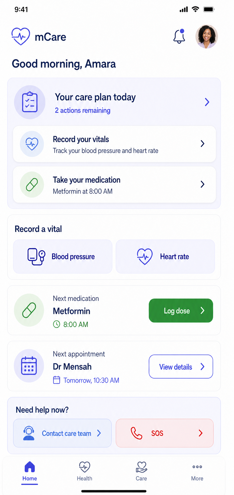
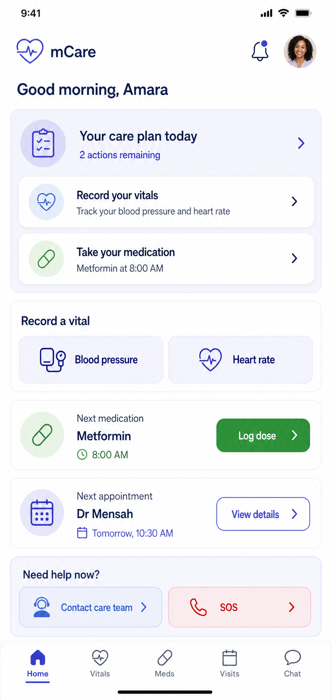
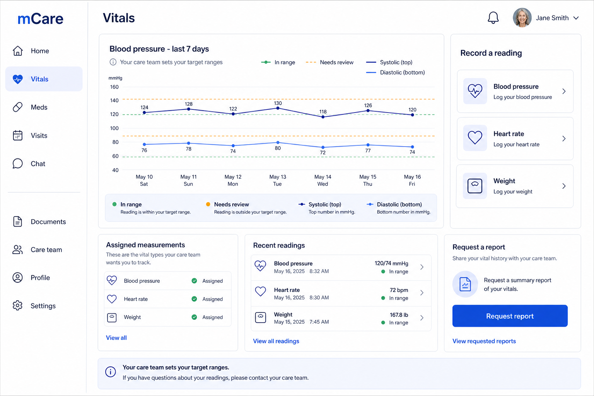
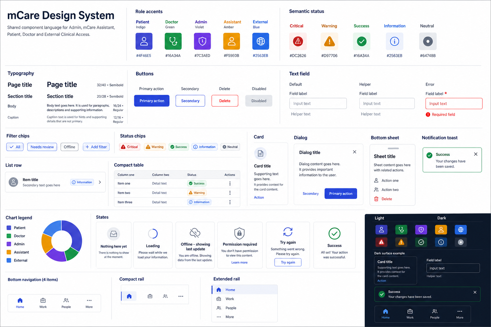

# 06 — Patient Portal

## 1. Approval contract

This chapter is the complete target design specification for the authenticated patient experience. It modernizes presentation and navigation while preserving the existing Laravel contracts, Flutter state stores, clinical thresholds, authorization rules, named routes, and mutation paths.

The approved patient direction is:

- one Flutter implementation for mobile, tablet, web, and desktop;
- four understandable primary destinations: **Home**, **Health**, **Care**, and **More**;
- a persistent notification bell and an unmistakable SOS entry in the global shell;
- progressive disclosure instead of adding more primary pages;
- existing detail routes reused behind the new hubs;
- patient data always scoped to the authenticated patient on the server;
- no UI copy that implies diagnosis, guaranteed safety, or live clinician availability;
- no removal or rename of any of the 21 existing patient routes during migration.

### Status vocabulary

| Label | Meaning in this document |
|---|---|
| **Existing-backed** | A current Flutter screen and current Laravel/state contract support the capability. |
| **Partial-backed** | Some UI/data exists, but the complete workflow named in the proposal is not backed end to end. |
| **Future-not-backed** | No safe production contract currently supports the feature. The image or specification is directional only and must not be implemented as a working control until backend, security, privacy, and test work is approved. |
| **Proposed additive** | A new presentation route/component may be added behind a feature flag; all legacy routes remain valid. |

## 2. Patient experience intent

### Primary user needs

Patients should be able to answer five questions quickly:

1. Is there anything I need to do now?
2. How are my monitored vitals changing?
3. What medication or visit is next?
4. How do I contact my care team?
5. How do I get urgent help?

The experience must work for users with low digital confidence, reduced vision, reduced dexterity, intermittent connectivity, or limited medical vocabulary. Clinical language is paired with plain-language meaning. Colour reinforces, but never carries, severity or status by itself.

### Design principles

- **Action before analytics.** Home shows the next medication, visit, alert, or setup action before charts.
- **Health information in context.** A reading always displays type, value, unit, time, classification, and source/note when available.
- **One safe action at a time.** High-risk or destructive actions require a review step and clear outcome.
- **Calm does not mean vague.** Critical and SOS states are explicit; normal states avoid false reassurance.
- **No duplicate care logic.** Widgets call existing state/service methods; they do not reclassify vitals, reconstruct permissions, or issue direct HTTP requests.
- **Privacy by default.** The smallest necessary health summary is visible until the patient chooses a detail page.

## 3. Target information architecture

### 3.1 Primary navigation

| Destination | Patient question | Included current screens | Proposed landing behavior |
|---|---|---|---|
| **Home** | What matters now? | Dashboard | Existing `/patient` becomes the redesigned role home behind a patient UI flag. |
| **Health** | How am I doing and what am I taking? | Vitals, vital detail/history/week, medications/detail, documents | Additive `/patient/health` hub may summarize these features; first migration may route the tab to `/patient/vitals` while the hub is disabled. |
| **Care** | Who is helping me and what is scheduled? | Appointments/detail, messages/thread, care team | Additive `/patient/care` hub may summarize visits, team, and chat; legacy destinations remain directly addressable. |
| **More** | Where are my account and support tools? | Profile, settings, support/ticket detail | Additive `/patient/more` catalog may group these utilities without moving their business logic. |

Global shell actions are not extra tabs:

- **Notification bell** opens `/patient/notifications`, with an accessible unread label.
- **SOS** opens `/patient/sos`; it must remain reachable in one deliberate action from every authenticated patient screen.
- **Profile menu** exposes profile, settings, support, security/change password, and sign out.

### 3.2 Route ownership map

```text
Patient gate
├── /patient/force-password
└── /patient/onboarding

Patient shell
├── Home
│   └── /patient
├── Health
│   ├── /patient/vitals
│   │   ├── /patient/vitals/detail
│   │   ├── /patient/vitals/history
│   │   └── /patient/vitals/week
│   ├── /patient/medications
│   │   └── /patient/medications/detail
│   └── /patient/documents
├── Care
│   ├── /patient/appointments
│   │   └── /patient/appointments/detail
│   ├── /patient/messages
│   │   └── /patient/messages/thread
│   └── /patient/care-team
├── More
│   ├── /patient/profile
│   ├── /patient/settings
│   └── /patient/support
│       └── /patient/support/detail
└── Global
    ├── /patient/notifications
    └── /patient/sos
```

Parent highlighting must be registry-based. For example, medication detail highlights **Health**, a chat thread highlights **Care**, and a support ticket highlights **More**. Exact-route comparisons alone are insufficient.

### 3.3 Authentication and authorization

- All patient routes are protected by `RoleGuard`/`_PatientGuarded` and corresponding Laravel `auth:sanctum`, rate-limit, and `role:patient` middleware.
- Onboarding and force-password screens remain gates, not ordinary navigation items.
- The client may hide an unavailable action for clarity, but Laravel ownership and policy checks remain authoritative.
- Route arguments are identifiers, not authorization. A patient must never gain another patient's data by changing an ID.
- A missing or stale user/session state fails closed to login or the appropriate gate; it must not render cached PHI under a different account.

## 4. Visual direction and approval images

The patient role uses the shared mCare design system with an indigo accent, white/neutral surfaces, high-contrast text, semantic status tokens, rounded but restrained cards, and generous touch targets. Layout density is lower than staff portals because the primary patient task is comprehension, not bulk processing.

### 4.1 Mockup references

| Artifact | Approval use | Important interpretation |
|---|---|---|
|  | Primary mobile Home direction | The hierarchy and tone are authoritative; all counts/content must come from live state. |
|  | Earlier visual exploration | Use for comparison only where it does not conflict with the v2 direction. |
|  | Expanded Health/vitals workspace | Demonstrates desktop reflow; it does not authorize new clinical calculations. |
|  | Cross-role components and tokens | Patient accent may vary, but shared components and behavior remain common. |

Mockups are visual specifications, not evidence that an endpoint exists. Any unsupported control shown in an illustration remains **Future-not-backed** until its contract is approved.

### 4.2 Page anatomy

Every standard patient page follows this order:

1. Global shell: brand/back context, page title, bell, profile, SOS.
2. Optional plain-language status summary.
3. One primary action, if appropriate.
4. Core content in a predictable reading order.
5. Filters or secondary actions.
6. Explicit loading, empty, offline, permission, and error states.

No page may display a floating or sticky control over form fields, medication instructions, or critical alert content.

## 5. Complete current route and screen catalogue — 21 routes

All entries below exist in `RouteNames` and are wired in `main.dart`. The redesign may change their composition, but not their names, arguments, guards, or behavior without a separately approved migration.

| # | Current named route | Current Flutter screen | Target IA | Purpose and principal action | Current state/API touchpoint |
|---:|---|---|---|---|---|
| 1 | `/patient/onboarding` | `PatientOnboardingView` | Gate | Complete the six-step health profile, emergency contact, consent, and monitored-vitals setup. | `PatientSessionService.completeOnboarding` → `POST /patient/onboarding`. |
| 2 | `/patient` | `PatientDashboardView` | Home | Orient the patient; show current priorities, recent vitals, medications, visits, and safe shortcuts. | Hydrated by `GET /patient/session` into shared patient stores. |
| 3 | `/patient/vitals` | `VitalsView` | Health | Review tracked vitals, record a reading, manage tracked items, and request a report. | `VitalsState`, `VitalReportState`; `GET/POST /patient/vitals`, `PATCH /patient/tracked-vitals`, report-request endpoints. |
| 4 | `/patient/vitals/detail` | `VitalDetailView` | Health | View one vital and selected time range; open history. Accepts `VitalDetailArgs`, default heart rate/7 days. | `VitalsState`; may query `GET /patient/vitals?vital_key=&days=`. |
| 5 | `/patient/vitals/history` | `VitalHistoryView` | Health | Chronological history for one selected vital. Defaults safely to heart rate if arguments are absent. | `VitalsState`/`VitalsApi.history`. |
| 6 | `/patient/vitals/week` | `Vitals7DayView` | Health | Seven-day summary across tracked vitals and report request entry. | `VitalsState`, `VitalReportState`. |
| 7 | `/patient/medications` | `MedicationsView` | Health | Show scheduled doses and active/archived medicines; add patient-entered medication and log a dose. | `MedicationsState`; session data plus medication/dose mutation endpoints. |
| 8 | `/patient/medications/detail` | `MedicationDetailView` | Health | Show dosage, frequency, instructions, source, dates, refills, and dose history. Requires medication ID argument. | `MedicationsState`; update/archive/record dose through `MedicationsApi`. |
| 9 | `/patient/appointments` | `AppointmentsView` | Care | Browse upcoming, past, and cancelled visits; book a visit. | `AppointmentsState`; session data and `POST/PATCH/DELETE /patient/appointments`. |
| 10 | `/patient/appointments/detail` | `AppointmentDetailView` | Care | Review visit details; reschedule or cancel where state permits. Requires appointment ID. | `AppointmentsState`/`AppointmentsApi`. |
| 11 | `/patient/documents` | `DocumentsView` | Health | Browse and filter documents; upload, view, edit metadata, download, or delete owned documents. | `DocumentsState`; document multipart and protected stream/download endpoints. |
| 12 | `/patient/messages` | `MessagesView` | Care | Browse care-team conversations and unread state. | `MessagesState`; session summaries and patient conversation endpoints. |
| 13 | `/patient/messages/thread` | `ChatThreadView` | Care | Read and send messages in one owned conversation. Requires conversation ID. | `MessagesApi.loadThread/send/markRead`. |
| 14 | `/patient/care-team` | `CareTeamView` | Care | Review assigned providers, browse providers, request care, manage pending requests, and open external access. | `CareState`, `CareApi`; `ExternalAccessApi` for patient-minted guest links. |
| 15 | `/patient/notifications` | `NotificationsView` | Global | Read care updates and alerts, resolve supported items, mark all read, and navigate to the canonical object. | `NotificationState`/`NotificationsApi`; optional `NotificationsFilter`. |
| 16 | `/patient/profile` | `ProfileView` | More | Review/edit account and health information, avatar, emergency information, and account shortcuts. | `AuthState`, `ProfileState`; profile/auth endpoints. |
| 17 | `/patient/force-password` | `ForceChangePasswordView` | Gate | Replace an administrator-issued temporary password before accessing the portal. | Auth service → `POST /auth/change-password`; gate state remains server-authoritative. |
| 18 | `/patient/settings` | `SettingsView` | More | Appearance, notification preferences, privacy, external access management, and account preferences. | `SettingsState`; `GET/PATCH /me/settings`; external-access endpoints. |
| 19 | `/patient/support` | `SupportView` | More | Browse support tickets and open a technical, medical, billing, account, or other ticket. | `SupportState`; session data and support ticket endpoints. |
| 20 | `/patient/support/detail` | `TicketDetailView` | More | Read/reply to an owned ticket and close it. Requires ticket ID. | `SupportState`/`SupportApi`. |
| 21 | `/patient/sos` | `SosView` | Global | Trigger, monitor, and resolve an emergency event; review contacts and history. | `SosState`/`SosApi`; session poll cadence increases during an active SOS. |

### Proposed additive hub routes

`/patient/health`, `/patient/care`, and `/patient/more` are design targets, not current routes. If approved, add them as new named routes behind a role-specific feature flag. Never repurpose, redirect permanently, or delete a current route during the compatibility window. Deep links and notification action routes continue to resolve to the current canonical detail pages.

## 6. Responsive layout specification

The current shared breakpoints are retained: mobile `<600`, tablet `600–1023`, desktop `>=1024`, with `1440` available for wide refinements. Breakpoints change layout only; they never change data, authorization, or actions.

### 6.1 Mobile

```text
┌─────────────────────────────────┐
│ Page/brand        Bell    SOS   │
│ Context or sync freshness       │
├─────────────────────────────────┤
│ Primary status / next action    │
│                                 │
│ One-column cards and lists      │
│ Full-width forms                │
│ Sticky submit only when safe    │
├─────────────────────────────────┤
│ Home   Health   Care   More     │
└─────────────────────────────────┘
```

- One content column with 16 px minimum side inset.
- Minimum interactive target 48 x 48 logical pixels; destructive controls are not adjacent to primary controls without spacing.
- Details open as full routes or accessible full-height sheets.
- Long medication names, units, and provider names wrap; they never shrink below the accessible text scale.
- At 200% text scale, primary navigation may use abbreviated visible labels only if full semantic labels remain and no destination is ambiguous.

### 6.2 Tablet

```text
┌──────────────┬──────────────────────────────┐
│ Compact rail │ Header: title, Bell, SOS     │
│ Home         ├──────────────────────────────┤
│ Health       │ Summary / primary content    │
│ Care         │ two-column cards when useful │
│ More         │ or list + selected detail    │
└──────────────┴──────────────────────────────┘
```

- Compact rail replaces bottom navigation.
- Health summary may use a two-column grid; chronological content remains a single reading column.
- Forms are constrained to a readable maximum width; help/context may occupy the second column.
- Master/detail is appropriate for messages and documents only when an empty detail panel cannot expose an arbitrary patient's data.

### 6.3 Desktop and wide web

```text
┌────────────────┬───────────────────────────────────────────────┐
│ mCare          │ Search/context     Sync   Bell   SOS  Profile │
│ Home           ├─────────────────────────────┬─────────────────┤
│ Health         │ Main content (max readable) │ Context panel   │
│ Care           │ charts/list/detail          │ next action     │
│ More           │                             │ help/status     │
└────────────────┴─────────────────────────────┴─────────────────┘
```

- Expanded rail width targets 224–256 px.
- Main reading column should generally remain under 920 px; wide space supports context, not stretched forms.
- Detail panels are at least 360 px and collapse below the desktop breakpoint.
- Keyboard focus order follows visual order. Escape closes non-destructive overlays; browser back and named-route back behavior remain predictable.

## 7. Page-family specifications

Each family below defines the design contract for all related current routes. Laravel validation remains authoritative; client validation exists to prevent avoidable errors and explain requirements early.

Unless a family explicitly says otherwise, its **role/auth** contract is: authenticated `patient` role, correct force-password/onboarding gate state, patient-owned or patient-scoped resource, current Sanctum session, and server ownership enforcement. Its **permission-denied** behavior is fail-closed without revealing whether another patient's object exists.

### 7.1 Gates: force password and onboarding

**Routes:** `/patient/force-password`, `/patient/onboarding`

| Requirement | Specification |
|---|---|
| Purpose | Establish a secure credential and the minimum health/emergency profile required for safe monitoring. |
| Role/auth | Authenticated patient only. Force-password gate precedes onboarding. The ordinary patient shell is not available until gate state is cleared. |
| Hierarchy | Progress header → plain-language reason → current step → Back/Continue → review and submit. Six onboarding steps remain one flow, not six routes. |
| Actions | Change temporary password; enter demographics/body measures; select conditions; record allergies/current medicines; add at least one emergency contact; review assigned vitals and location consent; submit. |
| Validation | Onboarding server requires health array, blood type, gender, DOB, height/weight >0, at least one emergency contact and one assigned vital. Current UI further constrains height 50–250 cm, weight 20–300 kg, and contact phone length >=7. Names max 120, relationship max 80, phone max 30, valid optional email. |
| Backend/state | `PatientSessionService.completeOnboarding`; `POST /patient/onboarding`; rehydrate with `GET /patient/session`. Password uses existing auth mutation and gate. |
| Responsive | Mobile is a single scrolling step with fixed progress/actions; tablet/desktop centers a 640–760 px form and may show a non-sensitive explanatory side panel. |
| Error/offline | Never claim completion before server success. Preserve entered values after validation/network failure. On offline submission, explain that setup needs a connection; do not create a local-only health profile. |
| Accessibility | Announce step number/title, place focus on first invalid field, expose selected conditions/vitals as checked controls, and explain why location permission is optional. |
| Acceptance | Back never loses completed steps; duplicate submit is blocked; refresh returns to the correct gate based on server state; no patient Home content flashes before gate completion. |

### 7.2 Home

**Route:** `/patient`

| Requirement | Specification |
|---|---|
| Purpose | Provide a calm summary and the next useful action, not a second menu. |
| Hierarchy | Greeting/freshness → urgent or overdue item → today's medication/visit → monitored-health snapshot → care-team shortcut → recent activity. |
| Actions | Record a vital, log a scheduled dose, open next appointment, read a critical notification, message care team, or open SOS. Sensitive completion occurs on its canonical detail/sheet. |
| State/API | Compose only from stores hydrated by `GET /patient/session`: vitals, medications/doses, appointments, documents, conversations, notifications, support, SOS, care, and vital report requests. |
| Content rules | Maximum three next-action rows on compact. If no action exists, say `Nothing needs action right now`; do not say the patient is healthy or all systems are safe. Show `Updated HH:mm` or offline freshness. |
| Responsive | Mobile stacks; tablet uses a two-column summary; desktop follows the patient Home mockup hierarchy with main timeline plus contextual side panel. |
| Errors/offline | Preserve the last valid snapshot with an explicit age. A failed refresh does not replace data with demo values. Empty is distinct from loading and unavailable. |
| Accessibility | Status includes text/icon, not colour alone; dynamic count updates use restrained live-region announcements; greeting is not the sole page heading. |
| Acceptance | Every card opens an existing canonical route; counts match the corresponding list; no hard-coded vitals, adherence, clinician presence, or online claim. |

### 7.3 Health hub and vitals

**Routes:** proposed `/patient/health`; current `/patient/vitals`, `/patient/vitals/detail`, `/patient/vitals/history`, `/patient/vitals/week`

| Requirement | Specification |
|---|---|
| Purpose | Let patients record and understand assigned/tracked readings without interpreting them as a diagnosis. |
| Hierarchy | Health summary → assigned/tracked vital selector → latest value and classification → trend/range → history → report request. |
| Actions | Record reading, change optional tracked vitals, open detail/history/week, submit/cancel vital report request. Doctor-assigned vital types cannot be removed by the patient. |
| Validation | `vital_key` string, numeric primary value, optional numeric secondary value, optional date and note; history days 1–365. Tracked list must contain at least one item, include every assigned vital, and contain only enabled catalog keys. Blood pressure presents both values where applicable. |
| Backend/state | `VitalsState`, `VitalReportState`; `GET/POST /patient/vitals`, `PATCH /patient/tracked-vitals`, `POST/PATCH /patient/vital-report-requests`. Risk is classified by Laravel against patient override or vital catalog; UI must display returned risk, not recompute it as authority. |
| Responsive | Mobile uses vital cards and one chart at a time; tablet uses selector + chart; desktop uses the referenced expanded mockup with list/chart/detail columns that collapse cleanly. |
| Error/offline | A failed record remains an editable draft, never a successful local reading. Retry must not create duplicates. Unsupported/unknown risk displays `Not classified`; it is not forced to Normal. |
| Accessibility | Chart has a textual table/summary, unit, high/low labels, and time range. Numeric inputs declare decimal keyboard and unit outside the placeholder. |
| Acceptance | Detail arguments survive rotation/resize; missing arguments use documented safe defaults; assigned vitals cannot be deselected; server classification and timestamp appear after save. |

**Vital-report validation:** range start and end are required; end must be on/after start; at least one vital; note max 500 characters. Fulfilment remains a doctor workflow; the patient cannot mark it fulfilled.

### 7.4 Medications and doses

**Routes:** `/patient/medications`, `/patient/medications/detail`

| Requirement | Specification |
|---|---|
| Purpose | Make the next dose, instructions, source, and adherence history easy to understand. |
| Hierarchy | Due/overdue dose → active medicines → dose timeline → archived medicines. Detail shows name, dosage, frequency, form, prescriber/source, instructions, dates/refills, then dose history. |
| Actions | Add a patient-entered medication, edit supported fields, archive owned medication, record a dose as taken/skipped/missed, inspect dose detail. Doctor-issued prescriptions remain visibly attributed. |
| Validation | Create requires name <=160, dosage <=60, frequency <=120, start date; optional form <=60, end date >= start, refills >=0. Dose status is `pending`, `taken`, `skipped`, or `missed`; optional `taken_at`. Server ownership is mandatory. |
| Backend/state | `MedicationsState`; `POST/PATCH/DELETE /patient/medications`; `PATCH /patient/medication-doses/{dose}`. The list itself is hydrated by `/patient/session`. |
| Responsive | Mobile uses a chronological dose-first layout; tablet/desktop may show medicine list and selected detail side by side. Never put `Archive` beside `Log dose` without clear separation. |
| Error/offline | Disable a dose control while saving. On failure, restore the previous status and retain an error message near that dose. Do not queue clinical dose changes for silent later replay without an approved conflict/idempotency contract. |
| Accessibility | Instructions are selectable/readable text; status has words and icons; dates use locale-aware display while preserving an unambiguous full date in semantics. |
| Acceptance | Repeated taps produce one mutation; archived medication no longer appears active after session reconciliation; medication IDs are validated and a missing item produces a safe not-found screen. |

### 7.5 Care: appointments, team, and external access

**Routes:** proposed `/patient/care`; current `/patient/appointments`, `/patient/appointments/detail`, `/patient/care-team`

| Requirement | Specification |
|---|---|
| Purpose | Keep upcoming visits, assigned providers, care requests, and patient-managed guest access together without conflating their permissions. |
| Hierarchy | Next visit → care team → pending care requests → available providers → external-doctor access. Appointment detail separates facts from actions. |
| Actions | Book/reschedule/cancel visit; request a provider; cancel a pending request; message assigned provider; create/share/revoke a temporary external link. |
| Validation | Patient appointment: doctor name required <=160, optional existing doctor ID, scheduled date, duration 5–480, type `inPerson`, `virtual`, or `phone`, reason <=200, link/location <=500. Care request requires a real provider; reason <=200. External label <=120, expiry 1–168 hours, maximum five active links. |
| Backend/state | `AppointmentsState`, `CareState`, `ExternalAccessApi`; patient appointment, care provider/request, and external-access endpoints. Appointment lists and current requests come from `/patient/session`. |
| Responsive | Mobile uses segmented Upcoming/Past/Cancelled and My team/Browse/Pending. Tablet/desktop may use calendar/list or directory/detail split, but booking remains one shared sheet/form implementation. |
| Error/offline | Calendar availability is not inferred; current backend accepts a scheduled time but has no availability engine. A `virtual` appointment can carry a link, but there is no embedded telemedicine session. Link creation/revocation requires connectivity and an explicit result. |
| Accessibility | Provider cards announce name, specialty, assignment/request status, and action. Dates include timezone. Share sheet never makes the secret link the only way to identify expiry. |
| Acceptance | Cancelled visits move to the correct filter after sync; pending care request cannot be submitted repeatedly; external secret is shown only after creation, expiry is visible, and revoke is confirmed. |

**Security hold:** current external access is powerful. The redesign must not expand its scope. Before production approval, store guest secrets hashed where feasible, exchange them for a short portal session, define scopes, minimize summary data, and audit open/write activity. Never place access tokens in analytics, crash logs, screenshots, or notification text.

### 7.6 Documents and medical-record presentation

**Route:** `/patient/documents`

| Requirement | Specification |
|---|---|
| Purpose | Present owned lab-result, prescription, imaging, discharge, consultation-note, and other files as one understandable record library. |
| Hierarchy | Search/filter → recent documents → category grouping → document detail/viewer → metadata and authorized file actions. |
| Actions | Upload file, edit metadata/replace file, stream/view, download, delete. Structured lab/radiology ordering and result interpretation are not part of this route. |
| Validation | Title required <=200; category from the current six-value allowlist; file type is `pdf`, `image`, `doc`, or `other`; optional description; PDF/JPG/JPEG/PNG/DOC/DOCX only; maximum 10 MB. Server validates MIME/extension and ownership. |
| Backend/state | `DocumentsState`/`DocumentsApi`; multipart patient document endpoints and authenticated stream route. |
| Responsive | Mobile opens viewer as full-height content; tablet/desktop uses list + preview when the format is supported. Unsupported native preview offers a clear download/open explanation, not an inert button. |
| Error/offline | Upload shows progress and retry without duplicating metadata. A missing file returns a safe 404 state. Never cache sensitive bytes beyond the approved encrypted/offline policy. |
| Accessibility | Document type is textual; filename/title is selectable; upload supports keyboard and screen reader; progress and failure are announced. |
| Acceptance | Category filters match server values; deleted documents disappear after success; no public direct URL is exposed; access is rechecked on every stream/download. |

**Security hold:** `MedicalDocumentFiles` currently writes to the Laravel `public` disk. Before real-patient deployment, move medical files to private encrypted storage, add malware/content scanning, and deliver via short-lived or controller-authorized streams. A visual redesign must not normalize the current public-disk pattern.

### 7.7 Communication: messages and notifications

**Routes:** `/patient/messages`, `/patient/messages/thread`, `/patient/notifications`

| Requirement | Specification |
|---|---|
| Purpose | Keep secure conversations and system/care notifications distinct while routing each notification to its canonical object. |
| Hierarchy | Conversations: unread first/filter → participant/context → thread → composer. Notifications: unresolved/unread → resolved/history, each with type and time. |
| Actions | Open thread, send message, mark conversation read; open notification target, mark read/resolve, mark all read. No care-critical mutation occurs merely by resolving an inbox row. |
| Validation | Message body is required. Conversation ownership is checked by Laravel. Notification IDs must belong to the patient. Empty/whitespace-only messages are blocked client-side. |
| Backend/state | `MessagesState`/`MessagesApi`; `NotificationState`/`NotificationsApi`; session summaries plus thread/list mutations. `NotificationRouter` maps type to an existing patient route. |
| Responsive | Mobile uses separate list/thread routes; tablet/desktop may show two panes. A thread deep link with no valid ID shows not found and no cached prior conversation. |
| Error/offline | Sending displays pending then confirmed/failed; failed text remains recoverable. Do not imply end-to-end encryption unless implemented and verified. Push is a prompt to sync, not the source of record. |
| Accessibility | Composer has a visible label; send state is announced; unread is not colour-only; timestamps and sender names are exposed in reading order. |
| Acceptance | Opening a thread marks only that conversation read; a notification opens the canonical object; stale target errors return to the correct parent hub. |

### 7.8 More: profile, settings, and support

**Routes:** proposed `/patient/more`; current `/patient/profile`, `/patient/settings`, `/patient/support`, `/patient/support/detail`

| Requirement | Specification |
|---|---|
| Purpose | Group low-frequency account, privacy, personalization, and help tools without hiding emergency access. |
| Hierarchy | Identity/security → health profile → emergency contacts → appearance/notifications → privacy/external access → support → sign out. Password change appears once in Security. |
| Actions | Edit account/health data; add/remove emergency contact; avatar/email/password changes; save preferences; manage external access; open/reply/close ticket. |
| Validation | Account names required <=100; phone <=30. Health fields follow onboarding/update rules. Emergency contact rules match onboarding. Ticket subject <=160, description required, category allowlist, priority allowlist; reply required. |
| Backend/state | `AuthState`, `ProfileState`, `SettingsState`, `SupportState`; `/auth/profile`, avatar, change-email and change-password endpoints; patient profile/contact endpoints; `/me/settings`; support endpoints. |
| Responsive | Mobile uses grouped list sections and full-height editors; tablet/desktop uses a settings category rail plus one content panel. One component/state path serves all sizes. |
| Error/offline | Account/security writes require connection and explicit server result. Unsaved form state survives recoverable failure. Sign-out clears PHI-bearing stores before another user can render. |
| Accessibility | Descriptive section headings, form error summary plus inline errors, confirmation for contact removal/close ticket, no duplicated focusable labels. |
| Acceptance | Preferences persist after a new session; health edits update Home/Health after rehydrate; support ticket state matches server; change password is not duplicated in multiple sections. |

### 7.9 Emergency SOS

**Route:** `/patient/sos`

| Requirement | Specification |
|---|---|
| Purpose | Let a patient deliberately trigger and track one active emergency event, with contacts and history visible. It is not a replacement for local emergency services. |
| Hierarchy | Emergency disclaimer → active-event status or trigger → type/location/note → emergency contacts → history. Active status stays visually persistent. |
| Actions | Confirm trigger; grant/decline location; acknowledge/update as supported; mark resolved; manage contacts through profile. |
| Validation | Kind is `medical`, `accident`, `fall`, `panic`, or `other`; optional location <=200; latitude -90..90; longitude -180..180; optional note. Update status is `acknowledged`, `resolved`, or `falseAlarm`. Server returns an existing active/acknowledged event instead of creating another. |
| Backend/state | `SosState`/`SosApi`; `POST /patient/sos`, `PATCH /patient/sos/{event}`; `SosNotifier`; faster session polling while active. |
| Responsive | A large but deliberate trigger is available on every size; confirmation is a separate modal/sheet. Desktop does not reduce urgency or bury the action in the rail. |
| Error/offline | If the request outcome is unknown, show `Could not confirm whether SOS was sent` and retry/status-check; never falsely say sent or not sent. Offer the configured local emergency-call guidance. Do not silently queue an SOS. |
| Accessibility | Confirmation does not rely on long press; screen readers announce consequence and current status; haptic/sound is supplementary; motion can be reduced. |
| Acceptance | One active event invariant holds under repeated taps; shell reflects active state after reconciliation; location is included only with consent; resolution updates all entry points. |

## 8. Shared patient component inventory

The patient redesign composes the application-wide component library; it does not create a parallel patient-only design system.

| Component | Patient use | Required behavior |
|---|---|---|
| `AdaptiveRoleShell` | Four destinations, bell, SOS, profile | Same route registry on every form factor; parent selection for detail routes. |
| `StatusSummaryCard` | Home urgency/freshness | Text + icon + semantic colour; no diagnostic conclusion. |
| `NextActionTile` | Dose, visit, alert, setup | One primary action; opens canonical workflow. |
| `VitalValueCard` | Latest values and risk | Unit, recorded time, server classification, unknown state. |
| `TrendChart` + table alternative | Vital detail/week | Accessible non-visual summary and range selection. |
| `MedicationDoseTile` | Schedule/adherence | Pending/saving/error state; guards repeat input. |
| `AppointmentCard` | Upcoming/past/cancelled | Timezone, visit type, status, provider, location/link rules. |
| `CareProviderCard` | Team/browse/request | Assignment/request status and safe contextual actions. |
| `ProtectedDocumentTile` | Records library | Category, uploader, size/date, protected open/download. |
| `ConversationTile`/`MessageComposer` | Secure chat | Unread semantics, recoverable failed message. |
| `ExternalAccessCard` | Link management | Label, expiry, last state, copy/share/revoke; secret minimized. |
| `EmergencyAction` | Global/SOS screen | Deliberate confirmation and uncertain-outcome handling. |
| `AsyncStatePanel` | All families | Loading, empty, stale, offline, forbidden, not found, retry. |

Screen widgets receive view models and callbacks. They never import an API client directly. Existing stores/services remain the sole mutation path until a typed domain controller intentionally replaces them.

## 9. Key patient journeys

### 9.1 First successful entry

```text
Register/login → verify account/OTP as required → force-password gate if set
→ onboarding (6 steps) → POST /patient/onboarding → full session rehydrate
→ Home with a truthful first-action state
```

Failure at submission returns to the review step with all entries retained. The Home route is not pushed until the server confirms onboarding.

### 9.2 Record a vital and respond to classification

```text
Home/Health → Record reading → select assigned/tracked vital → enter value/time/note
→ review units → POST /patient/vitals → server classifies → saved result
→ normal/warning/critical explanation → notification/care action when created
```

The client does not create a second threshold engine. Critical language recommends the approved care/emergency action without presenting a diagnosis.

### 9.3 Log a medication dose

```text
Home next dose → medication/dose detail → Taken / Skipped
→ disable repeat controls → PATCH dose → confirmation → session reconciliation
```

If the response is uncertain, the patient sees a retry/status-check state rather than a second automatic submission.

### 9.4 Book or change a visit

```text
Care/Visits → Book visit → provider/type/date/time/reason → review
→ POST appointment → confirmed detail
```

Reschedule or cancel occurs through the existing appointment update path. The UI must not advertise real-time slot availability because the current backend has no availability contract.

### 9.5 Request a provider

```text
Care → Browse providers → provider detail → Request care + optional reason
→ POST request → Pending → doctor/admin decision → notification → My team
```

The list must distinguish available provider records from assigned team members and pending requests.

### 9.6 Share temporary external-doctor access

```text
Care/More privacy → External access → create label + expiry → confirm
→ POST token → show code/link once with expiry → share
→ active-link card → revoke confirmation → PATCH revoke
```

The patient is told exactly what the guest can currently do: view the returned summary and submit notes, vitals, medications, and documents for the token's patient while valid. Broader permissions are not implied.

### 9.7 Open a care notification

```text
Bell → notification list → select item → mark read → NotificationRouter
→ canonical vital/visit/medicine/message/document/care/SOS route
```

Resolving an inbox item must not resolve a clinical alert or SOS unless that exact canonical workflow is completed.

### 9.8 Trigger SOS

```text
Global SOS → emergency type + optional note/location → explicit confirmation
→ POST SOS → active status and responder feedback → faster sync
→ resolved/false-alarm through canonical event update
```

The confirmation states that mCare does not replace local emergency services and provides the approved local call guidance.

## 10. Complete patient feature matrix

| Requested/product feature | Current status | Current evidence / safe design decision |
|---|---|---|
| Registration | **Existing-backed** | Shared `/register` and auth API; not duplicated inside the patient shell. |
| Login, forgot/reset, OTP, email verification | **Existing-backed** | Shared pre-login routes and auth endpoints. Preserve the shared design. |
| Google web / Apple wired auth | **Partial-backed** | Google web exists; Apple/live native OAuth remain credential/plugin gated. Do not show unavailable provider buttons by platform/config. |
| Dashboard | **Existing-backed** | `/patient`, session-driven. Redesign composition only. |
| Profile management | **Existing-backed** | Account/health/avatar/email/password/contact flows exist. |
| Medical history | **Partial-backed** | Health profile includes allergies, chronic conditions, current medications and basic demographics; no comprehensive coded longitudinal history/encounter model. |
| Medical records | **Partial-backed** | Profile, documents, reports, vitals, meds, appointments exist in separate domains; there is no single normalized record/encounter backend. Group visually without fabricating a combined write model. |
| Prescriptions / medication adherence | **Existing-backed** | Medication and dose models/endpoints exist, including doctor-prescribed source. |
| Appointments | **Existing-backed** | Booking/update/cancel exists. Availability, reminders beyond current notifications, and provider calendar negotiation are not backed. |
| Laboratory results | **Partial-backed** | `labResult` is a document category. Structured tests, reference ranges, order status, and result acknowledgment are **Future-not-backed**. |
| Radiology results | **Partial-backed** | `imaging` is a document category. PACS/DICOM viewer, imaging orders, structured report workflow are **Future-not-backed**. |
| Billing | **Future-not-backed** | `billing` exists only as a support-ticket category; there is no invoice/ledger API or screen. Do not display balances. |
| Payments | **Future-not-backed** | No payment gateway, transaction, receipt, refund, or reconciliation contract exists. |
| Insurance | **Future-not-backed** | No policy, eligibility, claim, or preauthorization model/API exists. |
| Documents | **Existing-backed** | Upload/edit/delete and authenticated stream routes exist; native opening is partial and storage hardening is a production prerequisite. |
| Messaging | **Existing-backed** | Patient conversation threads and mutations exist. Presence/`online` indicators must not claim real-time status without a reliable presence contract. |
| Notifications | **Existing-backed** | List/read/resolve/read-all and route mapping exist; push remains credential gated. |
| Health timeline | **Partial-backed** | Individual vitals, doses, appointments, notifications, SOS and documents have dates; a normalized cross-domain timeline API is **Future-not-backed**. |
| Health statistics | **Existing-backed with limits** | Vitals/week trends can be computed from returned readings. Do not infer diagnosis, population percentile, or unsupported adherence metrics. |
| AI patient assistant | **Future-not-backed** | No approved AI service, clinical safety boundary, consent, retrieval, audit, or escalation contract exists. `mCare Assistant` currently means a delegated human administration role, not an AI chatbot. |
| Video consultation | **Partial-backed** | Appointment type `virtual` and `location_or_link` exist. Embedded video, waiting room, recording, consent, and call-state APIs are **Future-not-backed**. |
| Care team / provider requests | **Existing-backed** | Provider listing, request/cancel, assignments via staff flows. |
| External-doctor links | **Existing-backed with security hardening required** | Create/list/revoke and guest submissions exist; do not broaden until security controls are completed. |
| SOS | **Existing-backed** | Trigger/update, history, notification service and faster polling exist. Production emergency policy and reliability testing remain mandatory. |
| Settings, light/dark preference | **Existing-backed** | `/me/settings` and shared settings components. Dark mode must meet the same contrast/semantic requirements. |
| Offline operation | **Partial-backed** | In-memory last state/demo mode exist; there is no approved durable encrypted offline write/sync engine. Read-only stale presentation may be designed; critical writes require connection. |

## 11. Backend and state compatibility map

### 11.1 Read path

```text
GET /patient/session
        ↓ PatientSessionSync
ProfileState · VitalsState · MedicationsState · AppointmentsState
DocumentsState · MessagesState · NotificationState · SupportState
SosState · CareState · VitalReportState
        ↓ role-specific presentation adapters
Home / Health / Care / More responsive views
```

The hub composes those stores. It must not create a second patient repository, another polling loop, or copied DTOs for mobile and desktop.

### 11.2 Write path

```text
Shared component → existing state/service command → existing API client
→ Laravel validation + ownership + domain side effects → response
→ local state update → PatientSessionSync reconciliation
```

Cards and mockups never call HTTP directly. Existing alert generation, notifications, auditing, and risk classification continue in Laravel.

### 11.3 Session behavior

- `SessionPoller` remains the single reconciliation mechanism: normal cadence around 30 seconds and faster during active SOS as currently configured.
- Manual pull-to-refresh invokes the same session service.
- A successful mutation may update local state for responsiveness, but the next session is authoritative.
- A malformed/partial response does not clear a previously valid snapshot until absence is explicitly confirmed.
- Logout/account switch clears every patient store and protected cached byte before rendering another identity.

## 12. Validation, error, offline, and state standard

Every patient screen must implement these distinct states:

| State | Required presentation |
|---|---|
| Initial loading | Skeleton shaped like final content; no fake patient names or values. |
| Empty | Explain what is absent and show one safe next action when available. |
| Stale/offline | Keep last valid content, show `Last updated`, disable unsafe writes, provide retry. |
| Validation error (422) | Field-level message plus focus/summary; preserve input. |
| Unauthenticated (401) | Clear sensitive state and return to login through the central auth path. |
| Forbidden (403) | Neutral permission/ownership message; never reveal whether another patient's object exists. |
| Not found (404) | Safe not-found content and a link to the owning hub. |
| Conflict (409) | Explain that the item changed, refresh it, and require a new review before resubmission. |
| Rate limited (429) | Explain retry timing without automatically flooding the endpoint. |
| Server/network error | Human-readable failure, retry, correlation ID if safely provided; never display stack traces. |
| Saving/unknown outcome | Disable duplicate action; status-check before retry for SOS, doses, uploads, or appointments. |

Demo data is only used when `MCARE_USE_BACKEND=false`. A live-backend error must never fall through to demo health data.

## 13. Accessibility and inclusive-use requirements

- Target WCAG 2.2 AA for web and equivalent Flutter semantics on native.
- Support 200% text scaling without clipped controls or hidden values.
- Minimum touch target 48 x 48; keyboard focus visible with at least 3:1 focus-indicator contrast.
- Body text and controls meet 4.5:1 contrast; large text 3:1; status components include text/icon.
- Respect `disableAnimations`; no pulsing emergency animation is required to understand state.
- Charts provide a text summary/table and do not rely on red/green alone.
- Error messages identify the field and correction; toast alone is insufficient.
- Screen titles, section headings, lists, dialogs, and progress steps expose correct semantics.
- Dates, times, units, and phone numbers are localized; clinical identifiers remain unambiguous.
- Plain-language labels lead; abbreviations such as bpm, SpO2, and mmHg have accessible expansions.
- SOS, sign out, archive, delete, revoke, and cancel are distinct labels and never icon-only.

## 14. Privacy and clinical-safety requirements

1. Never send PHI, access tokens, message text, vital values, diagnosis, location, or document titles to analytics/crash breadcrumbs by default.
2. Blur or hide protected content in app-switcher previews where platform support permits.
3. Notifications use generic lock-screen text unless the patient has explicitly chosen a privacy setting supported by the backend.
4. Do not persist web bearer tokens or PHI in unprotected browser storage in the target production architecture; use an approved HttpOnly cookie/CSRF approach for web and secure storage for native.
5. Patient-entered data and doctor-entered data remain visibly attributed; do not silently merge sources.
6. Vital classifications are returned by the backend. The UI may explain them but cannot override them.
7. SOS uncertainty is explicit. No optimistic `SOS sent` message before confirmation.
8. External access secret material is minimized, redacted after use where possible, and never placed in route history beyond the current compatibility requirement without an approved migration.
9. Document bytes require private storage, scanning, and authorized delivery before real-patient release.
10. Any future AI feature requires clinical-governance approval, intended-use definition, human escalation, consent, auditability, evaluation, and clear non-diagnostic boundaries.

## 15. Safe patient implementation sequence

The patient redesign begins only after the shared design-system foundation and the approved Admin rollout establish stable components. Each phase is independently reversible.

### P0 — baseline and safety freeze

- Capture goldens for all 21 patient routes at 360, 390, 599, 600, 800, 1024, 1440, and 1920 logical widths where applicable.
- Record route argument/deep-link behavior and backend fixtures.
- Add regression tests for onboarding gates, ownership, critical vital creation, dose updates, appointment updates, external link create/revoke, document authorization, and SOS duplicate prevention.
- Resolve document storage, token/session, and external-guest P0 security decisions before broad visual rollout.

**Exit:** every route and write command has a test owner; baseline failures are documented; no unreviewed route or backend mutation changes.

### P1 — shared shell and tokens, flag off

- Reuse the application-wide semantic tokens and components.
- Add a patient route-parent registry and optional `/patient/health`, `/patient/care`, `/patient/more` routes.
- Build the four-destination adaptive shell with global bell/SOS.
- Keep existing `PatientScaffold`, bottom navigation, and side rail available as the rollback path.

**Exit:** all legacy deep links work and select the correct parent; screenshots and accessibility tests pass with the feature flag disabled/enabled.

### P2 — Home composition

- Recompose `/patient` using adapters over the existing stores.
- Link next actions to existing detail routes; do not move mutations into Home.
- Add freshness, empty, stale, and unknown states.

**Exit:** Home values match canonical lists and no hard-coded or duplicate calculations remain.

### P3 — Health hub

- Add Health landing composition, then migrate vitals and medications visual components without changing APIs.
- Integrate documents as a Health subsection/link.
- Preserve current detail route arguments and state ownership.

**Exit:** vital classification, dose mutations, report requests, and file authorization tests pass; desktop/mobile use one implementation.

### P4 — Care and More hubs

- Group visits, care team, chat, external access, profile, settings, and support.
- Keep canonical pages and endpoints; only entry hierarchy changes.
- Add exact-route-to-parent mapping and back-stack tests.

**Exit:** no utility is lost, duplicated, or more deeply hidden than the approved navigation map.

### P5 — controlled rollout

- Internal patient test accounts → invited pilot → percentage cohort → default on.
- Monitor route failures, 401/403/409/422 rates, task completion, crashes, SOS confirmation latency, and accessibility/UAT findings without logging PHI.
- Roll back by disabling the patient UI flag; retain legacy shell/screens for at least one complete mobile release after full adoption.

### P6 — compatibility cleanup

Only after the rollback window and explicit approval may obsolete presentation-only code be removed. Existing public named routes continue as supported aliases unless a separately versioned migration and external-link/notification impact assessment approves retirement.

## 16. Patient test and acceptance matrix

| Test group | Mandatory coverage |
|---|---|
| Static/unit | Route registry exhaustive across 21 routes; parent selection; next-action ranking; no independent clinical risk calculation; state adapter empty/unknown behavior. |
| Widget/golden | Mobile/tablet/desktop and wide; light/dark; 200% text; long names/units; zero/one/many items; loading/error/offline/active SOS. |
| Navigation | Direct deep links, missing/invalid arguments, browser back, notification routing, onboarding/force-password gates, logout/account switch. |
| Backend feature | Patient-only ownership for every resource; validation cases; duplicate dose/SOS taps; external link cap/expiry/revoke; document stream authorization. |
| Failure | Timeouts, 401, 403, 404, 409, 422, 429, partial session payload, unknown mutation outcome, reconnect and retry. |
| Accessibility | Screen-reader order, keyboard-only web, focus restoration, error focus, contrast, reduced motion, chart alternative, touch targets. |
| Privacy/security | PHI-free telemetry, protected screenshots/cache, token redaction, no demo fallback in live mode, file privacy/scanning path, guest-access audit. |
| Performance | First useful content, rebuild scope, 1,000 vital readings, long document/conversation/ticket lists, low-memory mobile, resize without data reload. |
| UAT | Low-digital-literacy patient records a vital, logs dose, books/cancels visit, messages team, shares/revokes access, opens notification, and triggers/test-resolves SOS with guidance. |

## 17. Approval decisions

Stakeholders approve this patient chapter only when each item has an owner and answer:

- [ ] Four-destination IA: Home / Health / Care / More.
- [ ] Global bell and one-action deliberate SOS entry.
- [ ] Patient Home v2 visual direction and desktop Health direction.
- [ ] Lab and imaging remain document categories until structured services are built.
- [ ] Billing, payments, insurance, embedded video, and AI are clearly **Future-not-backed**.
- [ ] Existing 21 named routes and arguments remain supported.
- [ ] No duplicate risk, medication, appointment, notification, or external-access business logic.
- [ ] Document/private-storage and external-access security holds have assigned remediation.
- [ ] Responsive, dark mode, 200% text, offline/error, and privacy behavior are accepted.
- [ ] Feature-flag rollout, measurable exit gates, and rollback window are funded.

Approval authorizes detailed implementation planning and staged presentation work; it does not authorize unsupported clinical, billing, insurance, AI, or telemedicine backend features.
