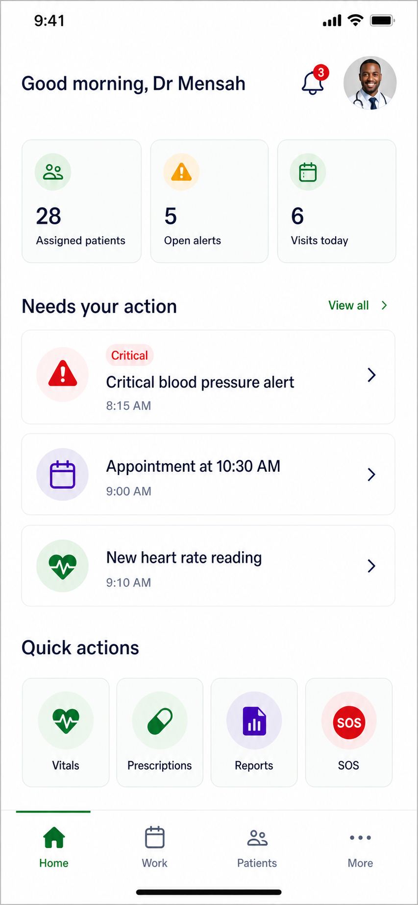
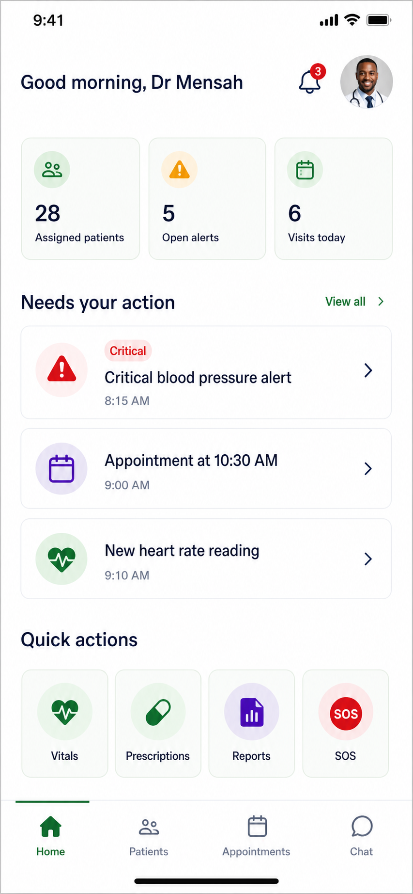
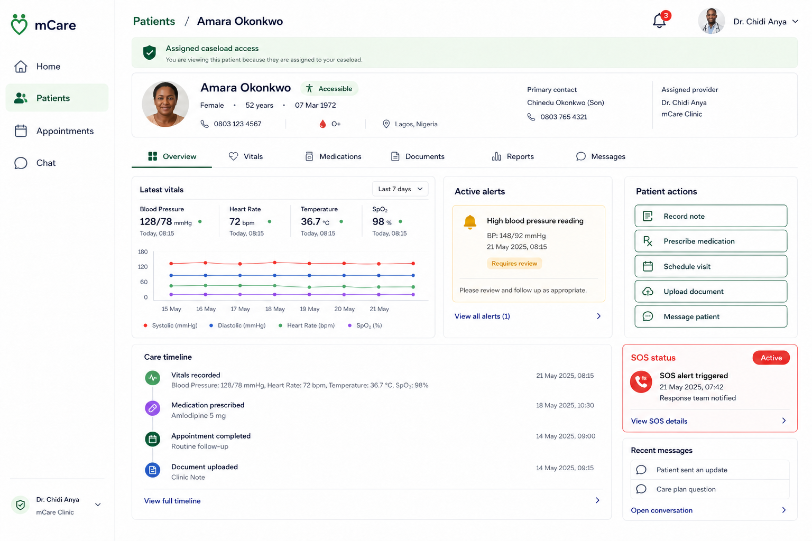

# 07 — Doctor Portal

## 1. Approval contract

This chapter defines the complete target user experience for authenticated mCare doctors. It is a presentation and workflow-organization redesign over the existing Flutter/Laravel implementation. It does not authorize replacement of clinical logic, caseload authorization, alerts, reports, appointment rules, auditing, notifications, or any current API.

The approved doctor direction is:

- one shared Flutter implementation for mobile, tablet, web, and desktop;
- four primary destinations: **Home**, **Work**, **Patients**, and **More**;
- a persistent notification bell and authorized SOS status/action in the global shell;
- an action-oriented Work queue that links to typed current workflows;
- a patient workspace that keeps all 13 current patient sections in context;
- existing named routes, arguments, guards, state stores, and backend commands retained;
- no automated diagnosis, autonomous clinical decision, or unsupported order-entry behavior;
- no removal or rename of any of the 22 existing doctor routes during migration.

### Status vocabulary

| Label | Meaning in this document |
|---|---|
| **Existing-backed** | Current Flutter UI and Laravel/state contracts support the capability. |
| **Partial-backed** | A portion is implemented, but the named end-to-end clinical workflow is incomplete or client-computed. |
| **Future-not-backed** | The necessary domain, API, authorization, safety, or integration does not exist. A design reference is not implementation permission. |
| **Proposed additive** | A new role hub/presentation route may be added behind a flag while every current route remains supported. |

## 2. Doctor experience intent

### Primary user needs

Doctors should be able to answer these questions without searching through a large menu:

1. What requires clinical attention first?
2. Which patient is this information about, and am I authorized to view it?
3. What changed since my last review?
4. What is the next safe, auditable action?
5. What remains unfinished in my caseload today?

### Design principles

- **Triage is explicit.** SOS, critical alerts, due visits, requests, and ordinary activity are visually and textually distinct.
- **Patient context persists.** Once a patient is selected, clinical tools remain within that workspace instead of repeatedly returning to global lists.
- **Clinical commands are typed.** Acknowledge, resolve, prescribe, publish, schedule, accept, and escalate remain separate commands with their existing required evidence.
- **Information density adapts.** Desktop supports list + chart + context; mobile shows the same information progressively, never a reduced clinical contract.
- **No duplicate domain logic.** Responsive views consume `StaffState`, `MessagesState`, and existing services. They do not copy alert, caseload, medication, report, or appointment behavior.
- **Safe uncertainty.** Missing, stale, or unknown data is labelled; the UI never fabricates a normal state.

## 3. Target information architecture

### 3.1 Primary navigation

| Destination | Doctor question | Included current screens | Proposed landing behavior |
|---|---|---|---|
| **Home** | What matters today? | Dashboard and caseload overview | `/doctor` becomes the redesigned Home behind a doctor UI flag. `/doctor/overview` remains the full insights screen. |
| **Work** | What do I need to act on? | Action inbox, alerts/detail, visits, vitals monitoring, appointments, prescriptions, reports/editor, messages/thread; authorized SOS items | Proposed `/doctor/work` unified presentation; initial flagged tab may route to `/doctor/inbox`. It never replaces the typed detail workflows. |
| **Patients** | Which patient am I caring for? | Patient list and full patient workspace | Existing `/doctor/patients` and `/doctor/patients/chart` remain canonical. |
| **More** | Where are clinical tools and account settings? | Vital template/catalog, profile, settings; overview shortcut if desired | Proposed `/doctor/more` catalog groups low-frequency tools. |

Global shell actions:

- **Notification bell** opens `/doctor/notifications` and shows a meaningful, authorized unread count.
- **SOS indicator/action** opens `/doctor/sos` for caseload-scoped emergency events.
- **Profile menu** exposes profile, settings, change password, and sign out.

### 3.2 Route ownership map

```text
Doctor gate
├── /doctor/force-password
└── /doctor/complete-profile

Doctor shell
├── Home
│   ├── /doctor
│   └── /doctor/overview
├── Work
│   ├── /doctor/inbox
│   ├── /doctor/alerts
│   │   └── /doctor/alerts/detail
│   ├── /doctor/visits
│   ├── /doctor/vitals
│   ├── /doctor/appointments
│   ├── /doctor/prescriptions
│   ├── /doctor/reports
│   │   └── /doctor/reports/editor
│   └── /doctor/messages
│       └── /doctor/messages/thread
├── Patients
│   ├── /doctor/patients
│   └── /doctor/patients/chart
├── More
│   ├── /doctor/vitals/template
│   ├── /doctor/profile
│   └── /doctor/settings
└── Global
    ├── /doctor/notifications
    └── /doctor/sos
```

The route registry must map every current child to its parent. Alert detail highlights **Work**; a patient chart highlights **Patients**; vital catalog highlights **More**. Notification and SOS screens may show their global state while leaving the prior parent selection stable.

### 3.3 Authentication, caseload, and authority

- Doctor pages are protected by `RoleGuard`/`_DoctorGuarded` and Laravel `auth:sanctum`, API throttle, and `role:doctor` middleware.
- Complete-profile and force-password screens remain gates. They are not ordinary menu destinations.
- Laravel `DoctorAccess::assertCaseload` or equivalent object checks remain mandatory for patient chart, prescription, report, document, appointment, vital-plan, messaging, request, and related actions.
- A patient identifier in route arguments is navigation context only; it never proves access.
- The UI may show server-authorized actions, but hidden/disabled controls are not authorization.
- A doctor whose assignment is removed must lose patient data and actions on the next server-authoritative refresh; protected cached detail is purged immediately when access denial is returned.

## 4. Visual direction and approval images

Doctors use the shared application design system with a green clinical accent, neutral information surfaces, high-contrast semantic statuses, and denser layouts than the patient portal. Critical red is reserved for true emergency/critical state and never used as a decorative role accent.

### 4.1 Mockup references

| Artifact | Approval use | Important interpretation |
|---|---|---|
|  | Primary mobile Home direction | Hierarchy and interaction density are authoritative; content/counts must come from current session state. |
|  | Earlier Home exploration | Comparison material only where consistent with the v2 direction. |
|  | Expanded patient workspace | Shows persistent patient context and adaptive tools; does not create new clinical domains. |
|  | Cross-role components and tokens | Components behave identically across roles; capability, content, and accent vary. |

Any diagnosis assistant, laboratory order, referral control, or embedded telemedicine element shown in later concept art remains **Future-not-backed** until a separately approved clinical/backend specification exists.

### 4.2 Doctor page anatomy

1. Global shell: current section, optional scoped search, sync freshness, bell, SOS, profile.
2. Context strip: selected patient or work filter and authorization boundary.
3. Priority summary: only canonical current items.
4. Main list/chart/workspace.
5. Selected detail or patient context panel on larger screens.
6. Typed actions with required evidence and explicit pending/result states.

Patient identity must remain visible when a clinical command sheet is open. At minimum show name plus unique ID or another approved disambiguator; avoid relying on name alone.

## 5. Complete current route and screen catalogue — 22 routes

All 22 routes below exist in `RouteNames` and are wired in `main.dart`. They remain supported throughout and after the first redesign rollout.

| # | Current named route | Current Flutter screen | Target IA | Purpose and principal action | Current state/API touchpoint |
|---:|---|---|---|---|---|
| 1 | `/doctor` | `DoctorDashboardView` | Home | Daily orientation, caseload/action summary, recent activity and shortcuts. | `StaffState`, `MessagesState`; hydrated by `GET /doctor/session` and doctor conversation sync. |
| 2 | `/doctor/overview` | `DoctorOverviewView` | Home | Caseload analytics: assigned patients, attention, alerts, adherence/workload distributions. | Primarily client-computed from `StaffState`; no dedicated doctor analytics endpoint. |
| 3 | `/doctor/vitals` | `DoctorVitalsHubView` | Work | Monitor caseload readings/alerts, filter by date/status/patient/vital, open thresholds and patient context. | Session vitals/alerts/catalog; per-patient detail and alert commands. |
| 4 | `/doctor/vitals/template` | `VitalCatalogScreen.doctor()` | More | View and currently mutate the global vital catalog/templates. | `GET/POST/PATCH/DELETE /doctor/vital-catalog`; clinical-governance safety hold applies. |
| 5 | `/doctor/inbox` | `DoctorActionInboxView` | Work | Current action queue for alerts, visits, requests and care activity. | Composed from `StaffState`; links to current typed routes. |
| 6 | `/doctor/alerts` | `DoctorAlertsView` | Work | List/filter caseload vital alerts. | `GET /doctor/alerts` and session alerts. |
| 7 | `/doctor/alerts/detail` | `DoctorAlertDetailView` | Work | Review one alert; acknowledge, resolve with clinical action/note, open patient, or message. Requires alert ID. | `PATCH /doctor/alerts/{id}/acknowledge` and `PATCH /doctor/alerts/{id}/resolve`. |
| 8 | `/doctor/patients` | `DoctorPatientsView` | Patients | Search/filter assigned caseload and select a patient. | Caseload from `GET /doctor/session`. |
| 9 | `/doctor/patients/chart` | `DoctorPatientWorkspaceView` | Patients | Patient-scoped workspace with overview, vitals, documents, prescriptions, meals, medications, alerts, SOS, appointments, messages, reports, timeline, and trends. | `GET /doctor/patients/{id}` plus existing typed endpoints. Accepts patient/section/SOS route arguments. |
| 10 | `/doctor/visits` | `DoctorVisitsView` | Work | Focused today/upcoming visit list and schedule entry. | `StaffState.appointments`; doctor appointment mutations. |
| 11 | `/doctor/appointments` | `DoctorAppointmentsView` | Work | Full schedule filters and appointment management. | `GET/POST/PATCH /doctor/appointments`. |
| 12 | `/doctor/prescriptions` | `DoctorPrescriptionsView` | Work | Review prescriptions and start a new patient-scoped prescription workflow. | Session prescriptions; `POST /doctor/prescriptions`, revoke endpoint. |
| 13 | `/doctor/reports` | `DoctorReportsView` | Work | Browse drafts and published clinical reports. | `GET /doctor/reports` plus session report data. |
| 14 | `/doctor/reports/editor` | `DoctorReportEditorView` | Work | Create/edit/publish a patient report; accepts existing editor argument contract. | Report create/update/publish/delete endpoints. |
| 15 | `/doctor/messages` | Shared `StaffRouteFactory.messages` | Work | Browse assigned patient conversations. | `MessagesState`; `GET /doctor/conversations`. |
| 16 | `/doctor/messages/thread` | Shared `StaffRouteFactory.chatThread` | Work | Read/send in an authorized patient conversation. Requires conversation ID. | Doctor conversation message/read endpoints. |
| 17 | `/doctor/notifications` | Shared `StaffRouteFactory.notifications` | Global | Review doctor attention items and persist read/resolved presentation state. | Some items are client-derived; `/me/notification-states` persists their state. |
| 18 | `/doctor/profile` | Shared `StaffRouteFactory.profile` | More | Review/edit doctor account, contact details, specialty, license, avatar and security shortcuts. | Auth/profile services and `AuthState`. |
| 19 | `/doctor/complete-profile` | `CompleteStaffProfileView` | Gate | Complete required name and mobile information before workspace access. | `ProfileService` → `PUT /auth/profile`. |
| 20 | `/doctor/force-password` | `ForceChangePasswordView` | Gate | Replace a temporary password before workspace access. | Existing auth change-password command. |
| 21 | `/doctor/settings` | `DoctorSettingsView` | More | Personal appearance, notifications, privacy/account preferences. | `SettingsState`; `GET/PATCH /me/settings`. |
| 22 | `/doctor/sos` | `StaffSosHubView` | Global / Work urgent | Review and respond to authorized caseload SOS events; optional patient/event arguments. | Session SOS data and `PATCH /doctor/sos/{event}`. |

### Proposed additive hub routes

`/doctor/work` and `/doctor/more` are target presentation routes, not current constants. Add them only as new named routes behind a doctor-specific feature flag. `/doctor/inbox` may act as the Work landing during the first migration. Existing direct links, notification routes, and route arguments remain unchanged.

## 6. Responsive layout specification

Reuse the shared breakpoints: mobile `<600`, tablet `600–1023`, desktop `>=1024`, with wide refinements at `>=1440`. Layout branches may reflow the same view model; they must not make different authorization or clinical decisions.

### 6.1 Mobile

```text
┌──────────────────────────────────┐
│ Section / patient   Bell    SOS  │
│ Sync / scope context             │
├──────────────────────────────────┤
│ Priority or selected patient     │
│ Filters as wrap/scroll chips     │
│                                  │
│ One-column work/list/detail      │
│ One primary clinical action      │
├──────────────────────────────────┤
│ Home    Work    Patients   More  │
└──────────────────────────────────┘
```

- Primary actions remain visible without covering content.
- Patient workspace section chooser uses a labelled dropdown/segmented overflow or `More patient tools`; all 13 sections stay discoverable.
- Alert resolution, chart edit, prescription, report, schedule, meal, vital-plan, and SOS response open as accessible full-height sheets/routes with patient identity pinned.
- Long notes use readable line length and preserve unsaved content on recoverable failure.

### 6.2 Tablet

```text
┌──────────────┬────────────────────────────────────────────┐
│ Compact rail │ Header / search / Bell / SOS               │
│ Home         ├────────────────────┬───────────────────────┤
│ Work         │ Queue or patients  │ Selected detail       │
│ Patients     │                    │ / patient summary     │
│ More         │                    │                       │
└──────────────┴────────────────────┴───────────────────────┘
```

- Work and Patients use master/detail where width permits.
- A selected detail is never chosen arbitrarily; the initial panel displays a neutral selection prompt.
- Clinical forms remain a single logical form and may use a supporting context column.
- At the 600/1024 boundaries, state, scroll position, draft content, and selected patient remain stable.

### 6.3 Desktop and wide web

```text
┌────────────────┬──────────────────────────────────────────────────────┐
│ mCare          │ Search/scope      Freshness  Bell  SOS  Profile     │
│ Home           ├──────────────────────┬───────────────────────────────┤
│ Work           │ Work/patient list    │ Detail / patient workspace    │
│ Patients       │ filters + results    │ optional context/action rail  │
│ More           │                      │                               │
└────────────────┴──────────────────────┴───────────────────────────────┘
```

- Expanded rail target 224–256 px.
- Work list 340–420 px; detail receives the remaining width; optional context rail appears only at wide width.
- Patient workspace follows the referenced desktop mockup: persistent identity, section tools, and a readable main clinical column.
- Data tables virtualize/paginate and remain keyboard operable. Do not put large eager lists inside the shell's outer `SingleChildScrollView`.

## 7. Page-family specifications

Unless a family explicitly says otherwise, its **role/auth** contract is: authenticated and approved `doctor` role, complete password/profile gate state, current Sanctum session, and server-enforced caseload/object access. Its **permission-denied** behavior is fail-closed, purge inaccessible selected detail, and avoid revealing whether an out-of-scope patient/object exists.

### 7.1 Gates, profile completion, and account security

**Routes:** `/doctor/complete-profile`, `/doctor/force-password`, `/doctor/profile`, `/doctor/settings`

| Requirement | Specification |
|---|---|
| Purpose | Ensure credential/account gates are complete, then provide one consistent place for professional identity, preferences, and security. |
| Role/auth | Authenticated doctor only. Force-password precedes complete-profile. Ordinary clinical data must not render through either gate. |
| Hierarchy | Gate: reason → required fields → save/continue. Profile: identity → professional details → contact → security. Settings: appearance → notifications → privacy/account. |
| Actions | Change temporary/voluntary password, update name/phone/specialty/license, avatar/email changes, save personal settings, sign out. |
| Validation | `PUT /auth/profile`: first/last names required <=80, phone required <=30, specialty optional <=120, license optional <=80. Current completion UI requires non-empty names and phone length >=7. New password minimum 8 with current password required. |
| Backend/state | `AuthState`, `ProfileService`, shared profile/settings components; `/auth/profile`, `/auth/avatar`, `/auth/change-email`, `/auth/change-password`, `/me/settings`. |
| Responsive | Gates center at max 480–640 px. Tablet/desktop profile/settings may use category rail + content; mobile uses grouped sections and full-height forms. |
| Error/offline | Security/account writes require confirmed server success. Preserve form input after failure; clear PHI/state on sign out. Server gate state is authoritative after refresh. |
| Accessibility | Focus first invalid field; status/error summary plus inline messages; labels do not rely on placeholders; professional identifiers are readable/selectable. |
| Acceptance | No clinical screen flashes before gate completion; password change invalidates other sessions as current backend intends; profile values persist after reauthentication. |

### 7.2 Home and overview

**Routes:** `/doctor`, `/doctor/overview`

| Requirement | Specification |
|---|---|
| Purpose | Home provides a concise clinical operations briefing; Overview provides deeper caseload analytics. |
| Hierarchy | Home: greeting/freshness → active SOS/critical action → today's visits → requests/messages → recent activity. Overview: assigned/attention/alerts/adherence → trends/distributions/workload. |
| Actions | Open next canonical work item, patient, visit, alert, inbox, vitals, or overview. Home never resolves/prescribes/publishes directly. |
| Backend/state | `DoctorSessionService` hydrates `StaffState` from `/doctor/session` and `MessagesState` from doctor conversations. Overview is presently calculated from that state; label unavailable/unknown metrics truthfully. |
| Responsive | Mobile shows at most three ranked actions and compact caseload pulse. Tablet uses two columns. Desktop may show work/activity side by side with constrained analytics. |
| Error/offline | Preserve last valid snapshot with timestamp. Do not substitute demo values when live backend refresh fails. Stale critical state is clearly marked and prompts retry. |
| Accessibility | Priority includes type/severity text; charts have data summary; counts announce noun and state, not bare numbers. |
| Acceptance | Home counts match canonical lists; no hard-coded KPI fallback; no `all systems online` claim without a real health contract; selecting an item opens the exact current route/object. |

### 7.3 Work queue and action inbox

**Routes:** proposed `/doctor/work`; current `/doctor/inbox`

| Requirement | Specification |
|---|---|
| Purpose | Rank the doctor's actionable work without merging distinct clinical commands into a generic task mutation. |
| Sources | Authorized active SOS, unresolved critical/warning alerts, upcoming/overdue visits, vital-report requests, directed care requests, unread patient conversations, and other currently represented doctor action items. |
| Normalized presentation | Stable typed key, source type, priority, server status/version when available, patient identity, minimum summary, time/due state, allowed command, canonical route/arguments. |
| Filters | All, Urgent, Alerts, Visits, Requests, Messages. Only show filters with authorized/current sources. Sort by severity then age/due time using one shared comparator. |
| Actions | Row opens canonical detail. Optional primary button opens the same detail with the intended command emphasized; no clinical command executes from a swipe or Home tile. |
| Backend/state | First release composes current `StaffState`/`MessagesState` and routes. A future server work summary may be additive; it must return typed allowed actions, not replace current endpoints. |
| Responsive | Mobile list → full detail; tablet/desktop list + selected detail. Preserve filter, scroll, and selected item on back/resize. |
| Error/offline | Stale queue is read-only for high-risk actions. Unknown item types fail closed and open a safe legacy route where possible. Missing target refreshes/removes the item with explanation. |
| Accessibility | Type/severity/status/age are textual; filters are a labelled group; keyboard shortcuts cannot execute destructive/clinical commands without review. |
| Acceptance | Every work row traces to one canonical current object and route; duplicate counts are deduplicated by typed ID; resolving an inbox presentation state cannot resolve the underlying alert/SOS. |

### 7.4 Patient directory and clinical workspace

**Routes:** `/doctor/patients`, `/doctor/patients/chart`

| Requirement | Specification |
|---|---|
| Purpose | Select an assigned patient, understand current status, and perform authorized patient-scoped work without losing identity/context. |
| Directory hierarchy | Search/filter → risk/attention summary → assigned-patient list → selected patient. Search is debounced and should move server-side if caseload size grows. |
| Workspace hierarchy | Identity + unique ID/demographics → risk/active alerts/SOS → selected section → evidence → typed action/history. |
| Current sections | Overview, Vitals, Documents, Prescriptions, Meals, Medications, Alerts, SOS, Appointments, Messages, Reports, Timeline, Trends. All remain accessible through one section registry. |
| Route arguments | `patientId` string; optional `section` matching `DoctorPatientSection`; `sosRespond` boolean and `eventId` for SOS response. Unknown section falls back to Overview; absent/forbidden patient fails safely. |
| Actions | Edit allowed health chart fields, assign monitored vitals, upload/edit/delete documents, prescribe/revoke, assign/remove meal plan, manage appointments, respond to alert/SOS, message, create/edit/publish report, fulfil/escalate vital report request. |
| Validation | Every write uses existing specific server validation and caseload checks. Chart patch accepts only supported health fields plus note <=500 and rejects empty change. Assigned vital list requires at least one enabled catalog key. |
| Backend/state | `GET /doctor/patients/{patient}` loads up to current server limits for vitals/documents/medications/appointments/SOS/reports/alerts/requests; `StaffState.mergePatientDetail` merges it. Writes use existing `DoctorApi`/document APIs. |
| Responsive | Mobile pins compact patient identity above section content. Tablet uses directory + workspace. Desktop follows the referenced mockup with persistent identity/context and optional action rail. |
| Error/offline | On 403, purge that patient's protected detail and return to Patients. Drafts may remain locally in memory but cannot be submitted offline. A partial patient payload labels missing sections unavailable; it does not reuse the previous patient. |
| Accessibility | Patient switch announces identity change; section selector is a labelled tab/list; clinical values have units/time/source; focus returns to invoking action after sheet close. |
| Acceptance | No patient data crosses selection/account boundaries; all 13 sections are discoverable at every width; one state/service path powers every layout; deep links enforce caseload before rendering. |

**Clinical safety warning:** the current workspace is a chart-and-coordination surface, not a complete electronic health record or structured encounter system. It must not be labelled as a finalized diagnosis, signed encounter, or complete legal medical record unless those contracts are built and governed.

### 7.5 Alerts, urgent vitals, and SOS

**Routes:** `/doctor/alerts`, `/doctor/alerts/detail`, `/doctor/vitals`, `/doctor/sos`

| Requirement | Specification |
|---|---|
| Purpose | Support rapid review and auditable response to abnormal readings and emergency events while preserving their separate lifecycle. |
| Hierarchy | Urgent list → patient/vital/event facts → chronology/context → acknowledge/review → evidence-required resolution → patient workspace/follow-up. |
| Alert actions | Acknowledge; resolve with `action_taken` and clinical note; optional custom action; open patient; message. Acknowledgment does not equal resolution. |
| Alert validation | Resolution action allowlist: patient contacted, medication adjusted, follow-up scheduled, monitored, referred, reading error, or other. `other` requires custom text 3–120; note required 4–500. |
| SOS actions | Acknowledge, resolve, or mark false alarm through the SOS endpoint. Status is `acknowledged`, `resolved`, or `falseAlarm`; optional responder <=120. |
| Backend/state | Doctor alert list/mutations, doctor SOS mutation, `/doctor/session`, patient detail. Laravel auditing and notifier side effects remain canonical. |
| Responsive | Mobile uses one alert/event per detail route or full-height response sheet. Tablet/desktop use list + detail. Critical controls remain visible but not adjacent in a way that invites accidental resolution. |
| Error/offline | Do not optimistically finalize resolution. If outcome is uncertain, refresh canonical object before retry. Stale/offline detail can be reviewed but resolution is disabled with explanation. |
| Accessibility | Severity, reading, unit, time, patient and state are spoken; colour is supplementary; confirmation states exactly which event and patient will change. |
| Acceptance | Alert and SOS never resolve merely because their notification/read-state is changed; audit entry and server state reconcile; duplicate submission is blocked; caseload scope is enforced. |

### 7.6 Vitals monitoring and catalog

**Routes:** `/doctor/vitals`, `/doctor/vitals/template`; patient-workspace Vitals/Trends sections

| Requirement | Specification |
|---|---|
| Purpose | Review caseload readings and alert states, assign appropriate tracked vital types, and access governed catalog configuration. |
| Monitoring actions | Filter by patient/vital/date/alert status; open reading/alert/patient; edit per-patient thresholds where currently supported in state/UI; assign tracked vital types. |
| Assigned-vital validation | At least one key; keys must be unique and present in enabled catalog. Patient's assigned set is reconciled with tracked set by existing backend logic. |
| Catalog validation | Create label <=80, unit <=24, numeric normal/warning/critical thresholds, normal max >= min, optional description <=280. Only custom catalog entries can be deleted; built-ins may be disabled. |
| Backend/state | Session vital readings/catalog; patient detail; assigned-vitals patch; global `/doctor/vital-catalog` CRUD. Risk classification remains backend-owned. |
| Responsive | Mobile emphasizes patient/vital filters and one trend; tablet/desktop support table/chart/context. Catalog editing is a separate governed form, not inline in routine monitoring. |
| Errors/accessibility | Unknown classification remains unknown. Charts have tables/summaries. Unit and threshold order are explicit. Conflict refreshes before re-edit. |
| Acceptance | The same filtered set drives counts/list/chart; no client-only threshold save is presented as committed; assigned keys cannot include disabled/unknown values. |

**P0 clinical-governance hold:** current doctor routes can mutate a global vital catalog by delegating to the admin catalog controller. The redesign must not make this easier or more prominent until a dedicated clinical-governance capability, threshold invariants/order validation, reason, versioning, audit detail, and step-up authentication are approved. Routine doctors should normally consume approved templates and set patient-scoped plans, not alter global clinical ranges.

### 7.7 Visits and appointment management

**Routes:** `/doctor/visits`, `/doctor/appointments`; patient-workspace Appointments section

| Requirement | Specification |
|---|---|
| Purpose | Separate near-term clinical workflow from full schedule management while using one appointment model and command set. |
| Hierarchy | Visits: today → upcoming → detail. Appointments: date/status filters/calendar-list → detail → actions. Patient workspace: that patient's history/upcoming items. |
| Actions | Schedule, confirm, reschedule, cancel with optional reason, mark complete, open patient chart. |
| Validation | Create requires assigned patient, future scheduled time, duration 5–480, type `inPerson`, `virtual`, or `phone`, reason <=200, link/location <=500. Updates allow supported statuses/time/cancellation reason <=200. |
| Backend/state | `StaffState.appointments`; `GET/POST/PATCH /doctor/appointments`; existing appointment flow/sheets. |
| Responsive | Mobile agenda cards; tablet calendar/list; desktop calendar/list/detail. The same detail sheet/controller is reused. Timezone and full date are always visible. |
| Error/offline | No unsupported availability claim or conflict-free promise. Require server success before final state. A 409/stale result refreshes the appointment before another action. |
| Accessibility | Calendar has agenda alternative; status and visit type are textual; date/time controls have clear labels and keyboard operation. |
| Acceptance | Visits and Appointments display the same canonical status; completed/cancelled items move filters correctly; patient route opens the correct workspace. |

**Telemedicine boundary:** `virtual` plus `location_or_link` supports an external meeting link. An embedded video room, waiting room, device checks, recording, consent, and call-state service are **Future-not-backed**.

### 7.8 Prescriptions, medication review, and meal plans

**Routes:** `/doctor/prescriptions`; patient-workspace Prescriptions, Medications, and Meals sections

| Requirement | Specification |
|---|---|
| Purpose | Issue and review patient-scoped medication instructions and nutrition plans with clear source and audit context. |
| Actions | Issue prescription, revoke prescription; review all patient medication sources/doses; assign/remove meal plan. |
| Prescription validation | Assigned patient required; name <=160, dosage <=60, frequency <=120, optional form <=60/instructions, start date, optional end >= start, refills >=0. Caseload assertion is mandatory. |
| Meal validation | Assigned patient; title <=120; type `breakfast`, `lunch`, `dinner`, `snack`, or `general`; optional description/notes <=500; calories 0–10000; macro strings <=32. |
| Backend/state | Session prescriptions/meal plans; doctor prescription and meal-plan endpoints; patient detail medication data. Notifications/audits remain server side. |
| Responsive | Mobile opens patient-confirmation form with identity pinned; desktop can retain patient summary beside form. Medication review and prescribing are visually distinct. |
| Error/offline | No optimistic issuance/revocation. Unknown outcome requires canonical refresh. Preserve draft text after validation/network failure; never auto-resubmit a prescription. |
| Accessibility | Drug, dose, route/form, frequency, duration, instructions, patient and prescriber are labelled independently. Destructive revoke is confirmed. |
| Acceptance | Prescription appears for the selected patient only; source/prescriber attribution is preserved; repeated taps create one command; meal plan remains distinct from a prescription. |

### 7.9 Clinical reports and requested vital reports

**Routes:** `/doctor/reports`, `/doctor/reports/editor`; patient-workspace Reports section; Work request items

| Requirement | Specification |
|---|---|
| Purpose | Draft, edit, publish, and review patient clinical summaries; fulfil or escalate patient-requested vital reports. |
| Hierarchy | Draft/published list → patient/title/status/date → editor → review/publish. Requested report shows date range/vitals/note → fulfil with response note or escalate. |
| Actions | Create draft, edit, publish, delete unpublished draft; fulfil request with optional note; escalate request to admin. |
| Validation | Report requires assigned patient, title <=200, non-empty body, optional publish flag. Published reports cannot be deleted. Vital request response note <=1000. |
| Backend/state | Report CRUD/publish endpoints; vital-report request list/fulfil/escalate endpoints; `StaffState` and patient detail. Publish and fulfil notify the patient through existing backend behavior. |
| Responsive | Mobile editor is distraction-reduced with patient identity and save state; desktop uses editor + patient context. Publishing is a separate review action, never the default save. |
| Error/offline | Draft text is retained locally in memory after failure, but unsaved status is explicit. Unknown publish outcome triggers refresh; never publish twice automatically. |
| Accessibility | Editor label and remaining/validation status are announced; published/draft is not colour-only; confirmation names patient and report. |
| Acceptance | Save does not publish unless explicitly chosen; published reports are protected from delete; fulfil/escalate updates the exact request and reconciles Work. |

**Documentation boundary:** a clinical report is not a structured diagnosis, signed encounter note, lab order, imaging order, or referral. Those require additional domains and governance.

### 7.10 Messaging and notifications

**Routes:** `/doctor/messages`, `/doctor/messages/thread`, `/doctor/notifications`

| Requirement | Specification |
|---|---|
| Purpose | Support caseload-scoped secure communication and a consolidated attention inbox without confusing read-state with clinical lifecycle. |
| Hierarchy | Conversations: unread/filter → patient → thread → composer. Notifications: urgent/current → normal → resolved/history, with canonical action target. |
| Actions | Open thread, send, mark read; open notification target, persist presentation read/resolved state, mark all read. |
| Validation | Message body required; conversation access is revalidated against doctor's current care relationship. Whitespace-only is blocked before send. |
| Backend/state | `MessagesState`, `DoctorApi` conversation endpoints. Staff notification content is partly derived from current state; `/me/notification-states` stores read/resolved keys. |
| Responsive | Mobile list/thread routes; tablet/desktop two panes. Invalid conversation ID shows a neutral not-found state and no prior patient's cached thread. |
| Error/offline | Failed message text remains recoverable. Presence/online labels are hidden unless a reliable presence contract exists. Push prompts a sync; it is not source of truth. |
| Accessibility | Sender/time/read status has correct reading order; composer and send status are labelled; unread uses text/weight/icon, not colour alone. |
| Acceptance | Assignment removal revokes thread access; message sends once; notification read/resolve does not acknowledge or resolve an alert/SOS/report request. |

## 8. Shared doctor component inventory

Doctor pages use the cross-role library plus typed clinical presentation adapters. They must not introduce independent mobile/desktop widgets with duplicate commands.

| Component | Doctor use | Required behavior |
|---|---|---|
| `AdaptiveRoleShell` | Home/Work/Patients/More, bell, SOS, profile | Registry-based parent state; capability/role data injected; same component as other roles. |
| `ClinicalPriorityBanner` | Active SOS/critical alerts/stale state | Canonical count, explicit type/state, one safe route action. |
| `DoctorWorkItemTile` | Typed queue rows | Type, severity, patient identity, reason, age, status, one detail action. |
| `PatientIdentityHeader` | All patient-scoped views/sheets | Name plus unique ID/demographic disambiguator; remains visible during writes. |
| `PatientSectionRegistry` | 13 workspace sections | One route/section definition used by mobile chooser, tablet tabs, and desktop rail. |
| `ClinicalFactRow` | Vitals/alerts/history | Label, value, unit, source, time, unknown state. |
| `TypedCommandFooter` | Resolve/prescribe/publish/schedule/respond | Pending lock, required evidence, confirmation, safe error/retry behavior. |
| `CaseloadList` | Patient directory | Search/filter, virtualization/pagination readiness, keyboard navigation, no unauthorized preview. |
| `AccessibleClinicalChart` | Trends/overview | Text/table alternative; semantic status; no unsupported inference. |
| `AppointmentAgenda` | Visits/schedule | Shared appointment detail/action controller. |
| `ClinicalDocumentTile` | Patient documents | Protected access, uploader/date/category, authorized mutation only. |
| `AsyncStatePanel` | All families | Loading, empty, stale, offline, forbidden, not found, conflict, retry. |

Widgets call existing state/service commands. A screen-local call to `ApiClient`, repeated route switch, copied caseload filter, or separate responsive business implementation is a review failure.

## 9. Key doctor journeys

### 9.1 Secure entry

```text
Login/invite → account approval/verification checks → force-password if required
→ complete-profile if required → GET /doctor/session + conversations
→ Home with freshness and authorized priority items
```

If account/caseload state changes, the server remains authoritative and protected state is purged before redirect.

### 9.2 Triage the next task

```text
Home → highest-priority row → Work canonical detail
→ review patient/event facts → perform typed action or open patient
→ server result/audit → session reconciliation → next item
```

Ranking does not turn different object types into a generic `Resolve` command.

### 9.3 Review and resolve a vital alert

```text
Work/Alerts → alert detail → acknowledge → review patient/vital history
→ choose approved action + required note (+ custom text if Other)
→ PATCH resolve → audit/confirmation → Work refresh
```

Acknowledge and resolve are separate. The notification row remains presentation state only.

### 9.4 Patient consultation workspace

```text
Patients → select assigned patient → GET patient detail → Overview
→ review Vitals/Timeline/Medications/Documents/Alerts
→ one or more typed actions: chart edit, assigned vitals, Rx, report,
   document, appointment, meal plan, message
→ server success and audit → patient/session reconciliation
```

There is currently no canonical `complete consultation` object/command. The redesign must not invent a finalized encounter status.

### 9.5 Schedule and complete a visit

```text
Work/Visits or patient workspace → Schedule → patient/date/time/type/reason
→ POST appointment → detail → confirm/reschedule/complete/cancel via PATCH
```

Scheduling is restricted to the doctor's caseload. Availability checking and embedded video are not implied.

### 9.6 Create and publish a report

```text
Patient workspace/Reports → New report → patient identity + title/body
→ Save draft → review → Publish confirmation → PATCH publish
→ patient notification → canonical published state
```

Auto-save, if later added, must remain a draft and have an idempotent/versioned contract.

### 9.7 Respond to a care or vital-report request

```text
Work/Requests → request detail
├── Care request → Accept (creates assignment) or Decline + optional reason
└── Vital report → Fulfil + optional response note or Escalate to admin
→ patient notification/audit → Work reconciliation
```

The UI displays only requests actually directed to the doctor/provider.

### 9.8 Respond to SOS

```text
Global SOS/Work urgent → event detail + patient/location if authorized
→ open patient context → Acknowledge / Resolve / False alarm
→ PATCH doctor SOS → notifier + audit → active indicator clears/reconciles
```

Location is minimum necessary and never copied into push content, analytics, or ordinary Work rows.

## 10. Complete doctor feature matrix

| Requested/product feature | Current status | Current evidence / safe design decision |
|---|---|---|
| Dashboard | **Existing-backed** | `/doctor`, session-driven; redesign hierarchy only. |
| Patient queue/caseload | **Existing-backed** | `/doctor/patients`; doctor session is scoped to assignments. Add better search/filter without a second data source. |
| Consultation workspace | **Partial-backed** | Rich 13-section patient workspace exists, but there is no structured encounter lifecycle, signed consultation, or `complete consultation` API. |
| Patient details/chart | **Existing-backed** | Per-patient detail and limited health-chart patch exist with caseload checks. |
| Medical notes | **Partial-backed** | Chart edit note, alert resolution note, meal note, report body, messages, and external consultation notes are separate. No canonical doctor clinical-note/encounter model exists. |
| Diagnosis | **Future-not-backed** as a structured workflow | Chronic-condition/profile fields can be edited, but there is no coded diagnosis, differential, status, attestation, or decision-support contract. Do not label profile edits `Diagnose`. |
| Prescriptions | **Existing-backed** | Issue/revoke and patient notification exist. Medication interaction/allergy checking and e-prescribing network are **Future-not-backed**. |
| Laboratory requests | **Future-not-backed** | Doctors can upload a `labResult` document; there is no lab order, specimen, status, result, reference range, or lab integration domain. |
| Imaging requests | **Future-not-backed** | Imaging documents exist; there is no order/PACS/DICOM/report workflow. |
| Referrals | **Future-not-backed** | No referral object, recipient workflow, status, document package, or endpoint exists. Care requests/assignments are not a substitute. |
| Calendar | **Existing-backed with limits** | Appointment list/calendar presentation and date filtering exist; no clinician availability/leave/recurrence engine. |
| Scheduling | **Existing-backed** | Create/update doctor appointments for assigned patients. No slot-locking or conflict contract. |
| Visits | **Existing-backed** | Focused today/upcoming screen and appointment detail/actions. |
| Video consultation | **Partial-backed** | Virtual appointment type/link exists. Embedded call, waiting room, consent, device test, recording and call telemetry are **Future-not-backed**. |
| Messaging | **Existing-backed** | Doctor conversation list/thread/send/read for authorized patients. Presence is not a reliable current service. |
| Notifications | **Partial-backed** | Staff inbox content is partly client-derived; read/resolve presentation state is persisted through `/me/notification-states`. A canonical server feed is future work. |
| Alerts | **Existing-backed** | List, acknowledge and evidence-required resolution are implemented. |
| SOS response | **Existing-backed** | Caseload session events and doctor status update exist; emergency policy/reliability tests remain production prerequisites. |
| Vitals monitoring | **Existing-backed** | Session readings, filters, alerts, patient detail and assigned-vitals changes exist. |
| Global vital template/catalog | **Existing-backed but unsafe to broaden** | Doctor CRUD exists; clinical-governance hardening is a P0 gate before redesigned exposure. |
| Reports | **Existing-backed** | Draft/create/edit/publish/delete-unpublished and patient notification exist. |
| Vital-report requests | **Existing-backed** | List, fulfil with note, or escalate to admin. |
| Meal plans | **Existing-backed** | Assign/remove patient-scoped meal plans. This is not a dietetics order/signature system. |
| Analytics | **Partial-backed** | `/doctor/overview` computes caseload metrics from current `StaffState`; no dedicated analytics API, historical warehouse, or validated quality-measure contract. |
| Profile and settings | **Existing-backed** | Shared staff profile and settings flows. |
| AI clinical decision support | **Future-not-backed** | No approved AI model/service, grounding, consent, evaluation, monitoring, human-review or clinical-governance contract exists. `mCare Assistant` is a delegated human admin role. |
| Medical knowledge search | **Future-not-backed** | No curated licensed knowledge source, citation/version policy, search API, or audit contract. |
| Voice assistant/dictation | **Future-not-backed** | No speech service, consent, PHI processing agreement, transcription review or correction workflow. |
| Offline clinical writes | **Future-not-backed** | Last state can be shown as stale, but prescriptions, alert/SOS resolution, reports, chart edits, appointments and messages require confirmed connectivity. |

## 11. Backend and state compatibility map

### 11.1 Read path

```text
GET /doctor/session
        ↓ DoctorSessionService + StaffMapper
StaffState
  caseload · alerts · appointments · prescriptions · reports
  vital requests · care requests · SOS · catalog · meal plans · readings

GET /doctor/conversations
        ↓ existing domain mapper
MessagesState

GET /doctor/patients/{id}
        ↓ DoctorAccess caseload check + StaffState.mergePatientDetail
Selected patient workspace

        ↓ role-specific presentation adapters
Home / Work / Patients / More responsive views
```

The target hubs consume these stores. They do not add parallel `DoctorMobileState`, `DoctorWebState`, or new polling loops.

### 11.2 Write path

```text
Shared typed component → existing StaffState/service command → DoctorApi/DocumentsApi
→ Laravel validation + caseload/ownership + audit/notification side effects
→ result/local reconciliation → DoctorSessionService refresh
```

Do not call HTTP directly from a dashboard card or duplicate optimistic-update logic. High-risk clinical mutations should not be considered complete until the server confirms them.

### 11.3 Session/freshness rules

- `SessionPoller` and `DoctorSessionService` remain the single normal reconciliation path.
- Active SOS may use the existing faster polling cadence; no page starts its own timer.
- A failed background sync preserves the last valid snapshot and exposes its age.
- A partial/malformed response does not merge data across patients or replace unknown with zero.
- Assignment/caseload changes purge inaccessible selected patient detail and conversation state.
- Logout/account switch clears protected stores before another role can render.

## 12. Validation, error, offline, and concurrency standard

| State | Required doctor behavior |
|---|---|
| Loading | Structured skeleton with no fake patient/clinical data. |
| Empty | Distinguish no assigned patients, no matching filter, and unavailable data. |
| Stale/offline | Show last-updated time and stale label; permit safe review but disable unsupported high-risk writes. |
| 401 | Clear protected state and return through central authentication handling. |
| 403 | Remove inaccessible patient/item; neutral wording prevents object enumeration. |
| 404 | Safe not-found screen and owning hub link; do not retain previous patient's detail. |
| 409 | Refresh canonical object and require clinician review before resubmission. |
| 422 | Field errors plus form summary; retain evidence/note/draft. |
| 429 | Explain retry delay; do not start repeated automatic mutations. |
| Network/server | Preserve current context/draft and offer deliberate retry; never show stack trace. |
| Unknown mutation outcome | Fetch the exact alert/SOS/Rx/report/appointment before offering retry. |
| Concurrent change | Prefer server `state_version`/updated timestamp when added; first version refreshes and explains conflict. |

Every clinical submit control locks while pending. Future write APIs should accept idempotency keys and object versions additively; the UI must not simulate these guarantees before the backend provides them.

Demo data is used only in explicit demo mode. Live API failure must never fall back to demo patients.

## 13. Accessibility and clinical usability

- Meet WCAG 2.2 AA and Flutter native semantics requirements.
- Support 200% text scaling; patient identity, value/unit, status, and primary action never clip.
- Minimum 48 x 48 touch targets; visible keyboard focus and logical reading order.
- Status/severity uses label + icon + colour. Critical red is not reused decoratively.
- Charts have textual summaries/tables and keyboard-operable range/filter controls.
- Data tables expose column headers and row action names; responsive cards preserve the same field labels.
- Notes and reports use clear editor labels, character/validation feedback, and unsaved-state indication.
- Confirmation names patient, object, and action; generic `Confirm` alone is insufficient.
- Screen reader announces selected patient/section and returns focus after dialogs.
- Reduced-motion preference removes nonessential animation; urgency remains understandable.
- Date/time includes timezone and full accessible representation; abbreviations have expanded semantics.
- Keyboard shortcuts, if later introduced, may navigate/open but cannot silently prescribe, publish, resolve, or delete.

## 14. Privacy, security, and clinical-safety requirements

1. No PHI, location, message/report text, diagnosis, vital value, access token, or document title enters analytics, crash breadcrumbs, route telemetry, or push text by default.
2. Caseload checks apply at every object endpoint. Client-side patient filtering never substitutes for `DoctorAccess`.
3. Protected selected-patient data is purged when access is lost or identity changes.
4. Web authentication should move away from bearer tokens in unprotected browser storage toward an approved HttpOnly cookie + CSRF approach; native uses secure storage.
5. Medical documents require private encrypted storage, scanning, and authorized/short-lived delivery before real-patient use.
6. Alert acknowledgment and resolution, SOS response, prescription, report publication, chart update, appointment update, and request decisions remain separate audited commands.
7. A Work item/notification can never act as a generic proxy that bypasses the canonical object's validation or audit.
8. Global vital catalog changes require governed capability, range invariants, reason, version, step-up authentication, and review before redesigned exposure.
9. Patient identity remains visible in clinical forms; switching patients cancels or explicitly transfers no draft.
10. Future AI, diagnosis, lab, imaging, referral, telemedicine, or voice functions require separate intended-use, data-flow, consent, threat, clinical safety, and validation approval.

## 15. Safe doctor implementation sequence

Doctor implementation follows the shared design-system and Administrator priority rollout. It is additive and feature-flagged; it does not wait for unsupported future modules.

### D0 — baseline and clinical safety freeze

- Capture goldens for all 22 routes at 360, 390, 599, 600, 800, 1024, 1440 and 1920 widths where applicable.
- Record route arguments, all 13 patient sections, current session/patient fixtures, and each mutation's validation/audit effect.
- Add/expand caseload IDOR tests, alert lifecycle tests, prescription/report/appointment tests, care/vital-report request tests, conversation access, SOS, and document authorization.
- Decide the global vital-catalog governance hold before changing its discoverability.

**Exit:** baseline is understood; every current route/action is owned; no unresolved clinical/security P0 is hidden by the redesign.

### D1 — shared shell and route registry, flag off

- Reuse the application-wide `AdaptiveRoleShell`, semantic tokens, async states, and responsive primitives proven by Admin.
- Add exhaustive doctor route-parent mapping and optional `/doctor/work`, `/doctor/more` routes.
- Build Home/Work/Patients/More navigation with global bell/SOS while retaining `RoleShell` and `StaffDestinations.doctor()` as rollback.

**Exit:** all legacy routes/deep links/back behavior pass; resizing changes layout only; flag defaults false.

### D2 — Home and read-only Work composition

- Recompose `/doctor` using current `StaffState`/`MessagesState`.
- Introduce one typed doctor work-item presentation model that links to legacy/canonical routes.
- Do not execute clinical commands inline in the first Work release.

**Exit:** no duplicate queue items/count logic; all items trace to canonical IDs/routes; stale/unknown states are truthful.

### D3 — Patients and adaptive workspace

- Recompose patient directory and workspace layout without changing `/doctor/patients/chart` arguments.
- Introduce one section registry for all 13 sections and all form factors.
- Reuse existing detail panels and typed sheets, then migrate them visually one workflow at a time.

**Exit:** caseload/403 purge tests, section/deep-link tests, responsive state-preservation tests, and clinical command regressions pass.

### D4 — Work detail and clinical tools

Sequence typed workflows by risk:

1. conversations and read state;
2. appointment review/scheduling;
3. care/vital-report requests;
4. documents;
5. reports/draft publication;
6. meal plans and assigned vitals;
7. prescriptions;
8. alert resolution;
9. SOS response;
10. global vital catalog only after governance controls.

Each workflow retains its current service/API and gains dedicated failure/concurrency tests before rollout.

### D5 — controlled rollout

- Internal doctors → clinical safety/UAT group → invited pilot → percentage cohort → default on.
- Monitor navigation failures, 401/403/409/422, clinical command success/unknown outcome, crash/performance, accessibility, and task time without PHI telemetry.
- Roll back by disabling the doctor UI flag; preserve old shell/screens for at least one complete mobile release after full adoption.

### D6 — compatibility cleanup

Only presentation code proven unused after the rollback window may be removed. The 22 current route strings remain supported aliases unless a separately versioned, impact-assessed migration explicitly approves retirement.

## 16. Doctor test and acceptance matrix

| Test group | Mandatory coverage |
|---|---|
| Static/unit | Exhaustive 22-route parent registry; all 13 patient sections; Work normalization/dedup/ranking; server-risk/status treated as authoritative. |
| Widget/golden | All breakpoints and boundary widths; light/dark; 200% text; long identities/notes/units; empty/loading/error/offline; active SOS/critical alerts. |
| Navigation | Direct patient/alert/report/thread/SOS links, invalid arguments, browser back, resize state, gate redirects, notification routes, logout/account switch. |
| Authorization | Caseload allow/deny for every patient object and mutation; assignment revocation; conversation/document IDOR; no cached cross-patient detail. |
| Clinical mutation | Alert acknowledge vs resolve; required evidence; SOS statuses; Rx issue/revoke; report draft/publish/delete conflict; appointment lifecycle; request decisions; assigned vitals. |
| Failure/concurrency | Double tap, timeout/unknown result, 401/403/404/409/422/429, stale session, parallel update, retry after exact-object refresh. |
| Accessibility | Keyboard-only web, screen-reader patient context, focus restoration, chart alternative, editor errors, contrast, reduced motion, touch targets. |
| Privacy/security | PHI-free telemetry/push, protected app preview/cache, session storage, document delivery, audit receipt, catalog governance, selected-patient purge. |
| Performance | Large caseload, 500 patient vital readings, long reports/messages/docs, virtualized lists, low-memory mobile, resize without refetch/rebuild storm. |
| Clinical UAT | Doctor triages Work, resolves alert with evidence, reviews full patient context, schedules/completes visit, prescribes, publishes report, responds to request/SOS, and verifies audit/state. |

## 17. Approval decisions

Stakeholders approve this doctor chapter only when each item has an owner and answer:

- [ ] Four-destination IA: Home / Work / Patients / More.
- [ ] Global bell and caseload-authorized SOS entry/state.
- [ ] Doctor Home v2 and desktop patient-workspace visual direction.
- [ ] All 22 current routes and all 13 patient workspace sections remain supported.
- [ ] Unified Work is a typed presentation layer, not a generic clinical mutation service.
- [ ] Consultation workspace is not misrepresented as a complete encounter/EHR workflow.
- [ ] Diagnosis, lab orders, imaging orders, referrals, embedded video, AI/voice and knowledge search remain **Future-not-backed**.
- [ ] Global vital-catalog governance hold and remediation owner are accepted.
- [ ] No duplicate caseload, alert, Rx, report, appointment, request, messaging, or SOS logic.
- [ ] Responsive, dark mode, 200% text, error/offline/concurrency, privacy and accessibility behavior are accepted.
- [ ] Feature-flag rollout, clinical UAT, measurable exit gates, and rollback window are funded.

Approval authorizes staged UI implementation over current capabilities. It does not authorize new diagnostic, ordering, referral, AI, voice, billing, or telemedicine business functionality.
