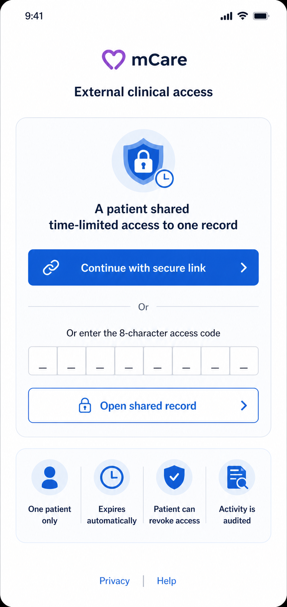
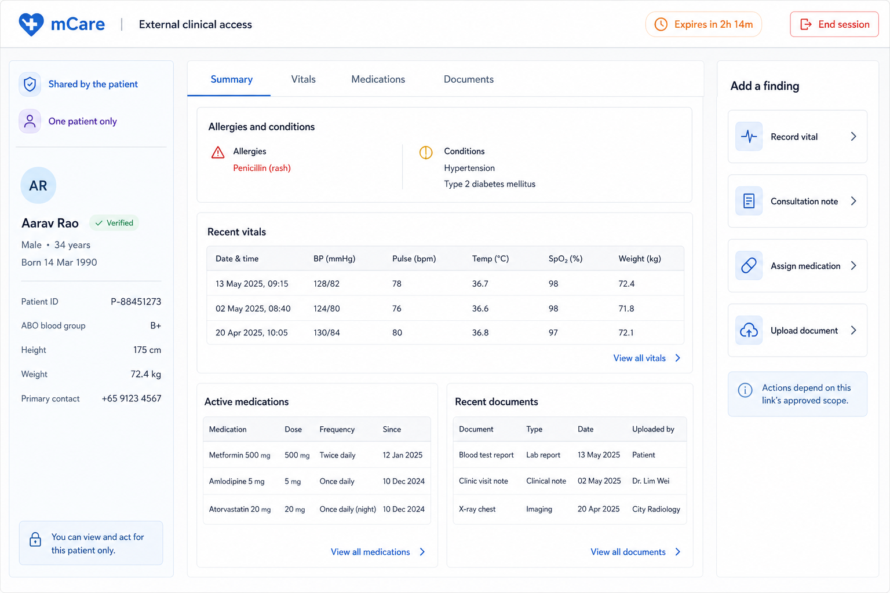

# 08 — External Clinical Access: One-Patient Guest Portal

## 1. Product truth and approval boundary

External clinical access is **not a fifth registered account portal** in the current mCare product. It is a patient-created, time-limited guest capability that opens one patient's record in a web portal through either:

- a long link token, or
- an eight-character spoken access code.

The guest does not sign in to an mCare account, has no dashboard/caseload, and receives no global navigation, directory, inbox, settings or persistent identity. The current guest can view a limited summary and can record a vital, assign a medication, upload a document and submit a consultation note. All access ends when the patient revokes the link or its expiry is reached.

This chapter documents both the current contract and the target design. Anything labelled **Future-only** is deliberately excluded from the presentation-only redesign because no current backend workflow supports it.

## 2. Visual design references

### 2.1 Access gate — compact



**Figure 08-1 — target visual intent.** It immediately explains the boundary: one patient, automatic expiry, patient revocation and audited activity. The secure-link action represents an already supplied link; it is not a general external-doctor login.

The current backend does not yet audit every read and does not exchange the raw secret for a short portal session. Therefore the `Activity is audited` promise becomes release-ready only after the hardening gates in Section 13 pass.

### 2.2 Patient workspace — expanded



**Figure 08-2 — target workspace composition.** Patient context is fixed on the left, the authorized record occupies the centre, and `Add a finding` actions sit on the right. The `Verified` badge, explicit action scopes, countdown session and `End session` control depict the hardened target. They must not be presented as active controls or guarantees until the corresponding identity, scope and portal-session contracts exist.

### 2.3 Fidelity note

The mockups describe layout, information hierarchy and interaction intent. Example names, identifiers, dates, height, weight and contact information are synthetic. The implemented page may only render fields actually returned by the authorized endpoint. It must never fill a missing field with a fabricated value.

## 3. Access and authorization model

```text
Patient account
  |
  | creates labelled link + code (1–168 hours; max 5 active)
  v
ExternalAccessToken for exactly one patient
  |
  +-- shared URL:  /external?token=<secret>
  `-- spoken code: XXXX-XXXX -> POST /external/resolve-code -> token
                                                        |
                                                        v
                                            GET /external/{token}
                                                        |
                                                        v
                                         One-patient guest workspace
                                         |-- review summary
                                         |-- record vital
                                         |-- add consultation note
                                         |-- assign medication
                                         `-- upload document

Patient revoke OR expires_at reached -> every subsequent show/write is invalid
```

### Invariants

1. One issued secret maps to one patient only.
2. The guest may never search for or switch to another patient.
3. No authenticated mCare role is created or inferred from the optional `doctor_name` field.
4. Expiry and revocation are checked server-side on every read and every write.
5. Route visibility is not authorization; the token capability and its current state are authoritative.
6. The generic public navigation is absent after the record opens.
7. Clinical writes use their existing canonical services/pipelines; the portal must not implement a second risk or notification engine.

## 4. Current routes, endpoints and permissions

### 4.1 Patient-managed access

All three endpoints require Sanctum authentication, general API throttling and `role:patient`.

| Method and endpoint | Current action | Validation/limits | Response/side effect |
|---|---|---|---|
| `GET /patient/external-access` | List the patient's latest issued links | Latest 20, newest first | Raw current link resource including code/token, expiry, revoked/active state and composed URL |
| `POST /patient/external-access` | Create a link and spoken code | Optional label max 120; `expires_in_hours` integer 1–168, default 24; maximum 5 currently active links | 201; creates token/code and a security audit row in one DB transaction |
| `PATCH /patient/external-access/{externalToken}/revoke` | Revoke the patient's link | Object must belong to current patient; out-of-scope returns 404 | Idempotently sets `revoked_at`; creates security audit row; immediate future checks fail |

The spoken code is generated from a no-lookalike alphabet and formatted `XXXX-XXXX`. The patient UI can label, select an expiry date up to seven days, share, copy code/link, create another link, show expired/revoked links, and revoke after a destructive confirmation.

The `privacy_allow_external_access` preference exists in `/me/settings`, but the current creation controller does not enforce that preference. The redesign must not describe the toggle as a server authorization control until enforcement is implemented and tested.

### 4.2 Public guest access

| Method and endpoint | Current action | Current validation | Current side effects |
|---|---|---|---|
| `POST /external/resolve-code` | Exchange a spoken code for the raw portal token | `code` required string, 6–16 chars; normalizes eight characters with/without dash; named limiter `external-resolve` (documented 6/min) | Returns token when valid; invalid/expired is a neutral 404 |
| `GET /external/{token}` | Load one-patient summary | Token row must exist, be unrevoked/unexpired, and point to a Patient | Returns expiry, vital catalog, patient summary, 20 latest readings, up to 40 active medications and 20 latest document metadata rows |
| `POST /external/{token}/notes` | Record consultation note | Note required 4–1000; optional doctor name max 120 | Audit entry + patient notification; 200 success |
| `POST /external/{token}/vitals` | Record a current vital | Known `vital_key` max 32; numeric value; optional numeric secondary; note max 500; doctor name max 120 | Risk assessment with patient override/global catalog; reading created; normal alert pipeline; audit + patient notification; 201 |
| `POST /external/{token}/medications` | Add active doctor-prescribed medication | Name max 160; dosage max 60; frequency max 120; optional form max 60; instructions max 1000; optional valid dates with end on/after start; doctor name max 120 | Medication created with external author and zero refills; audit + patient notification; 201 |
| `POST /external/{token}/documents` | Upload a chart document/report | Title max 200; category allowlist; type allowlist; optional description; PDF/JPG/JPEG/PNG/DOC/DOCX; max 10 MB; doctor name max 120 | Document created; audit + patient notification; 201 |

`GET` and guest writes are currently grouped under the named `external-write` limiter (route comment targets 30/min per token). There is no external document stream/download endpoint, so the current guest contract supports document metadata review and upload, not file preview/download.

### 4.3 Current returned summary fields

The target workspace may render only the following current `GET /external/{token}` fields unless an approved contract extends them:

- `token`, `expires_at`;
- enabled vital catalog entries: key, label and unit;
- patient: ID, name, unique ID, derived age, sex, blood type, chronic-condition display text, allergies and `no_known_allergies`;
- latest vital readings with risk classification;
- active medications;
- latest medical document metadata.

Current response does not provide a verified external-clinician identity, permitted-action scopes, access history, patient contact details, emergency contacts, complete longitudinal record, referrals, appointments, messages or telemedicine sessions.

## 5. Patient journey: create, share, monitor and revoke

```text
Patient Care Team or Settings > Privacy
  -> External doctor access
      -> Load current links
          |-- no active link -> creation form
          |-- active link    -> primary link card + Create another
          `-- old links      -> collapsed Expired / revoked list

Creation form
  -> optional label
  -> expiry (today through +7 days; server receives hours 1–168)
  -> Create & share
  -> share sheet / copy fallback

Active link card
  -> Share with doctor
  -> Copy code
  -> Copy link
  `-> Revoke -> confirm exact label/impact -> server revoke -> refresh
```

### Target management screen

**Purpose:** give the patient simple, visible control over an unusually powerful capability.

**Required content:**

- plain-language explanation of what the guest can currently see and do;
- one primary active-link card with label, exact expiry and active status;
- code and link displayed only when the user deliberately reveals/copies/shares them;
- `Create another` subject to the server cap;
- `Revoke access` with immediate-effect warning;
- inactive history labelled `Expired` or `Revoked`, never merely `Inactive`;
- after hardening, access history with time, verified/declared clinician identity, read/write action and device/session context without exposing raw secret.

**Error states:** loading skeleton, empty, list failed/retry, create 422 because five active links exist, create offline, share-provider unavailable with copy fallback, revoke conflict/already revoked, and generic server failure without printing exception text or raw token.

## 6. Guest journey and navigation

### 6.1 Access gate

**Entry A — link:** opening `/external?token=...` currently loads the portal directly. In the hardened target, the secret is exchanged once for a short-lived portal session and then removed from the address bar/history before any record renders.

**Entry B — code:** user enters the eight characters; input uppercases, ignores the visual dash for entry, supports full paste, and announces grouping without making eight separate inaccessible fields. `Open shared record` calls `POST /external/resolve-code`, then loads the one record.

**Content:** mCare brand, `External clinical access`, one-patient/time-limited explanation, secure-link state or code field, privacy/help links, and factual boundary icons. Do not show normal `Sign in`, `Register` or role navigation inside the access card.

**States:**

- no token/code — idle access gate;
- resolving code — one pending action, input disabled but readable;
- invalid/expired/revoked — same neutral message and recovery guidance;
- rate limited — retry-later state, no automatic loop;
- offline — connection guidance, no implication the code is invalid;
- valid — transition to workspace only after summary succeeds;
- patient not found/invalid relationship — same non-enumerating unavailable state.

### 6.2 Workspace navigation

The guest workspace has no application-wide side rail or bottom navigation. It contains only:

- persistent `External clinical access` identity;
- time remaining/expiry;
- patient-shared and one-patient-only boundary;
- Summary, Vitals, Medications and Documents views;
- `Add a finding` actions permitted by the current/target scope;
- `End session` in the hardened target.

```text
Access gate -> Summary
               |-- Vitals
               |-- Medications
               |-- Documents
               `-- Add a finding
                    |-- Record vital
                    |-- Consultation note
                    |-- Assign medication
                    `-- Upload document

Any view/write -> expiry/revoke detected -> access-ended page -> return home/help
```

Browser Back from a finding closes the finding and returns to the current record view. Back from the workspace ends local viewing and returns to the access gate/public home; it must not reveal another record or a previous user's cached data.

## 7. Screen specifications

### 7.1 Summary

**Purpose:** give the visiting clinician the minimum context needed for a time-limited encounter.

**Information order:** access/expiry status; patient name and mCare unique ID; age/sex/blood type when returned; prominent allergy/no-known-allergy status; condition summary; recent vitals; active medications; recent document metadata.

**Rules:**

- Allergy state appears before routine values and never relies on colour alone.
- `No known allergies` is shown only when the explicit boolean is true; an empty list otherwise becomes `Allergy information not recorded`.
- Unknown age, sex, blood type or conditions are omitted or labelled `Not recorded`; never guessed.
- Risk labels accompany vital colour/icon.
- The mockup's contact/height/weight fields are omitted unless the authorized API supplies them.
- No `Verified` clinician badge is shown under the current contract. Optional typed `doctor_name` is a declared author label, not verification.

### 7.2 Vitals

**Review:** newest-first readings, vital label, value/secondary value, unit, recorded time, risk text and recorded-by note when supplied. Compact uses cards; expanded may use a readable table with responsive columns.

**Record vital finding:** vital selector populated only from the returned enabled catalog; numeric value; conditional secondary value for paired readings; optional note; optional clinician name shared across all findings. Submit uses `POST /external/{token}/vitals`.

**Success:** show returned classified reading and state that it was added to the chart. Say the care team was alerted only according to the actual pipeline outcome/contract; avoid a blanket claim for normal readings. Refresh summary without clearing the entire workspace.

**Failure:** unknown vital/422 keeps input and refreshes catalog; expired/revoked transitions to access-ended; network failure preserves values for deliberate retry; duplicate tap is blocked.

### 7.3 Consultation note

**Form:** multiline note with remaining-character guidance and optional clinician name. Minimum four and maximum 1000 characters. `Submit consultation note` is the only primary action.

**Success:** clear note only after authoritative success; show `Consultation note added to the patient's chart activity` and return to the prior view. The current note is represented as an audit entry and patient notification, not as a first-class medical-document row, so the UI must not promise it appears in Documents.

### 7.4 Medications

**Review:** active medication name, dose, frequency, form/instructions, start/end where returned and prescriber source. No editing or revocation is available to the guest under the current contract.

**Assign form:** name, dosage and frequency required; optional form, instructions, start date, end date and clinician name. End date cannot precede start. Submit uses the existing external medication endpoint.

**Clinical safety:** show a review step summarizing patient, medicine, dosage and frequency before the final write. This review is UI safety, not a prescribing-verification claim. The current backend does not verify external clinician licence, drug interactions, allergy conflict, dose range or formulary. Production medication write access therefore requires the hardening/clinical-governance decision in Section 13.

### 7.5 Documents

**Review:** title, category, file type, uploaded date and uploaded-by metadata returned by the summary. Under the current endpoint set, do not render `Open`, `Preview` or `Download` for the guest.

**Upload form:** title; category (`labResult`, `prescription`, `imaging`, `discharge`, `consultationNote`, `other`); selected file; optional description; optional clinician name. Client accepts only the server allowlist and displays maximum 10 MB before upload.

**Upload states:** choosing, validating, uploading with progress when available, scanning/quarantine in the hardened target, success, invalid type/size, connection failure with explicit retry, expired during upload, and server rejection. Never optimistically add a usable document before the server confirms it.

### 7.6 Access ended

One shared page handles expired, revoked, ended and invalid capability without revealing whether a particular patient/link ever existed.

**Copy:** `This shared access is no longer available.` Secondary guidance: ask the patient for a new link/code when clinically appropriate. Actions: `Return to mCare home`, `Get help`. Clear all portal data and selected files before rendering this page.

### 7.7 End session

The current portal can navigate home but has no short-lived server portal session to revoke. In the hardened target, `End session` clears portal state, invalidates the exchanged guest session if supported, replaces history, and returns to the neutral access gate. It does **not** revoke the patient's issued link; only the patient can do that from their account.

## 8. Responsive layouts

### Compact: below 600 px

- Access gate is one centered column as shown in Figure 08-1.
- Workspace header shows access title and a concise expiry chip.
- Patient identity/allergy card precedes a four-item tab/segmented control.
- Each record type is a stacked list; wide tables convert to labelled cards.
- One sticky `Add finding` button opens a full-height accessible sheet with four actions; a finding form replaces that sheet content.
- Patient boundary/expiry remains visible without consuming excessive vertical space.

### Medium: 600–1023 px

- Persistent patient/access summary in a 240–280 px left pane when space permits.
- Record content occupies the main pane.
- Add-finding actions appear as a side sheet or bottom action rail; forms can use two columns for short related inputs.
- At narrow tablet portrait widths, use the compact flow rather than compressing three columns.

### Expanded: 1024 px and above

- Three-column composition as Figure 08-2: patient boundary panel, tabbed record workspace, add-finding rail.
- Main content is bounded and lists virtualize when long.
- Action rail remains visible, but no write occurs directly from a tile; it opens a reviewable form.
- Header shows factual expiry and an end-session action after the short-session contract exists.

### Responsive invariants

- Breakpoints alter layout only; the same token/session, validation and endpoint are used.
- Selected tab and unsaved finding state survive a resize.
- No horizontal page scroll at supported widths or 200% text.
- Allergies, access expiry and one-patient boundary remain perceivable on every tier.
- Data is not duplicated into multiple simultaneously focusable regions for responsive convenience.

## 9. Shared component specifications

```text
ExternalAccessGate
├── ExternalBoundarySummary
├── SecureLinkState
├── AccessCodeField
├── AccessGateStatus
└── PrivacyHelpFooter

ExternalWorkspaceShell
├── ExternalSessionHeader
├── PatientBoundaryPanel
├── ExternalRecordTabs
│   ├── ExternalSummaryPanel
│   ├── ExternalVitalsPanel
│   ├── ExternalMedicationsPanel
│   └── ExternalDocumentsPanel
├── ExternalFindingLauncher
└── AdaptiveFindingHost
    ├── RecordVitalForm
    ├── ConsultationNoteForm
    ├── AssignMedicationForm
    └── UploadDocumentForm
```

These components may reuse design tokens, buttons, fields, status badges, empty/error states and file picker primitives from the main app. They must not import authenticated role shells, stores or navigation destinations. The guest repository owns portal state; patient and staff stores must remain untouched.

## 10. State and interaction contract

| State/event | Required behavior |
|---|---|
| Gate idle | Explain one-patient boundary; code input enabled |
| Resolving code | Disable repeat submit; no record placeholder with fake content |
| Loading summary | Structure-matched skeleton; secret never displayed |
| Loaded | Render only returned fields/actions; show exact expiry |
| Refreshing after write | Keep current safe snapshot visible and mark Updating |
| Empty section | `No active medications` / `No recent documents` / `No readings available`; never `No patient data` |
| Invalid/expired/revoked 404 | Purge record state and show common access-ended page |
| Validation 422 | Inline field error; preserve non-file inputs; require reselect only when platform loses file handle |
| Rate limited 429 | Retry guidance; no rapid automatic requests |
| Offline/timeout | Distinguish connection failure from invalid access; no long-lived offline cache of guest PHI |
| Server 5xx | Stable retry/help state; no raw exception/token |
| Write pending | Disable all duplicates of that action; leaving asks before discarding |
| Write success | Confirm exact object created, clear only submitted form, refresh affected section |
| Expiry during write | Treat response as authoritative; purge and end access; never claim success without 2xx |
| Patient revokes while open | Next poll/request immediately ends access; hardened realtime/session expiry may end it sooner |
| Browser refresh | Current contract can reload from token; hardened target restores only a valid short portal session |
| End session | Clear memory, file selections, URL/history and guest-session material |

The page must not persist guest patient data to general local storage, IndexedDB, service-worker cache, crash breadcrumbs or analytics.

## 11. Backend ownership and event effects

| Guest action | Canonical backend owner | Downstream behavior to preserve |
|---|---|---|
| Resolve code | `ExternalDoctorController::resolveCode` | Validity check and code throttle |
| View summary | `ExternalDoctorController::show` | One-patient query, capped recent datasets |
| Add note | `ExternalDoctorController::addNote` | `external.consultation_note` audit + patient report notification |
| Record vital | `ExternalDoctorController::addVital` + `VitalRisk` + `VitalAlertNotifier` | Patient override/global range classification, clinical alert pipeline, audit, patient notification |
| Assign medication | `ExternalDoctorController::addMedication` | Active `doctorPrescribed` medication, audit, patient notification |
| Upload document | `ExternalDoctorController::uploadDocument` + `MedicalDocumentFiles` | File validation/storage, chart row, audit, patient notification |
| Create/revoke | `PatientExternalAccessController` | Ownership, active-link cap, transactional create/revoke audit |

The Flutter redesign calls these owners through one `ExternalAccessRepository`. It must not duplicate risk classification, notification creation, access validity or ownership logic in widgets.

## 12. Privacy, accessibility and clinical communication

### Privacy

- Never put patient name, identifier, allergy, condition, vital, medication, document title or clinician name into analytics or generic logs.
- Never send raw token/code in telemetry, referrer, error report, notification, screenshot label or support URL.
- Use `Cache-Control: no-store`, strict Referrer-Policy, CSP, `frame-ancestors` and no third-party session replay on guest pages.
- Do not use the clipboard automatically. Copy/share is explicit, acknowledged and should warn that the recipient can access the record until expiry/revocation.
- Clear guest state on expiry, revoke, end session, browser visibility timeout according to policy, and app lifecycle transitions where appropriate.

### Accessibility

- Code entry supports paste/autofill and announces `8-character access code` as one logical control.
- Expiry is human readable and screen-reader accessible; do not rely only on a countdown that changes every second.
- Allergy/risk status includes icon, text and accessible label, not colour alone.
- Tabs expose selected state; keyboard Left/Right or standard Tab/Enter behavior is supported.
- Finding forms have persistent labels, field errors, error summary and focus management.
- Upload progress and completed writes are announced politely; access expiry is assertive but not repeatedly announced.
- At 200% text, patient boundary, tabs and primary action remain available without two-dimensional scrolling.

### Clinical content

- Use `Record vital`, `Add consultation note`, `Assign medication`, and `Upload document`; avoid vague `Update chart` or generic `Submit`.
- State clearly that mCare supports monitoring and coordination and does not replace emergency services.
- Never label an external person `Verified` unless an authoritative verification source and current status are returned by the server.
- Never imply that medication or note submission was clinically reviewed merely because persistence succeeded.

## 13. Security and clinical hardening gates

The present guest capability is powerful. Production approval requires these controls before enabling the corresponding target promises/actions:

1. Store token and code hashes, not recoverable raw secrets; show/share newly created secrets once.
2. Exchange link/code for a short-lived, revocable portal session; remove the raw token from URL, referrer and browser history.
3. Add explicit server scopes such as `summary.view`, `vitals.write`, `notes.write`, `medications.write`, `documents.write`; default to minimum/view-only and return `allowed_actions`.
4. Let the patient choose duration and scopes in plain language; permission changes/revoke apply immediately.
5. Decide and implement clinician identity assurance. Typed `doctor_name` remains `Declared name`, never `Verified`.
6. Require verified clinician/step-up and approved clinical governance before medication write access; consider narrower default or disabling this action until approved.
7. Audit code resolve, link exchange, summary view, section reads, document access, every write, failure/denial and end session by token/session ID — never raw secret.
8. Provide patient-visible access history and suspicious-access notification without leaking detailed PHI in push copy.
9. Apply distributed abuse protection per secret/session plus IP/device signals; neutralize enumeration and time-based differences.
10. Move documents to private encrypted storage; authorize delivery, validate magic bytes, quarantine/scan, strip EXIF, set no-store/nosniff and audit access.
11. Add idempotency keys and state/version/conflict behavior for clinical writes; do not duplicate a medication/vital on retry.
12. Enforce expiry/revocation atomically at write time and cover races in tests.
13. Return minimum necessary data per scope; remove raw `token` and `access_code` from ordinary list responses after one-time display design lands.
14. Enforce the patient's external-access privacy preference server-side if the product presents it as an on/off control.
15. Ensure CORS, CSP, TLS, headers, secrets and production debug configuration are hardened for the public portal.

Until these controls pass, the PDF may approve the visual direction but must not be treated as production security approval.

## 14. Explicitly future-only external account concepts

The following requested ideas are **not current external guest features** and must not be drawn as if they exist:

- external-doctor account registration/login;
- dashboard or assigned-patient caseload;
- referral management or consultation-request queue;
- persistent medical-record access across patients;
- secure messaging inbox;
- telemedicine/video consultation;
- external-doctor reports library;
- notifications centre;
- profile/settings;
- external permission-management console.

They require a separate product decision, identity proofing/licensure model, consent and organization model, new roles/policies, routes, APIs, database schema, notifications and regulatory/security review. If pursued later, design them as a new authenticated referring-clinician product, not by expanding a bearer link into a permanent account.

## 15. Safe implementation sequence

1. Freeze and contract-test the seven current endpoints plus patient create/list/revoke behavior.
2. Add automated negative tests for cross-patient revoke, invalid/expired token, every write after revoke, unknown vital, invalid dates/files and rate limits.
3. Implement the hardened secret/session/scope/audit model behind a versioned or compatible adapter before presenting scope/verified/session promises.
4. Build shared guest components and repository without importing role stores.
5. Replace the access gate behind `external_access_redesign_enabled`; retain current `/external` route and deep links.
6. Add read-only Summary/Vitals/Medications/Documents panels using the current show response.
7. Migrate one finding form at a time, starting with note, then vital, then document; medication last after clinical governance approval.
8. Add patient management redesign and access history after backend support.
9. Run security, accessibility, responsive, expiry/revoke-race and upload tests in a production-like environment.
10. Roll out to internal/test patients; rollback is the feature flag, not route deletion.

## 16. Required tests

### Access and authorization

- Valid link and code open exactly the issued patient.
- With/without-dash code normalization behaves identically.
- Invalid, expired, revoked and wrong-patient relationships return the same safe unavailable experience.
- Five-active-link cap, 1–168-hour bounds, ownership and idempotent revoke pass.
- Every show/write rechecks validity; revoke/expiry races cannot complete unauthorized writes.
- A guest cannot enumerate/search/change patient ID or reach authenticated routes.

### Data/action parity

- Summary maps only current fields and caps; unknown fields show no fabricated fallback.
- Note, vital, medication and document success/failure map to their canonical endpoint.
- Vital uses server classification and alert side effects; client does not classify for authority.
- Medication date validation and review are correct; double submit cannot duplicate.
- Upload type/size/category/type validation agrees across Flutter and Laravel.
- External document preview/download remains absent until an authorized endpoint exists.

### Security/privacy

- Raw secret disappears from hardened URL/history/referrer/logs/analytics.
- Token/code hashes, short session, scopes, revoke and audit coverage pass.
- No PHI enters service-worker cache, local storage, crash telemetry or push payload.
- File spoof/malware/polyglot/unauthorized-delivery tests pass before file rollout.
- Clinician identity label never shows verified from free text.

### Responsive/accessibility

- Access gate and all finding forms pass 360, 390, 599, 600, 800, 1024, 1440 and 1920 px widths.
- Repeat at 200% text, dark mode, reduced motion, keyboard-only and screen reader.
- Expiry/revoke is announced once and focus moves to the access-ended heading.
- Mobile sticky action never covers content or software-keyboard controls.

## 17. Acceptance criteria

- [ ] The blueprint and UI consistently call this `External clinical access`, not a registered External Doctor portal.
- [ ] Every patient-management and public guest endpoint/action is documented and preserved.
- [ ] One token/code can expose only one patient's minimum authorized data.
- [ ] Access gate, workspace, four finding flows and access-ended state have compact, medium and expanded rules.
- [ ] The UI never shows fields, file actions, verification or scopes that the current/approved contract does not supply.
- [ ] Patient can create, share, copy, review status and revoke without navigating through unrelated pages.
- [ ] Revocation/expiry is checked server-side for every read/write and visibly ends the session.
- [ ] Consultation note, vital, medication and document writes preserve current audit/notification/clinical pipelines.
- [ ] Medication write receives explicit clinical/security approval before production enablement.
- [ ] Hardening gates for hashed secrets, short session, scopes, read audit, private files and no-store delivery pass.
- [ ] Future account/caseload/referral/messaging/telemedicine concepts remain clearly excluded until separately designed and built.
- [ ] No raw token/code or guest PHI appears in URL history, telemetry, logs, cache or push content after hardening.
- [ ] All responsive, accessibility, negative authorization and revoke-race tests are green.

